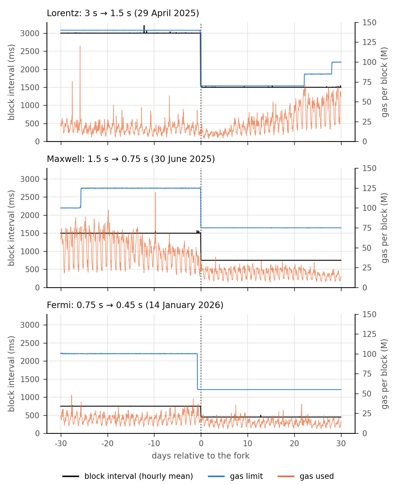
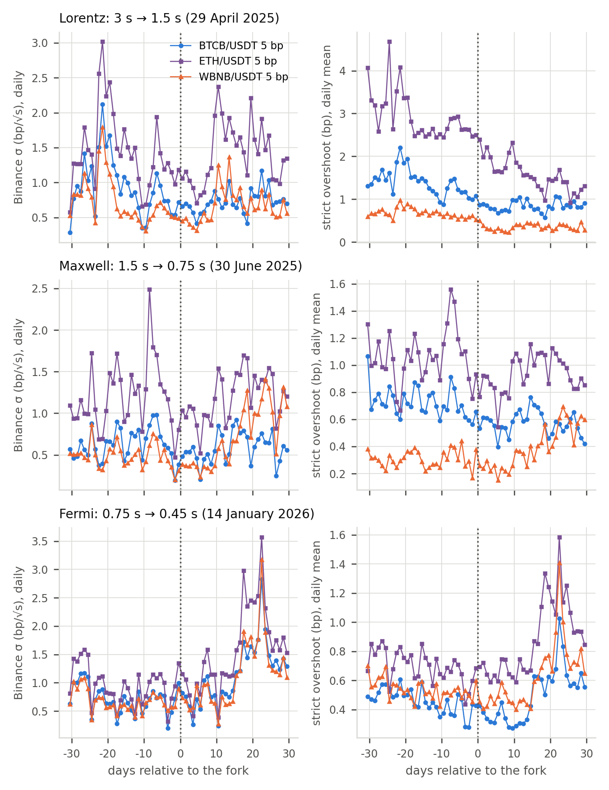
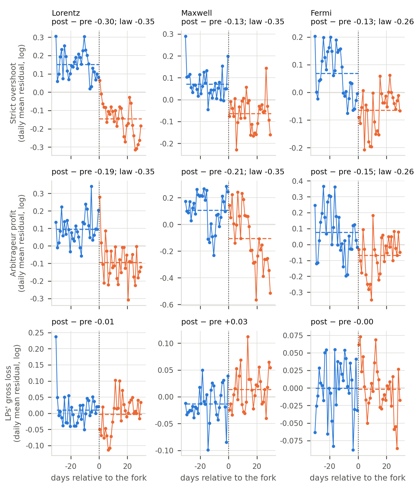
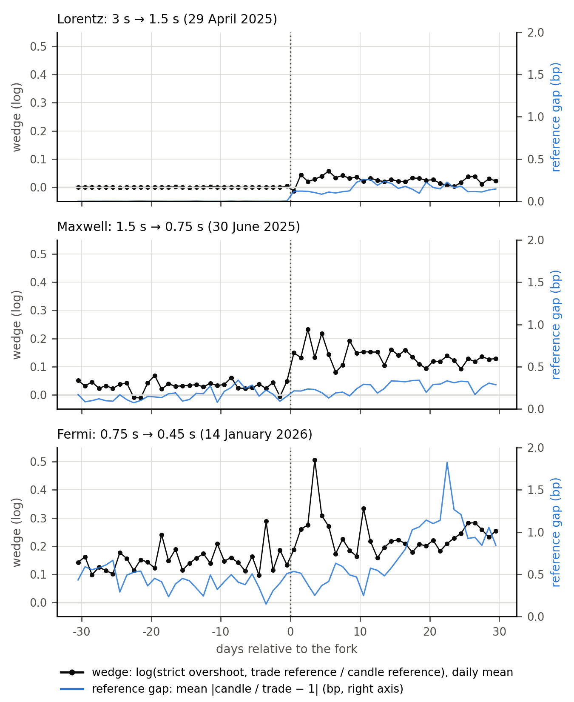
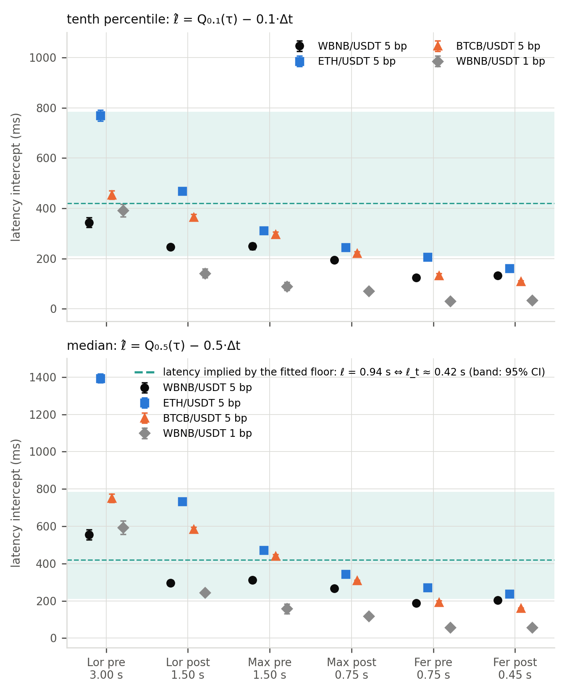
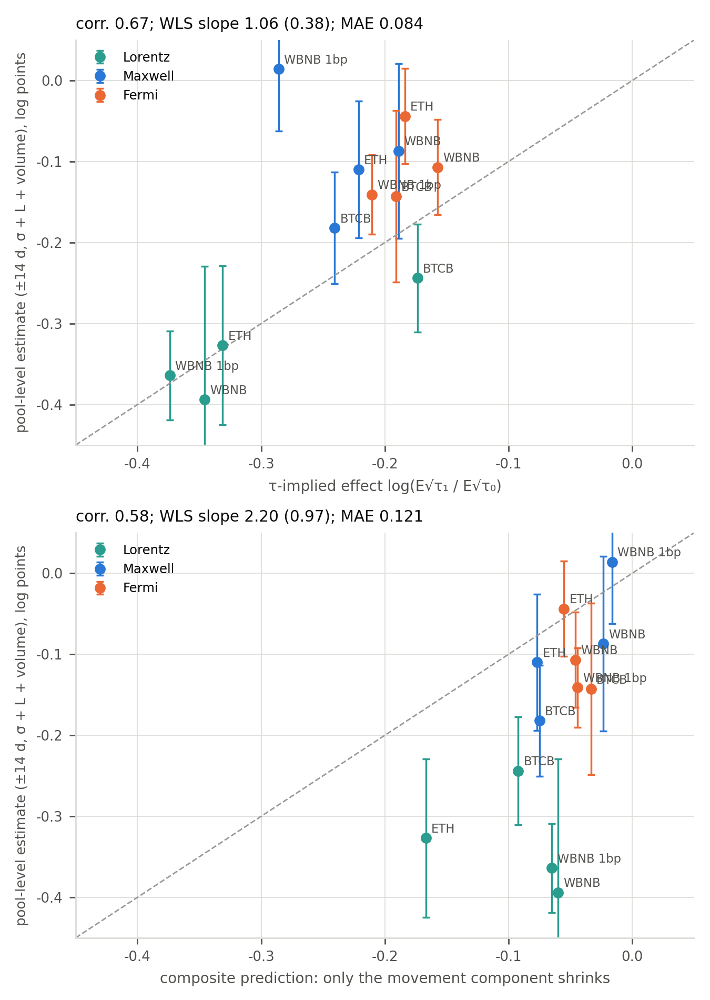

# Faster Blocks Fall Short of the Square-Root Law: Arbitrage Rents and Latency across Three Block-Interval Reductions on BNB Chain

*Zhengdong Zhu (ORCID 0009-0001-8953-0061) — School of Business, Macau University of Science and Technology, Macau, China — 2250030525@student.must.edu.mo (corresponding author)*

*Submission to Digital Finance — revised manuscript v6.0 (September 2026)*

## Abstract

We use three pre-announced reductions of BNB Chain's block interval, from 3 to 0.45 s, as natural experiments on seven PancakeSwap v3 pools, aligning 49 million swaps to Binance trades at millisecond resolution to test the prediction that the mispricing at which arbitrageurs trade scales with the square root of the block interval. In one regression-discontinuity specification applied to all three forks, the mispricing falls at every fork but by less than the law — 84% of the predicted change at the first halving (61% on arbitrage contracts' trades alone) and a third to a half of it at the two sub-second reductions, at most three quarters in any specification, classification or reference alignment — while liquidity providers' gross adverse-selection loss does not fall and, in the ETH and BTCB 5 bp pools, stays close to their fee income in every regime. Reconstructing when 6.5 million arbitrage opportunities opened shows why: arbitrageurs respond with a latency of 0.1–0.35 s that does not shrink with the block interval, so more arbitrages miss the first block; only the part of the mispricing that accumulates while they wait — a quarter to a third of it — follows the law, whereas the reference-price jump that opens an opportunity and same-block back-runs do not; and arbitrage competition responds to volatility within the hour. The block interval is thus a lever over price efficiency and arbitrage rents, with diminishing returns below one second, not over the cost of liquidity provision, which the fee band sets.

**Keywords:** automated market makers; loss-versus-rebalancing; block time; arbitrage latency; decentralized exchanges; natural experiment

**JEL classification:** D47; G12; G14; G23; O33
## 1. Introduction

Automated market makers (AMMs) quote prices mechanically and can only be updated by trades. Between two blocks the external price moves but the pool price does not, so the first trader to act in the new block can trade against the pool at a stale price. Milionis, Moallemi, Roughgarden and Zhang (2022) named the liquidity providers' cost of this stale quoting *loss-versus-rebalancing* (LVR); with trading fees, arbitrageurs act only when the mispricing exceeds the fee band, and the block interval becomes a market-design parameter: the shorter the interval, the less the price can drift out of the band before the next opportunity to correct it (Milionis, Moallemi and Roughgarden, 2025). The policy conclusion has been drawn many times — Fritsch and Canidio (2024) simulate that 100-millisecond blocks would cut LPs' arbitrage losses on Ethereum by 20–70%, and layer-2 sequencers advertise sub-second blocks as an LP-friendly feature — but it rests on a functional form that has never been tested against a change of the block interval on a market whose participants stayed the same.

This paper tests it on three such changes. BNB Chain shortened its block interval from 3 s to 1.5 s (Lorentz, 29 April 2025), to 0.75 s (Maxwell, 30 June 2025) and to 0.45 s (Fermi, 14 January 2026), by pre-announced hard forks whose timing was set by an engineering roadmap rather than by market conditions; the protocol (PancakeSwap v3), the pools, the fee tiers, the liquidity providers and the arbitrageurs were the same before and after each fork. We study all three events on seven pools covering four fee tiers and 49 million swaps, with the last Binance trade before each swap's millisecond block timestamp as the external price. The fee-band model makes point predictions: the *overshoot* — how far beyond the fee band the price has drifted when an arbitrageur trades — scales with σ√Δt, so its log should fall by ½·ln(Δt₁/Δt₀) at a fork (−0.347 for a halving, −0.255 for the 40% reduction of Fermi); arbitrageurs' profit rate should fall by the same amount; the LPs' gross adverse-selection loss should fall only by the arbitrageurs' share of it times the change in that share's own law; and the elasticity of the overshoot to Δt should be 0.5 at every step of the roadmap, unless arbitrageurs face a delay that does not shrink with the block interval, in which case it should fall as blocks get faster.

The design is a before–after comparison in an hourly pool panel around each fork, not a difference-in-differences: there is no untreated pool on the chain with comparable arbitrage, and the confounders that matter in our windows are chain-specific rather than market-wide (Section 5). One specification is fixed in advance and applied uniformly to the three forks and to every outcome — a regression-discontinuity-style jump at the fork with separate pre- and post-fork trends in a ±30-day window, controlling for the hour's realised volatility on Binance, active liquidity, volume, time-of-day and pool fixed effects — and every other window and set of controls is reported as robustness, each with a fake-fork placebo.

The overshoot at strict arbitrage falls after every fork, but by less than the law: by 84% of the predicted change at Lorentz (−0.293, s.e. 0.036) — 61% on the trades of arbitrage contracts alone, once the order flow that reaches the pools through public routers is excluded — and by 32% and 45% at Maxwell and Fermi (−0.110 and −0.115). The two sub-second forks deliver no more than two thirds of the law in any of the eleven windows and specifications we report or under any of four arbitrage classifications (at most three quarters with the reference aligned to the arbitrageur's information), and the placebos of the main specification, where they differ from zero, have the same sign as the estimates, so that correcting for them would enlarge the shortfall. The precision-weighted elasticity across the three forks is 0.29 (0.03), six standard errors below the law's 0.5. Arbitrageurs' profits fall by 22% at Lorentz and 13% at Fermi (the Maxwell profit series is contaminated by a concurrent activity cycle), mispricing episodes become 20–35% shorter, and the LPs' gross adverse-selection loss changes by −6% at Lorentz and by zero to +3% at the two sub-second forks (−5% and +2% to +6% when marked 30 seconds after the block); in the ETH and BTCB 5 bp pools it is 79–121% of fee income in every block-interval regime, and neither volume nor liquidity migrates across fee tiers at any fork.

We then open up the overshoot. For each of 6.5 million trades by arbitrage contracts we reconstruct, from Binance's millisecond trade record and the pool's own trade history, when the opportunity opened and how long the arbitrageur took to close it. Arbitrageurs' latency is directly measurable and does not shrink with the block interval: at sub-second block times the intercepts of the response-time quantiles are 0.1–0.35 s and move by less than 50 ms at Fermi, and the share of arbitrages that miss the first block after the opening rises from 14–47% at 3-second blocks to 37–51% at 0.45-second blocks — a fact that needs no regression and no placebo screen, and whose on-chain-triggered counterpart needs no reference price at all (Figure 2). The overshoot decomposes into a part that accumulates while the arbitrageur waits — a quarter to a third of the strict overshoot — and parts that do not depend on the block interval, the jump of the reference price at the trade that opens the opportunity and the overshoots of arbitrages triggered by the pool's own trades; only the first part follows the law (−0.32, −0.09 and −0.37 log points at the three forks against −0.35, −0.35 and −0.26), and the unresponsive parts rise from 32% of the overshoot at 3-second blocks to 44% at 0.75 s. The shortfall from the law is a composition effect that grows along the roadmap; the same composition explains why the overshoot's elasticity to volatility is one half rather than the model's one, and on top of it arbitrage competition responds to volatility within the hour in a way that a permanent change of the block interval did not trigger within weeks.

The paper contributes to three literatures. To the theory of AMM design (Milionis et al., 2022, 2025; Capponi and Jia, 2025; Hasbrouck, Rivera and Saleh, 2026a; Adams et al., 2026) it provides the first within-chain causal estimates of how the block interval enters arbitrage rents and LP costs, at three doses, and the first direct measurement of arbitrageurs' response times on a public chain. To the empirical literature on DEX market quality (Lehar and Parlour, 2025; Barbon and Ranaldo, 2026; Capponi, Jia and Yu, 2026; Alexander et al., 2025; Fritsch and Canidio, 2024) it adds a natural experiment in which the friction separating DEX from CEX prices was changed exogenously three times. To the measurement literature on MEV and arbitrage (Zhou et al., 2021; Qin et al., 2022; Öz et al., 2025) it shows that at sub-second block times the resolution and alignment of the reference price are first-order: the 1-second candle reference of the empirical literature goes stale by the fractional second of the block timestamp, and because the share of arbitrage trades that respond to price moves inside that fraction rises when blocks get faster, it manufactures part of the effect of a fork — with it the two sub-second forks looked like 69% and 77% of the law under the main specification, against 32% and 45% with the trade reference. Section 2 describes the setting, Section 3 the model, Section 4 data and measurement, Section 5 the empirical strategy, Section 6 the results, Section 7 the interpretation and limitations, Section 8 related work; Section 9 concludes.
## 2. Institutional Setting

### 2.1 BNB Chain's block-interval roadmap

BNB Smart Chain runs a proof-of-staked-authority consensus (Parlia) in which a fixed set of validators produce blocks in turn at a fixed nominal interval. In 2025–26 the chain implemented a three-stage roadmap toward sub-second blocks (Table 1; BNB Chain, 2025a, 2025b, 2026). The Lorentz hard fork (BEP-520, 29 April 2025 05:05 UTC, block 48,773,576) halved the interval from 3 s to 1.5 s and introduced millisecond timestamps; the Maxwell hard fork (BEP-524, 30 June 2025 02:30 UTC, block 52,337,091) halved it again to 0.75 s; the Fermi hard fork (BEP-619, 14 January 2026 02:30 UTC, block 75,140,593) reduced it to 0.45 s. Each fork was announced weeks in advance with a fixed activation time; the timing followed client releases and validator upgrades, not market conditions.

Each fork bundled other changes (Table 1). Gas limits were cut with the interval so as to hold per-second throughput roughly constant, and daily gas utilisation stayed between 9% and 61% around the forks (Figure A1), so none of the changes created congestion, and none touches how a swap is priced. Finality changed with the interval too: under BNB Chain's fast-finality rule (BEP-126) a block is final once its child has been justified by two thirds of the validators, so time to finality is a fixed number of block intervals — about 2.5 — and shortened in step with the interval at every fork, from roughly 7.5 s before Lorentz to about 1.9 s after Maxwell (BNB Chain, 2025b) and about 1.1 s after Fermi; Fermi's BEP-590 lets a proposer include votes for up to three ancestor blocks, which improves the resilience of finality without changing its latency. Because finality is defined in blocks, its change cannot be separated from the change of the interval; Section 7.3 discusses what this implies for the estimand. The forks were clean in the sense that matters for the design — the same validators, PancakeSwap contracts, LPs and arbitrageurs operated before and after — but they were not the only thing happening in their windows (Section 5).

**Table 1. The three block-interval reductions.**

| Fork | Activation (UTC) | Block | Δt before → after | Predicted log change of overshoot and arbitrage profit, ½·ln(Δt₁/Δt₀) | Bundled changes | Concurrent events in the ±30-day window |
|:--|:--|--:|:--|--:|:--|:--|
| Lorentz (BEP-520) | 2025-04-29 05:05 | 48,773,576 | 3 s → 1.5 s | −0.347 | gas limit 140 M → 70 M (throughput unchanged); millisecond timestamps | US tariff shock (2–9 April); CAKE tokenomics overhaul (23 April – 7 May); PancakeSwap Infinity launch; Binance Alpha trading-rewards ramp from early May |
| Maxwell (BEP-524) | 2025-06-30 02:30 | 52,337,091 | 1.5 s → 0.75 s | −0.347 | validator turn 8 → 16 blocks; finality ≈ 1.9 s; gas limit 125 M → 75 M | Binance Alpha volume cycle (peak early June, trough late June); gas-limit increase 100 M → 125 M on 4 June |
| Fermi (BEP-619) | 2026-01-14 02:30 | 75,140,593 | 0.75 s → 0.45 s | −0.255 | gas limit 100 M → 55 M; fast-finality voting rules (BEP-590) | crypto sell-off of 1–6 February 2026 (volatility ×1.7–1.8 over the 30 days after the fork) |

### 2.2 PancakeSwap v3 and the pools

PancakeSwap v3 is a concentrated-liquidity AMM with the Uniswap v3 design: LPs post liquidity on price ranges, trades move the price along a constant-product curve within the active range, and a fee tier (0.01%, 0.05%, 0.25% or 1%) is charged on the input amount. We study seven pools (Table 2). The three 0.05% pools for WBNB/USDT, ETH/USDT and BTCB/USDT are the *core sample*: liquid pools of volatile assets whose external price is observed on Binance with bid–ask noise of a few hundredths to a few tenths of a basis point, small relative to the 5 bp fee band. The 0.01% WBNB/USDT pool is the chain's main routing pool and is analysed separately because its band is of the order of the reference-price noise; the USDC/USDT 0.01% pool is a placebo (σ ≈ 0.09 bp/√s, so CEX–DEX arbitrage is economically irrelevant); and the CAKE/WBNB 0.25% and WBNB/USDT 1% pools have exposures σ√Δt/γ — how far the price drifts within one block relative to the fee band — too low to expect measurable effects.

**Table 2. Pools, sample sizes and pre-fork exposure.** Swaps in the ±30-day windows around Lorentz / Maxwell / Fermi; exposure is σ√Δt/γ from Binance realised volatility in the 14 days before each fork.

| Pool | Fee | Role | Swaps (millions), L / M / F | Exposure before the fork, L / M / F |
|:--|:--|:--|:--|:--|
| WBNB/USDT 0.01% | 1 bp | routing pool; band ≈ reference noise | 6.56 / 15.05 / 12.46 | 0.92 / 0.60 / 0.51 |
| WBNB/USDT 0.05% | 5 bp | core | 5.24 / 2.33 / 0.62 | 0.18 / 0.12 / 0.11 |
| ETH/USDT 0.05% | 5 bp | core | 0.50 / 0.52 / 0.60 | 0.42 / 0.34 / 0.16 |
| BTCB/USDT 0.05% | 5 bp | core | 0.25 / 0.25 / 0.63 | 0.26 / 0.17 / 0.12 |
| USDC/USDT 0.01% | 1 bp | placebo (σ ≈ 0.09 bp/√s) | 0.70 / 2.37 / 1.09 | 0.14 / 0.11 / 0.08 |
| CAKE/WBNB 0.25% | 25 bp | low exposure | 0.07 / 0.08 / 0.02 | 0.10 / 0.04 / 0.03 |
| WBNB/USDT 1% | 100 bp | near-inactive; placebo | 0.003 / 0.003 / 0.004 | 0.01 / 0.01 / 0.01 |
## 3. Model and Predictions

### 3.1 Arbitrage against an AMM with fees and discrete blocks

Consider a pool with fee γ (5 bp for the core pools) whose price can only change when a block is produced, every Δt seconds, and let the log external price follow a Brownian motion with volatility σ per √second. An arbitrageur who trades against the pool pays the fee, so a trade is profitable only when the mispricing — the log distance between the pool price and the external price — exceeds γ; when it does, the arbitrageur trades until the mispricing is back at the edge of the band. In the fast-block regime, σ√Δt ≪ γ, the mispricing behaves like a Brownian motion reflected at ±γ and is approximately uniform over the band (Milionis, Moallemi and Roughgarden, 2025): the probability that a block is profitable is of order σ√Δt/γ, and conditional on a profitable block the amount by which the mispricing exceeds the band — the *overshoot* that the arbitrageur captures — is of order σ√Δt. Two objects therefore scale with the square root of the block interval:

- **Overshoot at arbitrage.** E[overshoot | arbitrage] ∝ σ√Δt.
- **Arbitrageur profit rate.** Profit per unit time = (profit per profitable block) × (profitable blocks per unit time) ∝ [L·(σ√Δt)²] × [σ√Δt/γ] / Δt ∝ L·σ³√Δt/γ, where L is the pool's active liquidity; equivalently, the no-fee LVR rate ½σ²·L discounted by the fraction of blocks that are profitable.

The LPs' cost is different. Measured against the external price, the pool loses money on *any* trade executed while the pool price differs from the external price; summed over all trades, this gross adverse-selection loss — the empirical counterpart of LVR — equals the arbitrageurs' profit Π plus the fees F they pay. In the fast-block limit Π vanishes as √Δt but F does not: the volume required to keep the mispricing inside the band is governed by the local time of the reflected process at the band edges, of order σ²/γ per unit time and independent of Δt. Writing s = Π/(Π + F) for the arbitrageurs' share of the gross loss, a change of the block interval from Δt₀ to Δt₁ changes the gross loss by

Δlog(Π + F) ≈ −s·(1 − √(Δt₁/Δt₀)),

i.e. by 0.29·s for a halving and 0.23·s for the Fermi reduction: faster blocks transfer rent from arbitrageurs to the LPs' fee income, but the transfer is bounded by the arbitrageurs' profit — 0.8–2.0 bp of pool volume at sub-second intervals in our data, against a gross loss of 3.5–5.4 bp.

### 3.2 A latency floor and a discreteness floor

The model's clock is the block interval: the arbitrageur observes the external price at the instant a block is produced and trades in it. Real arbitrageurs observe the CEX price with a delay, build and broadcast a transaction and wait for inclusion. If the sum of these delays is a constant ℓ that does not shrink with the block interval, the overshoot scales with σ√(Δt + ℓ), a fork changes its log by ½·ln((Δt₁ + ℓ)/(Δt₀ + ℓ)), and the elasticity to Δt falls from 0.5 when Δt ≫ ℓ toward zero as Δt falls below ℓ. The extension has one parameter, is nested in the model at ℓ = 0, and predicts that the first halving from 3 s should deliver most of the √Δt law and the reductions below 1.5 s progressively less.

The latency extension treats the overshoot as a single quantity that grows with the time the arbitrageur takes. It is not. Consider an arbitrage triggered by the reference price crossing the edge of the band at t₀ and landing in a block at t₀ + τ. The overshoot at the trade is the sum of two pieces, |dev| − γ = J + M: the excess J by which the crossing trade itself carried the reference price beyond the band edge, and the movement M of the reference price between the crossing and the block. M accumulates over the response time τ and is the part to which the √Δt logic applies; J is set by the size distribution of trades on the reference exchange — the discreteness of the reference price — and by nothing on the chain. Two further kinds of arbitrage are triggered by the pool's own trades: a swap that pushes the pool price out of the band and is corrected in the same block (a *back-run*), whose overshoot is set by the size of the trade it corrects, and an arbitrage that completes a correction begun in an earlier block (a *continuation*), whose overshoot responds partly. The aggregate elasticity of the overshoot to Δt is therefore the elasticity of M weighted by the share w_M of M in the total, plus the smaller response of the continuations; since M shrinks with Δt while J and the back-runs do not, w_M falls along the roadmap and the aggregate elasticity falls with it even if arbitrageurs' latency were zero. The same composition applies to volatility: J does not scale with σ, so the aggregate elasticity to σ lies below that of M. A latency floor and a discreteness floor produce the same pattern in the aggregate and can only be told apart by opening up the overshoot: the first is identified from the distribution of response times, the second from the components' separate responses to a fork (Sections 4.5 and 6.7).

### 3.3 Predictions

Let Δt₀ and Δt₁ be the block intervals before and after a fork and define θ = ½·ln(Δt₁/Δt₀): θ = −0.347 for Lorentz and Maxwell and θ = −0.255 for Fermi.

- **P1 (overshoot).** Holding σ fixed, the log overshoot at arbitrage changes by θ.
- **P2 (arbitrageur profit).** Holding σ, γ and L fixed, the log arbitrageur profit rate changes by θ.
- **P3 (LP cost).** The LPs' gross adverse-selection loss changes by −s·(1 − √(Δt₁/Δt₀)), where s is the arbitrageurs' pre-fork share of it: a second-order effect, largest for Lorentz and smallest for Fermi.
- **P4 (multiplicativity).** The predicted changes are in logs and do not depend on σ, γ or L, so they should be the same across pools, volatility regimes and times of day; the elasticity of the overshoot to σ should be 1.
- **P5 (dose–response across forks).** With ℓ = 0 the elasticity of the overshoot with respect to Δt, β/ln(Δt₁/Δt₀), is 0.5 at each fork; with ℓ > 0 it is ½·ln((Δt₁+ℓ)/(Δt₀+ℓ))/ln(Δt₁/Δt₀), which falls from fork to fork, and the three estimates identify ℓ.
- **P6 (response times).** With a fixed latency ℓ the response time τ is ℓ plus a wait uniform on [0, Δt]: at a fork its median falls by half the change in Δt, its quantiles net of q·Δt share one intercept ℓ that does not change at the fork, and the share of arbitrages landing in the first block after the opening, E[max(0, 1 − ℓ/Δt)], falls as Δt shrinks toward ℓ.
- **P7 (components).** At a fork only the movement component M changes, by θ (or by ½·ln((Δt₁+ℓ)/(Δt₀+ℓ)) with a latency); the crossing jump J and the overshoot of same-block back-runs do not; the total changes by the components' changes weighted by their pre-fork shares.

The forks change Δt by known amounts, so P1–P3 are point predictions rather than sign predictions, and because the same pools were treated three times with known doses, P5 tests the functional form rather than the existence of the effect.
## 4. Data and Measurement

### 4.1 On-chain data

We collect every `Swap` event of the seven pools in a window of 720 hours before and after each fork: 13,336,583 swaps around Lorentz (30 March – 29 May 2025), 20,608,008 around Maxwell (31 May – 30 July 2025) and 15,420,282 around Fermi (15 December 2025 – 13 February 2026) — 49,364,873 in all — retrieved with `eth_getLogs` from a public RPC provider and from the Envio HyperSync log service, which return identical events on a reference slice. Each event gives the post-trade √price, the signed token amounts, the active liquidity and the transaction hash; the pre-trade price is the post-trade price of the preceding swap in the same pool. Block timestamps matter at the sub-second scale and are not returned by `eth_getLogs`; because BNB Chain's consensus sets each block's timestamp to its parent's plus the nominal interval, deviating only when the chain lags behind wall-clock time, the full timestamp vector is reconstructed from headers fetched every ten minutes, bisecting the spans whose elapsed time differs from the nominal one. Millisecond timestamps exist since Lorentz; before Lorentz, blocks were stamped in whole seconds, which is exact for a 3-second schedule. The reconstruction agrees with the provider-supplied timestamps of every swap block for which both are available (Appendix A). Hourly mean intervals are 3,000.7 and 1,500.6 ms around Lorentz, 1,500.7 and 750.1 ms around Maxwell, and 750.1 and 450.2 ms around Fermi (Figure A1).

### 4.2 Two reference prices

The external price is Binance's spot market, the dominant venue for all five assets. We construct two reference prices for every swap from Binance's public data archive. The **trade reference**, used for all results in the body of the paper, is the price of the last aggregate trade (BNBUSDT, ETHUSDT, BTCUSDT; CAKEUSDT/BNBUSDT as a cross-rate for the CAKE/WBNB pool) executed at or before the swap's block timestamp, at millisecond resolution. The **candle reference** is the close of the last *completed* 1-second candle before the block timestamp, the convention of the empirical literature. Both avoid look-ahead; hourly realised volatility σ is computed from 1-minute log returns and expressed per √second.

The candle reference lags the block by the fractional part of the timestamp — between zero and one second — plus the gap to the last trade within the candle. Before Lorentz, timestamps are whole seconds and the two references coincide exactly; afterwards timestamps advance in steps of 1.5, 0.75 and 0.45 s, and the mean absolute gap between the references is 0.06–0.56 bp in the core pools at 1.5- and 0.75-second blocks and 0.34–1.81 bp around Fermi (Table C3), the same order as the overshoot at strict arbitrage. Staleness of this size would be harmless if it were unrelated to the block interval. It is not: an arbitrage trade responds to a move of the external price that occurred at most one block interval earlier; when that move postdates the candle close, the candle reference does not contain it, the deviation the arbitrageur acted on is understated, and the trade may not be classified as an arbitrage at all. The share of such trades is larger the faster the blocks, so a fork changes the candle reference's error in a direction that mimics the effect being estimated; Section 6.2 measures this wedge directly. The trade reference has its own noise floor — Binance's minimum price increment (0.1–0.2 bp for BNB, 0.03–0.05 bp for ETH, negligible for BTC) and bid–ask bounce — but that floor is symmetric around the fork.

### 4.3 Arbitrage identification and LP economics

For each swap we compute the pre-trade deviation dev_pre = p_pre/P − 1, where p_pre is the pool price before the trade and P the reference price. A swap is an **identified arbitrage** if |dev_pre| > γ and the trade moves the pool price toward P; it is a **strict arbitrage** if in addition the post-trade deviation lies inside the band — the trade the model describes. The **overshoot** of an arbitrage is |dev_pre| − γ; averaged over strict arbitrages in an hour it is our empirical counterpart of E[overshoot | arbitrage] and the headline outcome. Because any price-based classification also captures DEX–DEX arbitrage and informed flow that happens to trade in the correcting direction, Section 6.1 reports the fork effect under four definitions: the strict overshoot; the overshoot of all identified arbitrages; the strict overshoot of *bot flow*, the trades of arbitrage contracts excluding those sent through public routers (Section 4.5); and the overshoot of bot arbitrages triggered by a move of the reference price.

LP economics are measured from the pool's side in quote-currency units. For a swap that changes the pool's reserves by (ΔQ, ΔB) in quote and base tokens, `lp_gain` = ΔQ + ΔB·P is the pool's mark-to-market gain at the reference price, `fee_income` = γ × input value, and the **gross adverse-selection loss** is `arb_loss` = fee_income − lp_gain: the amount by which the pool's execution fell short of the external price, gross of fees. Summed over all swaps in an hour it is the empirical counterpart of Π + F; summed over identified arbitrages it is the LPs' loss to arbitrageurs, and `arb_profit` = Σ_arbitrages (arb_loss − fee_income) is the arbitrageurs' profit net of the pool fee (gross of gas and CEX costs); the ratio of the two hourly sums is the empirical share s. Because the LVR literature reports several mark-out horizons, every swap is also marked at the reference price 30 seconds after the block, and the LPs' loss is reported at both horizons. Price efficiency is measured on a 1-second grid as the share of seconds with |dev| > γ and the mean length of runs of consecutive seconds outside the band (the *episode length*).

### 4.4 The hourly panel

All outcomes are aggregated to pool-hours: 10,081 (Lorentz), 10,075 (Maxwell) and 10,074 (Fermi) pool-hours in the ±30-day windows. Table A1 reports descriptive statistics for the core pools. The strict overshoot is below one basis point at sub-second intervals (0.30–0.97 bp) against 0.36–1.95 bp at 1.5-second blocks and 0.6–2.8 bp at 3-second blocks, in every case far below the 5 bp band, which is why the LPs' loss is dominated by the band; the arbitrageurs' share s of the gross loss is 26–73% before Lorentz, 19–39% before Maxwell and 21–44% before Fermi; and volatility fell by 16–24% in the two weeks after Maxwell, rose by 8–14% after Fermi and moved both ways around Lorentz depending on the window (Table A2) — a three-way test of the σ confound.

### 4.5 Opening times, response times and the components of the overshoot

For every identified arbitrage we reconstruct when the opportunity it closed had opened. Because the pool price is constant between the pool's own trades, the no-arbitrage band around the pre-trade pool price — the reference prices P with |p_pre/P − 1| ≤ γ — is known at every instant since the previous swap, and Binance's millisecond trade record tells us when the reference price last crossed out of it. A *CEX-triggered* arbitrage is one for which the reference price crossed out of the band at some time t_open after the previous swap and stayed outside until the block; its response time is τ = t_block − t_open. An *on-chain-triggered* arbitrage is one whose previous swap, in an earlier block, pushed the pool price out of the band: the opportunity opened when that block was published, so τ = t_block − t_prev is a difference of two block timestamps and is immune to any clock offset between Binance and BNB Chain. A *continuation* is an arbitrage whose previous swap, in an earlier block, was itself an arbitrage that left the price outside the band; a *same-block* arbitrage follows another swap of the pool in the same block — a back-run or a bundle. For CEX-triggered arbitrages we also record the number k of blocks sealed between the opening and the arbitrage and the two components of Section 3.2: the jump J = |p_pre/P_open − 1| − γ, where P_open is the price of the crossing trade, and the movement M = (|dev_pre| − γ) − J.

The response times identify the latency in three ways: under P6 the quantile intercepts Q_q(τ) − q·Δt estimate ℓ; because the arbitrage was not in the block before the one it landed in, its latency lies in the interval (t_{b−1} − t_open, t_b − t_open], and the nonparametric maximum-likelihood estimator of Turnbull (1976) for interval-censored data recovers its distribution without assuming anything about the phase of the block grid; and for on-chain-triggered arbitrages the trigger sits on the block grid, so the share landing in the first block is the distribution function of ℓ at Δt. We also compute response times to wider bands and for *sharp* openings, in which the crossing trade itself carried the price at least half a band beyond the edge.

The arbitrageur is identified through the transaction receipts (Appendix D): for every contract with at least twenty strict arbitrages in a window we retrieve the account that signed each of its swaps, its target and its gas. A *public* contract — PancakeSwap's routers, aggregators, the routers of retail trading bots — is called by many unrelated accounts, most of them once; every other contract is *private*, and private contracts and the wallets that sign for them form a bipartite graph whose connected components are the *operators*. The response-time and component statistics use the arbitrages of private contracts — *bot flow* — because the trades that reach the pools through public routers from one-off accounts are ordinary order flow that happens to trade in the correcting direction (median overshoot 0.04–0.27 bp against 0.4–0.7 for the bots; Table D16); such flow is 6–23% of strict arbitrages and matters only in the two WBNB pools. Across the three ±30-day windows the seven pools contain 10.3 million identified arbitrages, 6.5 million of them by arbitrage contracts; among their strict arbitrages in the core pools, CEX-triggered ones are 29–70% depending on pool and regime, continuations 20–41%, same-block back-runs 4–43% and on-chain-triggered ones 0.4–1.6%. The per-arbitrage quantities are aggregated to the same pool-hours as the other outcomes, and Appendix D validates the construction on simulated data with known latencies.
## 5. Empirical Strategy

### 5.1 Panel specification

For pool p and hour t we estimate

log y_pt = β·Post_t + δ·log σ_pt + X_pt'κ + α_p + η_h(t) + ε_pt,

where y is the outcome (strict overshoot, arbitrageur profit, LPs' gross loss, loss per arbitrage, number of arbitrages), Post is one after the fork, σ_pt is the hour's Binance realised volatility, η_h(t) are 24 hour-of-day fixed effects and α_p pool fixed effects, and X contains the log of active liquidity L, log volume and, depending on the specification, a linear time trend in days or a trend with separate slopes before and after the fork. Standard errors are clustered by calendar day. Because the outcomes are in logs, β is approximately the proportional change; the predictions of Section 3 are θ for overshoot and profit and −s·(1 − √(Δt₁/Δt₀)) for the LPs' gross loss. Estimates are pooled over the three core pools with pool fixed effects; pool-by-pool estimates are in Appendix B.

Realised volatility enters every prediction and moved in different directions around the three forks; liquidity and volume enter arbitrageur profit and LP loss mechanically and absorb the activity cycles described next; the trend terms absorb slow drifts within the window, at the cost of collinearity with Post in short windows.

### 5.2 A before–after design, and what it has to contend with

The design compares the same pools before and after a fork; it is not a difference-in-differences. There is no untreated pool on the chain with comparable arbitrage — the USDC/USDT pool absorbs chain-level shocks but has essentially no CEX–DEX arbitrage — and we do not use a contemporaneous panel from another chain as a control, for two reasons. The confounders that matter in our windows are chain-specific rather than market-wide: the Binance Alpha trading-rewards programme, which drove the activity wave that started two weeks after Lorentz and receded through the Maxwell window, rewarded trading in BNB-Chain tokens, and PancakeSwap's tokenomics overhaul and the launch of PancakeSwap Infinity fall in the Lorentz window; neither would be differenced out by a pool on Ethereum or Arbitrum, which would in turn bring its own chain's events into the window (Ethereum's Pectra upgrade of 7 May 2025 falls inside the Lorentz window). The market-wide shocks — the April 2025 tariff shock, the February 2026 sell-off and the volatility regimes in between — enter our outcomes through the same Binance volatility that drives arbitrage on every chain, and we control for it hour by hour rather than through a control trend. What a before–after design cannot do is rule out a chain-specific shock coincident with the fork; the fake-fork placebos of Section 5.3 test how much of a jump the ambient drift in each window can produce, and Section 7.4 states the limitation.

None of the events is a clean step in an otherwise stationary environment (Figure A2). Around Lorentz, daily swaps in the WBNB/USDT 0.05% pool jumped from 50,000–110,000 to 140,000–310,000 as the Alpha programme started; around Maxwell the same programme was receding, and volatility was 16–24% lower in the two weeks after the fork; around Fermi the sell-off of 1–6 February 2026 falls in days 18–30 of the post-window, realised volatility in the ±30-day post-period is 1.7–1.8 times its pre-period level, and the overshoot residuals drifted down during the two weeks before the fork. Activity waves of this size contaminate every per-volume statistic (after Lorentz the WBNB pool's loss per hour rose while its loss per unit of volume halved, because the added volume was uninformed), so the LP results are based on the loss in currency units with volume as a control.

### 5.3 The main specification, the placebo screen and the specification-search problem

With three windows and four sets of controls at each fork, a fake-fork test could be used to select the cells that pass it — a different subset at each fork. That procedure is a specification search: the sampling distribution of an estimate selected on placebo performance is unknown, and the cross-fork comparison at the heart of the paper is only meaningful within one row of the grid. We therefore nominate one specification as the main result and apply it uniformly to the three forks and to every outcome: **the RD jump in the ±30-day window** — Post plus a trend in days that is allowed to change slope at the fork, with log σ, log L, log volume, hour-of-day and pool fixed effects. It is the most general specification of the grid (it nests the linear-trend specification), it estimates the jump at the fork separately from any pre-existing drift instead of averaging over it, and the 60-day window gives it the precision to do so. Every other cell of the grid is reported as robustness in Appendix B, and the classification of arbitrages is varied in the main table itself. The placebo screen is kept as a diagnostic, not as a selection device: for every window and specification, including the main one, the pre-period is split at its midpoint and the specification is re-estimated with a fictitious fork there. We do not correct the reported p-values for the number of specifications, because the inference rests on the main specification alone; the range of estimates across the grid is reported, and the conclusions we draw are those that hold across it.
## 6. Results

### 6.1 The overshoot at arbitrage falls at every fork, by less than the √Δt law (P1, P5)

Table 3 reports the main specification for every outcome and fork: the RD jump at the fork in the ±30-day window, three core pools pooled, with the estimate as a share of the prediction, the fake-fork placebo of the same specification, and, for the four arbitrage classifications, the elasticity with respect to Δt, its precision-weighted mean across the three forks and a test of equality across forks. Figure 1 chains the estimates along the roadmap against the √Δt law and the latency-floor model of Section 7.2; Figure B1 shows the daily residuals of each outcome after partialling out volatility, liquidity, volume and the fixed effects.

**Table 3. Main specification: the effect of the three block-interval reductions on the core pools.** RD jump at the fork in the ±30-day window: log outcome on Post, a trend in days with separate slopes before and after the fork, log σ, log L, log volume, hour-of-day and pool fixed effects; three 0.05% pools pooled; standard errors clustered by day. Panel A: coefficient on Post; the placebo rows re-estimate the same specification on the pre-period with a fictitious fork at its midpoint, and the last row nets the headline estimate of its placebo (a bound, without a standard error). Panel B: the estimate as a share of the prediction (−0.347 for Lorentz and Maxwell, −0.255 for Fermi); elasticity = β/ln(Δt₁/Δt₀), predicted 0.5; the pooled elasticity is the inverse-variance-weighted mean across forks and the equality test a χ² with two degrees of freedom; the last column gives the range of the estimate, as a share of the law, across the four windows and specifications of Table B5. Standard errors in parentheses; ∗, ∗∗ and ∗∗∗ denote significance at the 10%, 5% and 1% levels.

*Panel A. Fork effects (coefficient on Post)*

| Outcome | Lorentz (3 → 1.5 s) | Maxwell (1.5 → 0.75 s) | Fermi (0.75 → 0.45 s) |
|:--|:--|:--|:--|
| Strict overshoot (headline) | −0.293*** (0.036) | −0.110*** (0.041) | −0.115*** (0.037) |
| Overshoot, all identified arbs | −0.094*** (0.032) | −0.002 (0.043) | −0.062 (0.038) |
| Strict overshoot, bot flow | −0.210*** (0.030) | −0.108** (0.049) | −0.129*** (0.036) |
| Overshoot, CEX-triggered arbs | −0.259*** (0.024) | −0.092** (0.040) | −0.149*** (0.033) |
| Arbitrageur profit | −0.245*** (0.056) | +0.153* (0.082) | −0.138** (0.066) |
| LP gross loss, block timestamp | −0.067*** (0.020) | +0.001 (0.023) | +0.030* (0.018) |
| LP gross loss, 30 s mark-out | −0.051** (0.023) | +0.024 (0.027) | +0.056*** (0.020) |
| Arbitrages per hour | +0.053 (0.039) | +0.177*** (0.045) | −0.020 (0.039) |
| Loss per arbitrage | −0.186*** (0.051) | −0.083 (0.052) | −0.064 (0.044) |
| Pre-fork slope of overshoot (/day) | −0.0032*** (0.0011) | −0.0006 (0.0015) | −0.0039** (0.0017) |
| Placebo: strict overshoot | +0.035 (0.032) | −0.075** (0.034) | −0.061* (0.037) |
| Placebo: all identified arbs | +0.033 (0.031) | −0.090*** (0.021) | −0.172*** (0.043) |
| Placebo: bot flow | +0.046 (0.028) | −0.023 (0.040) | −0.074** (0.035) |
| Placebo: CEX-triggered arbs | +0.022 (0.029) | +0.028 (0.052) | −0.068 (0.047) |
| Placebo: arbitrageur profit | −0.018 (0.051) | −0.434*** (0.056) | −0.305*** (0.087) |
| Placebo: LP gross loss | +0.012 (0.024) | −0.040 (0.029) | +0.042 (0.028) |
| Strict overshoot net of placebo | −0.328 [95%] | −0.035 [10%] | −0.053 [21%] |

*Panel B. Shares of the law and elasticities with respect to the block interval*

| Arbitrage definition | Share of the law, L / M / F | Elasticity L / M / F (law 0.5) | Pooled elasticity (s.e.) | t vs 0.5 | Equal (p) | Range across specifications, L / M / F (% of law) |
|:--|:--|:--|:--|--:|--:|:--|
| Strict (headline) | 84% / 32% / 45% | 0.42 / 0.16 / 0.22 | 0.289 (0.035) | −6.1 | 0.00 | 53–103 / 32–59 / 7–51 |
| All identified | 27% / 1% / 24% | 0.14 / 0.00 / 0.12 | 0.095 (0.033) | −12.2 | 0.21 | −2–58 / 1–37 / −4–24 |
| Strict, bot flow | 61% / 31% / 50% | 0.30 / 0.16 / 0.25 | 0.261 (0.032) | −7.4 | 0.20 | 45–82 / 31–61 / 11–56 |
| CEX-triggered bot arbitrages | 75% / 26% / 58% | 0.37 / 0.13 / 0.29 | 0.307 (0.027) | −7.2 | 0.00 | 74–88 / 26–54 / 27–61 |

**Figure 1. The arbitrage overshoot along the block-interval roadmap: chained main-specification estimates against the √Δt law and the latency-floor model.** The level at 3-second blocks is normalised to one and each fork's estimate is chained onto the previous level (error bars: 95% intervals of the cumulated estimates), for the strict overshoot of all flow, the strict overshoot of bot flow and the overshoot of CEX-triggered bot arbitrages. Curves: the √Δt law and the latency-floor model of Section 7.2 fitted to each set of estimates (χ²(2) p = 0.06, 0.24 and 0.02 for the strict, bot-flow and CEX-triggered sets, Table 7; Section 7.2 rests on the composition of the overshoot and uses the fit as corroboration).

The strict overshoot falls at every fork: by −0.293 (0.036) after Lorentz, 84% of the predicted −0.347; by −0.110 (0.041) after Maxwell, 32% of the prediction; and by −0.115 (0.037) after Fermi, 45% of the predicted −0.255. The event-study differences (Figure B1) are −0.30, −0.13 and −0.13, and the same-weekday-hour matched-pair medians (Table B9) 0.54–0.72, 0.80–0.86 and 0.80–1.03 against predicted ratios of 0.707, 0.707 and 0.775. As elasticities with respect to the block interval the three forks give 0.42 (0.05), 0.16 (0.06) and 0.22 (0.07) against the law's 0.5; the precision-weighted elasticity is 0.29 (0.03), six standard errors below 0.5, equality of the three elasticities is rejected (p < 0.01), and the stacked three-fork panel of Table B4 gives 0.30 (0.04) overall and 0.49 / 0.18 / 0.19 fork by fork.

Two features of Panel A discipline the reading. First, the placebo of the main specification is +0.04 (0.03) at Lorentz, −0.08 (0.03) at Maxwell and −0.06 (0.04) at Fermi: a fictitious fork in the middle of the two sub-second pre-periods "finds" a fall of 0.06–0.08 log points where there was none, because the overshoot residuals reached a trough around mid-June 2025 and drifted down through late December 2025. Read as a bound on the drift the design can mistake for a jump, the placebos say that the true sub-second effects are, if anything, smaller than the estimates and the Lorentz effect larger — the last row of Panel A nets each estimate of its placebo and gives −0.33, −0.04 and −0.05, 95%, 10% and 21% of the law: the ordering across forks is not produced by the drift, and the shortfall of the two sub-second forks from the law is understated rather than manufactured (the specifications whose placebos are clean for those forks give −0.111 and −0.131 at ±14 days with liquidity and volume, Table B1). Second, the estimate depends on which trades are called arbitrages. Widening the strict definition to all identified arbitrages — trades that cross the band in the correcting direction whether or not they return the price to it, two to three times larger on average — cuts the estimates to −0.09, −0.00 and −0.06, because the broader class is dominated by informed and partial trades whose size is not set by the clock. Narrowing it to the trades of arbitrage contracts lowers the Lorentz estimate to −0.210 (0.030), 61% of the law, and leaves Maxwell and Fermi within 0.02: the router flow, whose overshoot is a tenth of the bots', rose in share after Lorentz and accounts for about 0.08 of that fork's headline estimate. Narrowing it further to bot arbitrages triggered by a move of the reference price gives −0.259, −0.092 and −0.149, 75%, 26% and 58% of the law.

What survives every classification is the shape of the response, not its exact size. Every fork delivers less than the law; among the three classifications that isolate arbitrage, the first halving delivers most of it (61–84%) and the two sub-second reductions between a quarter and three fifths under the main specification, never more than two thirds in any of the eleven windows and specifications of Tables B1 and B10, and at most about three quarters with the reference aligned 250 ms before the block (Section 6.5); the pooled elasticity is 0.10–0.31 depending on the classification, never within six standard errors of 0.5. The ordering Lorentz > Fermi ≳ Maxwell holds under every classification, but its statistical significance does not: equality of the three elasticities is rejected for strict and for CEX-triggered arbitrages (p < 0.01) and not for bot flow (p = 0.20) or all identified arbitrages (p = 0.21). The claim the rest of the paper rests on is therefore the one that holds throughout: all three forks fall short of the √Δt law, the two sub-second forks fall well short of it, and the shortfall is largest where the model's clock is fastest.

### 6.2 What the reference price does to these estimates

Every estimate above uses the trade reference. With the 1-second candle reference the same specifications give −0.325, −0.239 and −0.196 for the three forks — 94%, 69% and 77% of the law — and equality of the three elasticities cannot be rejected in five of the seven specifications with trends or short windows (Table C4). The difference is a measurement artefact of the block interval itself. Table C2 measures it directly — the log ratio of the strict overshoot computed with the trade reference to the same hour's overshoot computed with the candle reference, in the same pool-hours, regressed on Post, log σ, hour and pool effects with a trend allowed to change slope at the fork — and Figure C1 plots it day by day. The wedge is a step at the fork and nothing else: flat before each fork, it jumps on the fork day by 0.030 (0.007) at Lorentz, 0.128 (0.016) at Maxwell and 0.079 (0.030) at Fermi and is flat afterwards, while volatility does not jump; controlling for the hour's reference gap reduces the Maxwell and Fermi jumps only to 0.121 and 0.067 — the bias is not that the candle is noisier after the fork, it is that the same staleness now falls on the wrong side of more arbitrage trades. Lorentz behaves exactly as the mechanism of Section 4.2 requires: before it the two references coincide and the wedge is identically zero; at the fork the half-second timestamps appear, the reference gap jumps to 0.15 bp, and the wedge jumps by 0.030, an amount that the reference-gap control absorbs entirely (0.011, s.e. 0.009). The ordering of the three jumps, Lorentz ≪ Fermi ≲ Maxwell, is the ordering of the change in the share of arbitrage trades whose triggering move postdates the candle close. Any study that aligns sub-second on-chain trades to second-level CEX candles contains an artefact of this kind, largest exactly at the transition to sub-second blocks; Appendix C keeps the candle-reference tables for comparison.

### 6.3 Arbitrageurs' profits fall, LPs' gross loss does not (P2, P3)

Arbitrageur profit is a noisier outcome than the overshoot — the product of the overshoot, the trade size and the number of trades, dominated by a few large episodes — and the most sensitive to the reference price. Under the main specification it falls by −0.245 (0.056) after Lorentz, 71% of the predicted −0.347, with a clean placebo (−0.02), and by −0.138 (0.066) after Fermi, 54% of the predicted −0.255, with a contaminated one (−0.31, the February volatility entering the second half of the post-window; the ±14-day specification with liquidity and volume, whose profit placebo is clean, gives −0.088 (0.048)). At Maxwell the profit series is not identified: the placebo of the main specification is −0.43, and the estimate is +0.15 (0.08) at ±30 days and −0.22 (0.08) at ±14 days with the same RD design (Table B2). We read the profit results as confirming the sign of P2 where the series is clean and an order of magnitude — 13–22% per fork — that falls short of the prediction, as the overshoot estimates do; the number of identified arbitrages per hour does not fall at any fork (+0.05, +0.18 and −0.02) while the loss per arbitrage does (−0.19, −0.08 and −0.06): more, smaller corrections, as the model implies.

The LPs' gross adverse-selection loss does not fall. Under the main specification the pooled change is −0.067 (0.020) after Lorentz, +0.001 (0.023) after Maxwell and +0.030 (0.018) after Fermi, with placebos of +0.01, −0.04 and +0.04; marked 30 seconds after the block, the changes are −0.051 (0.023), +0.024 (0.027) and +0.056 (0.020). Across the full grid the Maxwell and Fermi estimates lie within 0.03 of zero in every ±30-day and ±14-day specification with liquidity and volume controls (Table B2). These magnitudes are what P3 allows: with the arbitrageurs' pre-fork shares s of 0.26–0.73 (Lorentz), 0.19–0.39 (Maxwell) and 0.21–0.44 (Fermi), the √Δt law would predict changes of −8% to −21%, −6% to −11% and −5% to −10%, and with the profit changes actually observed −6% to −16% at Lorentz and −3% to −6% at Fermi. The observed −6% at Lorentz is of this order; the zero to +3% at the two sub-second forks is smaller than even the reduced prediction.

The level of the LPs' loss is as informative as its change. Table 4 reports, for the four liquid pools and the six block-interval regimes, the LPs' gross loss as a fraction of their fee income at both mark-out horizons. In the ETH and BTCB 5 bp pools the loss is 79–120% of fee income at the block timestamp and 88–121% at the 30-second horizon in every regime from 3-second to 0.45-second blocks; in the WBNB 5 bp pool 84–100% (93–112% at 30 s) except in the two regimes swamped by the uninformed volume of the Alpha wave, and in the 1 bp pool 72–107% (103–140%) outside the same two regimes. The mark-out horizon matters little and, where it matters, raises the ratio — the price impact of the flow these pools execute does not revert within 30 seconds — so at either horizon the fees that LPs in these pools collect on their volume are about equal to the adverse selection they suffer on it, and the block interval does not move the ratio.

The fee tier is the margin on which LPs can respond, and the core sample holds it fixed. Panel B of Table 4 therefore asks whether liquidity or volume migrated between the 1 bp and the 5 bp WBNB/USDT pools at the forks. The 1 bp pool's share of the pair's volume was 64%, 89% and 98% in the 30 days before the three forks and 68%, 89% and 98% in the 30 days after, its share of active liquidity 34%, 64% and 92% before and 40%, 66% and 91% after, and hour-by-hour jumps of the log volume ratio have opposite signs at the three forks (−1.4, −0.3 and +0.4), tracking the routing of the activity waves rather than the fork: there is no migration toward either tier, which is what one expects if the cost of providing liquidity did not change.

**Table 4. LPs' loss relative to fee income at two mark-out horizons, and the fee-tier margin, across the six block-interval regimes (trade reference, ±30-day half-windows; L, M, F denote the Lorentz, Maxwell and Fermi windows).** Panel A: Σ(fee income − pool gain) / Σ fee income, with the pool's gain marked at the reference price at the block timestamp and 30 seconds after it; the arbitrage share of swaps is the share of swaps classified as identified arbitrages. Panel B: the 1 bp pool's share of WBNB/USDT volume (sum over the half-window) and of active liquidity (mean of hourly shares), and the RD jump (main specification without pool effects) of the log ratios; standard errors in parentheses; ∗, ∗∗ and ∗∗∗ denote significance at the 10%, 5% and 1% levels.

*Panel A. LPs' loss relative to fee income*

| Statistic | Pool | 3 s (L pre) | 1.5 s (L post) | 1.5 s (M pre) | 0.75 s (M post) | 0.75 s (F pre) | 0.45 s (F post) |
|:--|:--|--:|--:|--:|--:|--:|--:|
| Loss / fee, block timestamp | ETH 5 bp | 1.20 | 1.05 | 1.07 | 1.03 | 1.09 | 1.03 |
| Loss / fee, block timestamp | BTCB 5 bp | 1.11 | 1.03 | 0.89 | 0.79 | 1.00 | 0.98 |
| Loss / fee, block timestamp | WBNB 5 bp | 0.98 | 0.36 | 0.56 | 0.84 | 0.86 | 1.00 |
| Loss / fee, block timestamp | WBNB 1 bp | 1.07 | 0.47 | 0.45 | 0.72 | 0.95 | 0.86 |
| Loss / fee, 30 s after the block | ETH 5 bp | 1.21 | 1.08 | 1.11 | 1.10 | 1.10 | 1.02 |
| Loss / fee, 30 s after the block | BTCB 5 bp | 1.19 | 1.09 | 0.95 | 0.88 | 1.09 | 1.06 |
| Loss / fee, 30 s after the block | WBNB 5 bp | 0.99 | 0.38 | 0.58 | 0.93 | 0.95 | 1.12 |
| Loss / fee, 30 s after the block | WBNB 1 bp | 1.20 | 0.58 | 0.58 | 1.03 | 1.38 | 1.40 |
| Arbitrage share of swaps | ETH 5 bp | 0.52 | 0.59 | 0.60 | 0.69 | 0.71 | 0.70 |
| Arbitrage share of swaps | BTCB 5 bp | 0.65 | 0.64 | 0.61 | 0.52 | 0.57 | 0.61 |
| Arbitrage share of swaps | WBNB 5 bp | 0.16 | 0.09 | 0.08 | 0.21 | 0.37 | 0.44 |

*Panel B. The fee-tier margin: WBNB/USDT 0.01% versus 0.05%*

| Fork | 1 bp share of volume, pre → post | 1 bp share of liquidity, pre → post | RD jump, log(volume 1 bp / 5 bp) | RD jump, log(L 1 bp / 5 bp) |
|:--|:--|:--|:--|:--|
| Lorentz | 0.641 → 0.680 | 0.336 → 0.398 | −1.442*** (0.295) | −0.618*** (0.179) |
| Maxwell | 0.890 → 0.891 | 0.639 → 0.657 | −0.270*** (0.094) | −0.184* (0.096) |
| Fermi | 0.975 → 0.979 | 0.923 → 0.909 | +0.352*** (0.100) | +0.245*** (0.072) |

### 6.4 Price efficiency: mispricing episodes become 20–35% shorter

Table B11 reports the 1-second price-efficiency statistics for the ±30-day windows, which are the same under either reference. The mean length of an episode during which the pool price sits outside the fee band fell after every fork in the WBNB and ETH pools — by 20–35%, from 7–10 s to 5–7 s at Lorentz, 4–7 s to 3–4.5 s at Maxwell and 3–4 s to 2.6–2.7 s at Fermi — and in the BTCB pool after Maxwell and Fermi; the USDC/USDT placebo pool did not change. The mechanical component of these changes is small — the expected wait for the next block fell by 0.75, 0.375 and 0.15 s at the three forks, whereas episodes shortened by 1.9–2.9, 1.0–2.5 and 0.7–1.4 s — because most of the life of a mispricing is spent in the arbitrageurs' detection and submission and in successive partial corrections, each paced by the block interval.

### 6.5 Robustness

*The grid.* Tables B1 and B2 report all eleven windows and specifications for the three headline outcomes and Table B3 their placebos. The specifications without a trend overstate the Lorentz effect by up to a factor of two (−0.58 in the ±30-day baseline), because the added uninformed flow of the activity wave induces arbitrageurs to act at smaller deviations; the ±14-day specifications with a trend understate the Fermi effect (−0.02), because the overshoot residuals were drifting down faster in the fortnight before the fork than over the whole pre-period (Section 5.2) and a trend fitted through that fortnight absorbs the jump. Within the grid the Maxwell estimate ranges from −0.10 to −0.21 (28–59% of the law), the Fermi estimate from 0.00 to −0.16 (0–64%) and the pooled elasticity from 0.15 to 0.38.

*Heterogeneity (P4) and other pools.* Interacting Post with demeaned log volatility, with an indicator for above-median-volatility hours and with an indicator for the Asian trading session (Table B8) gives interactions indistinguishable from zero at Maxwell, at Fermi except the high-volatility indicator (−0.10, p = 0.05), and a positive interaction with log volatility at Lorentz (+0.13, p = 0.01) that we attribute to the activity wave. The three core pools' coefficients have the same sign at each fork with no monotonic relation to exposure (Table B6); the 1 bp pool at 3-second blocks, with an exposure of 0.92, gives an effect of the same size as the 5 bp pools (−0.36 (0.03) at ±14 days with liquidity and volume); the USDC/USDT placebo pool shows no overshoot effect (not estimable after Lorentz and Maxwell, +0.46 (0.74) after Fermi), and the CAKE/WBNB and 1% pools give estimates that do not differ from zero at the 5% level.

*Aligning the reference to the arbitrageur's information.* The arbitrageur observed the CEX price some time before the block was produced; a reference at the block measures the deviation it acted on with an error that inflates the absolute deviation, more so at longer intervals. Re-estimating every panel with the reference taken 250 ms before the block timestamp (Appendix C) raises the Maxwell and Fermi overshoot effects under the main specification from 32% and 45% of the law to 37% and 52%, across the grid by 0.01–0.05 log points, and the profit effects by 0.03–0.17, while the LP loss, the σ elasticity and the placebos are unchanged; we read the lag-0 and lag-250 estimates as bounds, within which every conclusion of Section 6.1 holds.

*Router flow.* Table B10 repeats the grid on the strict overshoot of bot flow: the Maxwell and Fermi estimates move by at most 0.03 in every cell, the Lorentz estimates fall from 84% to 61% of the law under the main specification, and equality of the three elasticities is no longer rejected in the trend and RD specifications.
### 6.6 Volatility and competition within the hour: why the elasticity to σ is one half (P4)

The functional form that Section 6.1 tests in the Δt dimension has a second dimension, and it fails there too: in every event, before and after the fork and under either reference price, the coefficient of the log strict overshoot on log σ in the hourly panel is 0.34–0.59 for the pooled core pools and 0.19–0.76 pool by pool (Table A3), never near the model's 1. This section shows that the two shortfalls have the same cause, and that the σ dimension reveals a response of arbitrage competition that the Δt dimension does not.

**Table 5. Arbitrage competition and the components of the overshoot within the hour: elasticities to realised volatility within each block-interval regime.** Hourly panel of CEX-triggered bot arbitrages in the three core pools (public routers excluded; hours with at least 20 such arbitrages); each cell is the coefficient on log σ in a regression of the hourly statistic (in logs, or in levels for the two shares) on log σ with hour-of-day and pool fixed effects within each regime (Lor., Max., Fer.), without further controls (Panel A) and with log volume and log active liquidity added (Panel B; Table D2 pools the two regimes of each fork with the same controls). Day-clustered standard errors in parentheses.

*Panel A. No further controls*

| Outcome | Lor. pre (3 s) | Lor. post (1.5 s) | Max. pre (1.5 s) | Max. post (0.75 s) | Fer. pre (0.75 s) | Fer. post (0.45 s) |
|:--|:--|:--|:--|:--|:--|:--|
| Median τ (log) | −0.21 (0.02) | −0.15 (0.04) | −0.09 (0.01) | −0.12 (0.02) | −0.09 (0.01) | −0.03 (0.02) |
| 10th percentile of τ (log) | −0.35 (0.04) | −0.29 (0.07) | −0.18 (0.05) | −0.15 (0.03) | −0.27 (0.04) | −0.12 (0.03) |
| E[√τ] (log) | −0.20 (0.01) | −0.17 (0.02) | −0.14 (0.01) | −0.17 (0.02) | −0.15 (0.01) | −0.11 (0.01) |
| First-block share (level) | +0.14 (0.01) | +0.09 (0.02) | +0.09 (0.01) | +0.08 (0.01) | +0.08 (0.01) | +0.02 (0.01) |
| Active contracts (log) | +0.53 (0.03) | +0.61 (0.03) | +0.48 (0.03) | +0.41 (0.02) | +0.45 (0.03) | +0.48 (0.04) |
| Top-1 contract share (level) | −0.05 (0.01) | −0.16 (0.03) | −0.08 (0.01) | +0.01 (0.02) | −0.04 (0.01) | −0.06 (0.01) |
| Movement M (log) | +0.52 (0.06) | +0.54 (0.18) | +0.55 (0.06) | +0.81 (0.33) | +0.80 (0.21) | +0.97 (0.12) |
| Crossing jump J (log) | +0.22 (0.03) | +0.35 (0.04) | +0.39 (0.03) | +0.37 (0.05) | +0.23 (0.04) | +0.39 (0.03) |
| CEX-triggered overshoot (log) | +0.43 (0.03) | +0.47 (0.05) | +0.45 (0.03) | +0.44 (0.03) | +0.32 (0.03) | +0.56 (0.03) |

*Panel B. With log volume and log active liquidity added*

| Outcome | Lor. pre (3 s) | Lor. post (1.5 s) | Max. pre (1.5 s) | Max. post (0.75 s) | Fer. pre (0.75 s) | Fer. post (0.45 s) |
|:--|:--|:--|:--|:--|:--|:--|
| Median τ (log) | −0.08 (0.03) | −0.08 (0.05) | −0.08 (0.03) | −0.01 (0.03) | −0.04 (0.03) | −0.05 (0.02) |
| 10th percentile of τ (log) | −0.13 (0.10) | −0.25 (0.09) | −0.08 (0.11) | −0.05 (0.07) | −0.09 (0.08) | +0.06 (0.07) |
| E[√τ] (log) | −0.08 (0.02) | −0.06 (0.03) | −0.11 (0.03) | −0.03 (0.03) | −0.09 (0.02) | −0.07 (0.02) |
| First-block share (level) | +0.04 (0.02) | +0.06 (0.03) | +0.08 (0.02) | −0.01 (0.03) | +0.07 (0.02) | +0.04 (0.02) |
| Active contracts (log) | +0.05 (0.07) | +0.25 (0.10) | +0.08 (0.09) | +0.08 (0.05) | +0.27 (0.06) | +0.08 (0.05) |
| Top-1 contract share (level) | −0.03 (0.02) | −0.12 (0.04) | −0.03 (0.03) | +0.02 (0.03) | −0.04 (0.02) | +0.00 (0.02) |
| Movement M (log) | +0.58 (0.31) | −0.03 (0.55) | +0.48 (0.14) | +0.58 (0.59) | +1.78 (0.55) | +0.64 (0.26) |
| Crossing jump J (log) | −0.03 (0.08) | +0.27 (0.09) | +0.13 (0.08) | −0.07 (0.09) | +0.07 (0.07) | −0.02 (0.09) |
| CEX-triggered overshoot (log) | +0.24 (0.05) | +0.31 (0.07) | +0.27 (0.07) | +0.16 (0.04) | +0.21 (0.04) | +0.18 (0.06) |

The first cause is composition, and it is mechanical. Within a block-interval regime the movement component M of CEX-triggered arbitrages has an elasticity to σ of 0.52–0.97, rising along the roadmap from 0.5 at 3- and 1.5-second blocks to 0.8–1.0 at 0.75 and 0.45 s, while the crossing jump J — set by the size of trades on Binance, not by their diffusion — has an elasticity of 0.22–0.39 without controls and, once volume and liquidity are held fixed, −0.07 to +0.13 in five of the six regimes (Table 5), and the overshoot of the CEX-triggered arbitrages, their sum, has 0.32–0.56 without controls and 0.16–0.31 with them. A simulation of the arbitrage process with three fixed latencies and no behavioural response whatever (Appendix D) reproduces the pattern: scaling the reference volatility by 0.5–2 gives log-log elasticities of 0.90–0.91 for M, −0.01 to +0.03 for J and 0.36–0.41 for the overshoot. An aggregate elasticity of about 0.4 is therefore what the model itself produces once the jump that opens an opportunity is counted as part of the overshoot; the model's elasticity of 1 applies to M — the same composition, weighted by the components' shares, that Section 6.7 shows for the Δt dimension.

The second cause is a finding in its own right: arbitrage competition responds to volatility within the hour. In hours of high σ, in each of the six regimes, more arbitrage contracts are active (elasticity 0.41–0.61), the median response time is shorter (−0.03 to −0.21), the tenth percentile shorter still (−0.12 to −0.35), E[√τ] lower (−0.11 to −0.20), the share of arbitrages landing in the first block after the opening higher (+0.02 to +0.14 per log unit of σ) and the largest contract's share lower in five of the six regimes; in terciles of σ within the post-Fermi regime the median response time is 443, 428 and 416 ms and the number of active contracts 8.0, 9.4 and 12.9 per hour from the lowest to the highest tercile (Table D3). Because the main specification holds volume and liquidity fixed, Panel B of Table 5 adds the same controls. They halve the speed response and remove most of the entry response: E[√τ] and the median response time still fall with σ in every regime (−0.03 to −0.11 and −0.01 to −0.08), and the first-block share still rises in five of six (+0.04 to +0.08), whereas the number of active contracts rises by only 0.05–0.27 per log unit of σ and the largest contract's share no longer moves systematically; 39 of the 42 competition cells keep their sign and 23 remain significant at 5%. Volatility brings volume and volume brings entrants; what responds to volatility itself, at given volume, is the speed of the incumbents. The lower panel of Table D8, which pools the two regimes of each fork with the same controls, gives 0.43–0.54 for M and 0.21–0.25 for the total, the same ordering. In the latency model the accumulated movement is proportional to σ·E[√τ], so the response of E[√τ] alone lowers the elasticity of M from one toward 0.8–0.9 (0.9–0.97 with the controls), consistent with M's within-regime estimates at sub-second blocks.

The contrast between the two dimensions is the point. Competition responds to the size of the prize on the time scale of hours — when σ doubles, the incumbents respond faster and, through the volume that comes with volatility, more contracts compete — but not to a permanent, pre-announced change of the clock on the time scale of weeks: the operators active on both sides of a fork moved their response times by the mechanical amount at Maxwell and Fermi (Section 6.7), entrants took 1–12% of post-fork arbitrages, and concentration did not change systematically. The σ elasticity of one half is therefore what the mechanism implies for an aggregate that contains a jump component, compressed further by a competitive response that the forks themselves did not trigger.

### 6.7 Response times and the anatomy of the overshoot: what the shortfall is made of (P6, P7)

**Response times and latency.** Table D4 summarises the response times of CEX-triggered arbitrages by arbitrage contracts in the three core pools across the six block-interval regimes (Table D6 gives the four liquid pools regime by regime); Figure 2 plots the share of arbitrages landing in the first block after the opening and Figure D1 the latency intercepts. At sub-second block times the picture is the one P6 describes. In the Fermi window the intercepts of the tenth percentile and of the median differ by less than a tenth of a second and move by less than 50 ms at the fork (WBNB 125/187 → 132/203 ms, ETH 206/271 → 162/237 ms, BTCB 133/192 → 109/160 ms), the Turnbull estimator places the median latency at 160–230 ms, and the median response time falls by 134–184 ms in the three pools against the 150 ms by which the expected wait for a block fell (Table D7); at Maxwell the corresponding changes are −420 to −505 ms against −375, and the intercepts are 0.20–0.47 s. On-chain-triggered arbitrages, which use only block timestamps, tell the same story: the share landing in the first block, the distribution function of the latency at Δt, is 0.80–0.91 whether Δt is 3 s or 0.45 s.

**Figure 2. The share of CEX-triggered arbitrages landing in the first block after the opening, against the block interval.** Filled markers: CEX-triggered arbitrages; open markers: on-chain-triggered arbitrages, for which the share equals the distribution function of the latency at Δt. Curves: the share implied by a point latency of 0.1, 0.25 and 0.5 s.

Figure 2 is the least model-dependent evidence in the paper for a floor under the response to the clock: it requires no regression and no placebo screen, and its on-chain-triggered series requires no reference price at all. As a fixed latency implies, the share of CEX-triggered arbitrages that land in the first block after the opportunity opens falls at both sub-second forks in every pool — from 0.68–0.85 to 0.54–0.64 at Maxwell and from 0.62–0.73 to 0.49–0.63 at Fermi — so that at 0.45-second blocks 37–51% of arbitrages miss the first block; the points sit between the curves for a point latency of 0.1 and 0.25 s, and the on-chain-triggered shares, which do not move, mark the tail. At Lorentz the share fell in the ETH and BTCB pools and rose in the two WBNB pools, whose arbitrageurs became faster within the window: at 3-second blocks arbitrageurs were slower and more heterogeneous (median intercepts of 0.56–1.4 s), and they kept getting faster through the year (Table D10).

**What the response times imply for the fork effects.** If the overshoot were σ√τ, the fork effect would be log(E[√τ]_post / E[√τ]_pre); computed from the response times alone (Table D7, Figure D2), it tracks the pool-level estimates across the twelve pool-forks (correlation 0.67, weighted slope 1.06) and coincides with them at Lorentz, but at the two sub-second forks it is systematically larger than the estimates — −0.16 to −0.24 against −0.04 to −0.18 in the 5 bp pools: the latency accounts for part of the sub-second shortfall, not for all of it. Holding the pre-fork latency distribution fixed and changing only Δt reproduces the post-fork response times almost exactly at Maxwell and Fermi, whereas at Lorentz the arbitrageurs also became faster.

**The components of the overshoot.** Table D5 estimates the fork effect on each component of the strict overshoot of bot flow under the main specification and in the ±14-day window, with the placebos of the main specification, and Figure 3 plots the main-specification estimates pool by pool. Three results. First, the accumulated-movement component M falls at every fork, by the √Δt law or more at Lorentz and Fermi and by a quarter of it at Maxwell: −0.32 (0.04), −0.09 (0.07) and −0.37 (0.07) under the main specification against −0.35, −0.35 and −0.26, with clean placebos (+0.04, +0.06, −0.02), and −0.46, −0.19 and −0.32 in the ±14-day window. That M falls by as much as the law although the response times fall by less than half is what a fixed latency produces once the selection of the arbitrages that actually occur is taken into account — an opportunity is only closed if the price stays outside the band until the block — and the simulation of Appendix D reproduces it. Second, the components that the model says should not respond respond little: the crossing jump J changes by −0.14 (0.05), −0.02 (0.06) and −0.09 (0.04) — about two fifths of the law at Lorentz and Fermi, nothing at Maxwell — and the overshoot of same-block back-runs by +0.12, −0.00 and −0.16 (its Fermi placebo, −0.22, is larger than the estimate); continuations fall by −0.32, −0.12 and −0.13. Third, the weighted sum of the components' effects, with each pool's pre-fork weights, reproduces the pool-level totals with a mean absolute difference of 0.03 across the twelve pool-forks (at most 0.07; Table D8).

The weights are what makes the returns diminish. In the fortnight before each fork the movement component M is 28% of the strict overshoot on average across the twelve pool-forks (8–54%), the jump 19%, continuations 34% and same-block back-runs 18%; the two components that do not respond together rise from 32% of the overshoot before Lorentz, at 3-second blocks, to 35% before Maxwell and 44% before Fermi, at 0.75-second blocks, because each fork removes part of M and none of the rest. Lorentz is the fork at which everything fell, including the jump in three of the four pools — most plausibly a selection effect, since at 3-second blocks only large jumps were corrected before the price returned into the band — and it is the fork at which the aggregate effect was close to the law.

**Figure 3. Fork effect by component of the overshoot, four liquid pools, main specification (RD jump, ±30 d).** Post coefficients with 95% intervals for the movement component M (blue), the jump component J (black) and the overshoot of same-block back-runs (grey), against the √Δt law (red).

**The arbitrageurs.** CEX–DEX arbitrage on these pools is done by few operators, and by the same ones throughout (Appendix D): in each core pool and regime 3–8 contracts account for 90% of strict arbitrages, three operators are among the eight largest in every one of the six regimes, and their latency fell steadily — the tenth-percentile intercept of the largest from 372 ms before Lorentz to 97 ms after Fermi — as a trend rather than a step at the forks (for operators active on both sides of a fork the median change of the intercept is −159 to +56 ms at Lorentz, −178 to −50 ms at Maxwell and −91 to +9 ms at Fermi); entry is modest (1–12% of post-fork arbitrages) and concentration changes in no systematic direction. The arbitrageurs' organisation does respond to the block interval: because each account's transactions are serialised by its nonce, the number of wallets an operator signs from bounds the number of transactions it can have in flight, and at 0.45-second blocks the fastest operators sign from fixed pools of 41–189 wallets, the operators with more wallets being the faster ones (Table D15).

### 6.8 Predictions and verdicts

Table 6 collects the seven predictions of Section 3.3, where each is tested and what the test found.

**Table 6. Predictions, tests and verdicts.**

| Prediction | Where tested | Result | Verdict |
|:--|:--|:--|:--|
| P1: log overshoot falls by θ | Table 3 | −0.293, −0.110, −0.115; 84%, 32%, 45% of θ | Sign confirmed; size short of the law at the sub-second forks under every specification and classification |
| P2: log arbitrageur profit falls by θ | Table 3, Section 6.3 | −0.245 (Lorentz, placebo −0.02); −0.138 (Fermi, placebo −0.31; −0.088 in the ±14-day specification whose placebo is clean); Maxwell not identified | Sign confirmed where identified; 35–71% of θ |
| P3: LP gross loss falls by −s·(1 − √(Δt₁/Δt₀)) | Tables 3, 4 | −0.067, +0.001, +0.030 (block); −0.051, +0.024, +0.056 (30 s); loss/fee 0.8–1.2 in the ETH and BTCB pools throughout | Confirmed at Lorentz; no fall at the sub-second forks; no fee-tier migration |
| P4: same effect across pools, σ and time of day; σ elasticity 1 | Tables B8, A3, 5 | Interactions ≈ 0 at Maxwell and Fermi (one at p = 0.05); σ elasticity 0.3–0.6 aggregate, 0.8–1.0 for M | Multiplicativity confirmed at the sub-second forks; elasticity 1 holds for M, not for the aggregate |
| P5: elasticity to Δt is 0.5 at every fork (ℓ = 0) or falls along the roadmap (ℓ > 0) | Table 3 Panel B, Table 7, Figure 1 | 0.42, 0.16, 0.22; pooled 0.29 (0.03); ℓ = 0 rejected; ℓ = 0.9–1.3 s | Law rejected; ordering holds under every classification, significantly under two of four |
| P6: τ = ℓ + U(0, Δt); intercepts unchanged; first-block share falls | Table D4, Figures 2, D1 | Median τ −134 to −184 ms at Fermi vs −150 mechanical; intercepts move < 50 ms; first-block share 0.62–0.73 → 0.49–0.63 | Confirmed at the sub-second forks; at Lorentz arbitrageurs also became faster |
| P7: only M responds, by θ; J and back-runs do not | Table D5, Figure 3 | M −0.32, −0.09, −0.37; J −0.14, −0.02, −0.09; back-runs +0.12, −0.00, −0.16 | Confirmed at Maxwell and Fermi; at Lorentz J and back-runs also fell (selection); unresponsive share 32% → 44% |
## 7. Discussion

### 7.1 Why the LPs' cost does not fall

The result that organises the paper is the contrast between the arbitrageurs' rent, which falls at every fork, and the LPs' gross loss, which does not. It follows from the fee band. The pool loses relative to the external price whenever it executes at a stale price, and the stale price can be up to γ away from the external price without any arbitrageur having an incentive to correct it. The part of the staleness that depends on the block interval is the overshoot beyond the band — 0.3–2.8 bp in our pools against a band of 5 bp — and only this part shrinks when blocks get faster. The first halving removed about a quarter of the overshoot and the two sub-second reductions about a tenth each; because the arbitrageurs' profit is a quarter to three quarters of the gross loss at 3-second blocks and a fifth to almost a half at sub-second blocks, the LPs' loss was predicted to fall by 6–16% at Lorentz and by 3–11% at the later forks, and fell by 6% and by nothing. The rest of the LPs' loss is the price of allowing the pool price to sit anywhere inside the band, and no block-time change will remove it; only a narrower band, an oracle-updated price, or a mechanism that makes arbitrageurs pay for the right to correct the price (as in the auction-managed AMM of Adams et al., 2026) would. Table 4 says the same thing in levels, at both mark-out horizons: read as a statement about LVR and fees — not about LPs' net returns, which also depend on inventory risk, the gas cost of range management and range choices — it says that in the ETH and BTCB 5 bp pools the fees collected on all volume approximately pay for the adverse selection borne on it, at 3-second and at 0.45-second blocks alike, and that neither the balance nor the LPs' fee-tier choices moved at the forks. Sub-second block roadmaps are good for price efficiency and bad for arbitrageurs, but of second-order and diminishing importance for the passive LP, because the arbitrageurs' share of the loss shrinks with the interval and the overshoot itself stops responding.

### 7.2 Two floors — discreteness and latency — and what they imply for further reductions

The three forks are three doses of the same treatment on the same pools, and the response to the dose is not the one the √Δt law predicts. Two arguments explain why, and both give a forward prediction for the next step of the roadmap; we present them in the order of the strength of their evidence.

**The composition of the overshoot.** The components that do not respond to the clock — the jump of the reference price that opens an opportunity and the overshoots of same-block back-runs — are 32% of the strict overshoot in the fortnight before Lorentz, 35% before Maxwell and 44% before Fermi, and 41% in the fortnight after Fermi, when continuations are a further 36% (Section 6.7). Each fork removes part of the movement component M and none of the rest, so the responsive share falls along the roadmap, and with it the aggregate response; the argument depends only on the components' shares and their separate fork effects, not on any functional form for the aggregate. Its forward prediction for a further halving from 0.45 s to 0.225 s is w_M times the law, −0.09, plus the partial response of continuations at the rate observed at Fermi, −0.14 to −0.16 in all, against the −0.35 of the law; and if a continuation's overshoot is a residual that does not respond plus a drift that scales with √Δt, its response at Fermi implies that three tenths to a half of it is residual, which puts the overshoot on an infinitely fast chain at 0.52–0.59 of its 0.45-second level.

**The latency floor.** The extension of Section 3.2 summarises the same shortfall in one parameter. Table 7 fits it by minimum χ² to the three main-specification estimates of each arbitrage classification, with profile-likelihood intervals; Figure 1 draws the fitted curves. The pure √Δt law is rejected by every set (χ² of 49–65 on three degrees of freedom), and the fitted ℓ is 0.9–1.3 s with 95% intervals of 0.5–2.3 s — a factor of three to four of uncertainty in the parameter itself; the fit is acceptable for the headline and bot-flow sets (p = 0.06 and 0.24) and poor for the CEX-triggered set (p = 0.02), whose Fermi effect exceeds its Maxwell effect, which no monotone floor can reproduce. Translated into a response latency (a fixed delay ℓ_t before a wait uniform over the block interval gives an effective ℓ of about 2.2–2.4·ℓ_t in the convention of the fit), 0.94 s corresponds to ℓ_t ≈ 0.42 s (0.21–0.78 s), whereas the response times measure ℓ_t at 0.20–0.47 s at Maxwell and 0.11–0.27 s at Fermi: the latency is real, and what the fitted ℓ absorbs on top of it is the composition of the overshoot. A single-parameter latency floor fitted to aggregate effects is therefore an *effective* latency that attributes composition to delay, and its forward prediction is model-dependent: −0.07 to −0.09 for the next halving (95% intervals −0.04 to −0.13) and a floor of 82–86% of the 0.45-second level.

**Table 7. The latency-floor model fitted to the main-specification estimates.** Overshoot ∝ σ√(Δt + ℓ); the predicted log change at a fork is ½·ln((Δt₁+ℓ)/(Δt₀+ℓ)); ℓ = 0 is the √Δt law; ℓ is fitted by minimum χ² to the three RD jumps of Table 3 with a profile-likelihood 95% interval; the law's own predictions are −0.347, −0.347 and −0.255. The last two columns give the model's prediction for a further halving from 0.45 s to 0.225 s and the overshoot at Δt → 0 relative to its 0.45-second level, with the intervals implied by the interval for ℓ.

| Estimate set (RD jump, ±30 d) | ℓ (s), 95% CI | χ²(2), p | χ² at ℓ = 0 (3 df) | Lorentz: est. / model | Maxwell: est. / model | Fermi: est. / model | Next halving 0.45 → 0.225 s (95% CI) | Floor relative to 0.45 s (95% CI) |
|:--|:--|:--|:--|:--|:--|:--|:--|:--|
| Strict overshoot, all flow (headline) | 0.94 (0.51–1.65) | 5.52, 0.06 | 49.3 | −0.293 (0.036) / −0.240 | −0.110 (0.041) / −0.184 | −0.115 (0.037) / −0.098 | −0.089 (−0.133 to −0.057) | 0.82 (0.73–0.89) |
| Strict overshoot, bot flow | 1.30 (0.73–2.30) | 2.90, 0.24 | 57.5 | −0.210 (0.030) / −0.214 | −0.108 (0.049) / −0.156 | −0.129 (0.036) / −0.079 | −0.069 (−0.106 to −0.043) | 0.86 (0.79–0.91) |
| CEX-triggered bot arbitrages | 0.92 (0.56–1.45) | 8.38, 0.02 | 64.7 | −0.259 (0.024) / −0.241 | −0.092 (0.040) / −0.185 | −0.149 (0.033) / −0.099 | −0.090 (−0.127 to −0.063) | 0.82 (0.74–0.87) |

The two routes bracket the answer rather than coincide — the composition route gives −0.14 to −0.16 for the next halving, the latency fit −0.07 to −0.09 (−0.04 to −0.13 with its intervals) — and it is the bracket, not either point, that we rely on: a further halving of the block interval from 0.45 s would reduce the mispricing at which arbitrageurs trade by something between 7% and 15% — by about a tenth — not by the 29% of the law, and most of what remains at 0.45-second blocks is set by the discreteness of the reference price, by the on-chain trades that create arbitrage opportunities and by the arbitrageurs' own latency, none of which the chain's clock can remove. The discreteness floor is not a measurement artefact: Binance's price increment is four to five times larger for BNB than for ETH, so measurement noise predicts a smaller Fermi effect in the WBNB pool than in the ETH pool, whereas the estimates are −0.11 for WBNB and −0.04 for ETH; the all-arbitrage overshoot, two to three times larger than the strict one, shows smaller rather than larger effects; and the mean jump component J is 0.21–0.50 bp in the 5 bp pools, a component of the price path rather than of our measurement. The reference lagged by 250 ms raises the sub-second estimates by 0.02 and lowers the fitted ℓ to 0.81 s (0.44–1.42; Table C5): alignment accounts for a seventh to a quarter of the gap to the law at Fermi, the arbitrageurs' latency for a further part, and the composition of the overshoot for the rest.

### 7.3 What is estimated: the total effect of a fork

The model of Section 3 holds the set of arbitrageurs and their technology fixed, and P1–P7 are predictions about that mechanical response. What a before–after comparison of the same pools estimates is the *total* effect of the fork over the window — the mechanical response plus whatever arbitrageurs, LPs and traders did in reaction to it within 30 days — and for the policy question "should blocks be made faster?" the total effect is the relevant one. Within the windows the behavioural component is small: the contracts and operators present on both sides of a fork moved their response times by the mechanical amount at Maxwell and Fermi, entrants took 1–12% of post-fork arbitrages, concentration did not change systematically (Section 6.7), and LPs did not move liquidity across fee tiers (Section 6.3). The response that is large — the fall of the leading operators' tenth-percentile latency from 0.4–0.8 s in April 2025 to 0.1–0.15 s in January 2026 (Table D14) — is a trend across the nine months of the roadmap rather than a step at any fork, netted out of the fork estimates by the windows and working in the same direction as the forks. Over the horizon of the windows the estimates are therefore close to the mechanical effect; over the horizon of the roadmap the total effect on the mispricing is larger than the sum of the fork effects, and the total effect on the LPs' cost is, as far as the levels of Table 4 show, zero.

Two features of the treatment qualify what "the fork" means. Each fork bundled a gas-limit cut, which created no congestion (Section 2.1), and a proportional shortening of finality, because finality on BNB Chain is defined in blocks. Faster finality reduces the settlement risk of an arbitrageur who hedges on Binance before the on-chain leg is final; it could lower the deviation at which arbitrageurs are willing to act, and such a threshold effect would appear as a fall in the overshoot of every trigger type, not only of the movement component. The evidence bounds it rather than excludes it: at the two sub-second forks the jump and the same-block back-runs moved by −0.02 to −0.16 against −0.09 to −0.37 for the movement component, and the response-time evidence, which is about timing rather than thresholds, does not depend on it. The estimand is the effect of the fork as implemented, interval and finality together; the decomposition attributes most of it to the timing channel.

### 7.4 Limitations

The design is a before–after comparison. It cannot rule out a chain-specific shock coincident with the fork, and the fake-fork placebos of the main specification are not zero at the two sub-second forks (−0.08 and −0.06), which bounds the drift the design can mistake for a jump at 0.06–0.08 log points, in the direction that understates the shortfall. The Fermi window is the thinnest of the three: its ±30-day post-window contains the sell-off of 1–6 February 2026, realised volatility in the post-period is 1.7–1.8 times its pre-period level, and the overshoot residuals were drifting down before the fork, so the Fermi estimates lean more heavily on the volatility control and the trend terms than the other two; the ±14-day estimate with liquidity and volume (−0.131, 0.028), whose window ends before the sell-off, is the check. A contemporaneous panel of the same pairs on another chain would add a control trend for market-wide shocks; we argue in Section 5.2 that the confounders in our windows are chain-specific, but the point stands. Arbitrage identification is heuristic and price-based (Section 6.1 shows the range across four definitions), and the reference price is aligned to the block rather than to the moment at which the arbitrageur observed the CEX price (the 250 ms lag brackets that choice). Response times conditional on an arbitrage having occurred are a selected sample that compresses the upper tail of the latency distribution (the simulation of Appendix D reproduces this), and a bot that rotated a fresh account for every trade would be excluded from the bot-flow statistics with the router flow. Finally, our LP loss is a pool-level, mark-to-CEX proxy in the spirit of Fritsch and Canidio (2024); a position-level reconstruction from Mint and Burn events (Heimbach, Schertenleib and Wattenhofer, 2022) would allow statements about LPs' realised returns and range choices.
## 8. Related Work

**AMM theory and LVR.** Milionis et al. (2022) define loss-versus-rebalancing; Milionis, Moallemi and Roughgarden (2025) add fees and Poisson block arrivals and derive the fast-block regime we use; Capponi and Jia (2025) model LPs' adverse selection by arbitrageurs and the role of gas costs; Park (2023) shows that constant-function pricing exposes LPs to arbitrage by construction; Hasbrouck, Rivera and Saleh (2026a) build an equilibrium model of concentrated liquidity; Cartea, Drissi and Monga (2024) and Singh et al. (2025) characterise LVR as a predictable loss and as an option-financing cost. Design responses include batch trading (Canidio and Fritsch, 2023), auction-managed AMMs (Adams et al., 2026) and optimal fees (Campbell et al., 2025; Hasbrouck, Rivera and Saleh, 2026b); Xu et al. (2023) survey the space. We measure, in a setting where Δt changed exogenously three times, which of these quantities actually move and by how much, and show that the block-interval elasticity of arbitrage rents flattens below about one second for reasons — the discreteness of the reference price and the arbitrageurs' latency — that the models abstract from.

**Empirical DEX market quality, speed and MEV.** Lehar and Parlour (2025) document stable liquidity and few durable arbitrage opportunities on Uniswap, and Lehar, Parlour and Zoican (2024) show how liquidity fragments across fee tiers (hence the fixed fee tier of our core sample and the fee-tier test of Section 6.3); Barbon and Ranaldo (2026) and Alexander et al. (2025) compare price efficiency and price discovery across CEX and DEX; Capponi, Jia and Yu (2026) study how on-chain frictions, including block time, shape informed trading; Fritsch and Canidio (2024) measure arbitrage losses on Uniswap with CEX prices and simulate the effect of shorter blocks; Heimbach, Schertenleib and Wattenhofer (2022) and Urusov et al. (2026) study concentrated-liquidity LPs' returns. The reference-price result of Section 6.2 bears on all of these studies. The idea that the rent from discrete trading opportunities accrues to the fastest trader and can be reduced by changing the market's clock is central to the equity-market debate on frequent batch auctions (Budish, Cramton and Shim, 2015); block time is the crypto analogue of the batch interval, here changed by the venue itself three times. Zhou et al. (2021) and Qin et al. (2022) quantify sandwich attacks and arbitrage on Ethereum, Öz et al. (2025) study cross-chain arbitrage, in which BNB Chain is a frequent leg, and He, Yang and Zhou (2025) model gas competition among arbitrageurs; our identification of arbitrage by price deviation follows this literature, and the finding that the classification depends on the resolution of the reference price in a way that co-moves with block time is, to our knowledge, new.

## 9. Conclusion

Three pre-announced reductions of the block interval on BNB Chain, on the same pools and with the same participants, show what the discreteness of block production is worth to whom, and where its value runs out. In one specification applied to all three, the mispricing that arbitrageurs trade on fell at every step of the roadmap from 3 s to 0.45 s, but by less than the √Δt law: by 84% of the law at the first halving — 61% on the trades of arbitrage contracts alone — and by a third to a half at the two reductions below 1.5 s, at most three quarters in any specification or classification. Reconstructing when each of 6.5 million arbitrage opportunities opened shows why: arbitrageurs respond with a latency of a tenth to a third of a second that does not shrink with the block interval, and only the part of the mispricing that accumulates while they wait — a quarter to a third of the total — follows the law. The same composition explains why the mispricing's elasticity to volatility is one half rather than one; competition among arbitrageurs responds to volatility within the hour but did not respond to the clock within weeks. The returns to faster blocks diminish because the responsive part shrinks and the unresponsive parts remain; a further halving would buy about a tenth of the remaining mispricing. Arbitrageurs' profits fell by 13–22% where they can be measured and mispricing episodes shortened by 20–35%, but the liquidity providers' gross cost of adverse selection fell by 6% at 3-second blocks and not at all below, remaining about equal to fee income in the ETH and BTCB 5 bp pools in every regime. The block interval is a lever over price efficiency and arbitrage rents, and a weak and weakening lever over the cost of providing liquidity, which the fee band, the discreteness of the reference price and the arbitrageurs' latency set rather than the chain's clock.

## Statements and Declarations

**Funding.** The author received no financial support for the research, authorship or publication of this article.

**Competing interests.** The author has no relevant financial or non-financial interests to disclose.

**Ethics approval and consent.** Not applicable: the study uses public blockchain and exchange data and involves no human participants.

**Data availability.** All data are public: BNB Chain block headers and swap events (public JSON-RPC nodes, Envio HyperSync and `eth_getLogs`) and Binance's public market-data archive (1-second candles and aggregate trades, data.binance.vision). The processed data underlying the results — the reconstructed block timestamps, the hourly pool panels, the component panels, the arbitrage-level tables with opening and response times, and the operator tables — together with the scripts that generate every table and figure, are provided in the replication package at https://github.com/Zzedd2001/bnb-blocktime-arbitrage (Appendix E; the arbitrage-level tables are attached to its Release v6.0), which will be deposited with a DOI on acceptance.

**Code availability.** The data pipeline and the estimation code are part of the replication package at https://github.com/Zzedd2001/bnb-blocktime-arbitrage, released under the MIT licence (Appendix E).

**Supplementary information.** Appendices A–E — descriptive statistics and data validation, the full grid of specifications and additional estimates, the reference-price comparison, opening times, operators and simulations, and the replication package — accompany the article as Electronic Supplementary Material.

**Author contributions.** Single-authored article: the author designed the study, built the data pipeline, performed the analysis and wrote the manuscript.

**Use of generative AI.** A large language model (Claude, Anthropic) was used to assist with writing and debugging the data-pipeline and estimation code and with language editing of the manuscript. All analyses, results and interpretations were verified by the author, who takes full responsibility for the content.
## References

Adams, A., Moallemi, C. C., Reynolds, S., & Robinson, D. (2026). am-AMM: An auction-managed automated market maker. In C. Garman & P. Moreno-Sanchez (Eds.), *Financial Cryptography and Data Security — FC 2025, Part I* (Lecture Notes in Computer Science, Vol. 15751, pp. 93–108). Springer. https://doi.org/10.1007/978-3-032-07024-1_6 (Proceedings of the conference held in April 2025; the volume appeared in 2026.)

Alexander, C., Chen, X., Deng, J., & Fu, Q. (2025). Price discovery and efficiency in Uniswap liquidity pools. *Journal of Futures Markets*, 45(8), 1023–1048. https://doi.org/10.1002/fut.22593

Barbon, A., & Ranaldo, A. (2026). On the quality of cryptocurrency markets: Centralized vs. decentralized exchanges. *Management Science*, advance online publication. https://doi.org/10.1287/mnsc.2024.07703

BNB Chain (2025a). BEP-520: Short block interval phase one: 1.5 seconds. BNB Evolution Proposals, GitHub. https://github.com/bnb-chain/BEPs/blob/master/BEPs/BEP-520.md

BNB Chain (2025b, May 22). BNB Chain announces Maxwell hardfork: BSC moves to 0.75-second block times. *BNB Chain Blog*. https://www.bnbchain.org/en/blog/bnb-chain-announces-maxwell-hardfork-bsc-moves-to-0-75-second-block-times

BNB Chain (2026, January 7). Fermi hard fork accelerates BSC to 0.45-second block times. *BNB Chain Blog*. https://www.bnbchain.org/en/blog/fermi-hard-fork-accelerates-bsc-to-0-45-second-block-times

Budish, E., Cramton, P., & Shim, J. (2015). The high-frequency trading arms race: Frequent batch auctions as a market design response. *Quarterly Journal of Economics*, 130(4), 1547–1621. https://doi.org/10.1093/qje/qjv027

Campbell, S., Bergault, P., Milionis, J., & Nutz, M. (2025). Optimal fees for liquidity provision in automated market makers. Working paper, arXiv:2508.08152.

Canidio, A., & Fritsch, R. (2023). Arbitrageurs' profits, LVR, and sandwich attacks: Batch trading as an AMM design response. arXiv:2307.02074.

Capponi, A., & Jia, R. (2025). Liquidity provision on blockchain-based decentralized exchanges. *Review of Financial Studies*, 38(10), 3040–3085. https://doi.org/10.1093/rfs/hhaf046 (Earlier version: The adoption of blockchain-based decentralized exchanges, arXiv:2103.08842, 2021.)

Capponi, A., Jia, R., & Yu, S. (2026). Price discovery on decentralized exchanges. *Review of Financial Studies*, advance online publication. https://doi.org/10.1093/rfs/hhag002

Cartea, Á., Drissi, F., & Monga, M. (2024). Decentralized finance and automated market making: Predictable loss and optimal liquidity provision. *SIAM Journal on Financial Mathematics*, 15(3), 931–959. https://doi.org/10.1137/23M1602103

Di Nosse, D. M., Gatta, F., Lillo, F., & Jaimungal, S. (2025). Deviations from tradition: Stylized facts in the era of DeFi. arXiv:2510.22834.

Fritsch, R., & Canidio, A. (2024). Measuring arbitrage losses and profitability of AMM liquidity. In *Companion Proceedings of the ACM Web Conference 2024 (WWW '24 Companion)* (pp. 1761–1767). ACM. https://doi.org/10.1145/3589335.3651961

Hasbrouck, J., Rivera, T. J., & Saleh, F. (2026a). An economic model of a decentralized exchange with concentrated liquidity. *Management Science*, 72(5), 3666–3683. https://doi.org/10.1287/mnsc.2024.04510

Hasbrouck, J., Rivera, T. J., & Saleh, F. (2026b). The need for fees at a DEX: How increases in fees can increase DEX trading volume. *Management Science*, advance online publication. https://doi.org/10.1287/mnsc.2023.00726

He, X. D., Yang, C., & Zhou, Y. (2025). Arbitrage on decentralized exchanges. arXiv:2507.08302.

Heimbach, L., Schertenleib, E., & Wattenhofer, R. (2022). Risks and returns of Uniswap V3 liquidity providers. In *Proceedings of the 4th ACM Conference on Advances in Financial Technologies (AFT '22)* (pp. 89–101). ACM. https://doi.org/10.1145/3558535.3559772

Lehar, A., & Parlour, C. A. (2025). Decentralized exchange: The Uniswap automated market maker. *Journal of Finance*, 80(1), 321–374. https://doi.org/10.1111/jofi.13405

Lehar, A., Parlour, C. A., & Zoican, M. (2024). Fragmentation and optimal liquidity supply on decentralized exchanges. Working paper, SSRN 4267429 (revised May 2024); arXiv:2307.13772.

Milionis, J., Moallemi, C. C., & Roughgarden, T. (2025). Automated market making and arbitrage profits in the presence of fees. In J. Clark & E. Shi (Eds.), *Financial Cryptography and Data Security — FC 2024, Part I* (Lecture Notes in Computer Science, Vol. 14744, pp. 159–171). Springer. https://doi.org/10.1007/978-3-031-78676-1_9 (Proceedings of the conference held in March 2024; the volume appeared in 2025.)

Milionis, J., Moallemi, C. C., Roughgarden, T., & Zhang, A. L. (2022). Automated market making and loss-versus-rebalancing. Working paper, arXiv:2208.06046 (version 6, revised May 2026; unpublished as of September 2026).

Öz, B., Ferreira Torres, C., Schlegel, C., Mazorra, B., Gebele, J., Rezabek, F., & Matthes, F. (2025). Cross-chain arbitrage: The next frontier of MEV in decentralized finance. *Proceedings of the ACM on Measurement and Analysis of Computing Systems*, 9(3), Article 51. https://doi.org/10.1145/3771566

Park, A. (2023). The conceptual flaws of decentralized automated market making. *Management Science*, 69(11), 6731–6751. https://doi.org/10.1287/mnsc.2021.02802

Qin, K., Zhou, L., & Gervais, A. (2022). Quantifying blockchain extractable value: How dark is the forest? In *2022 IEEE Symposium on Security and Privacy (SP)* (pp. 198–214). IEEE. https://doi.org/10.1109/SP46214.2022.9833734

Singh, S. F., Li, R. K. X., Gaskin, S., Wu, Y., Klinck, J., Michalopoulos, P., Poulos, Z., & Veneris, A. (2025). Modeling loss-versus-rebalancing in automated market makers via continuous-installment options. In Z. Avarikioti & N. Christin (Eds.), *7th Conference on Advances in Financial Technologies (AFT 2025)* (LIPIcs, Vol. 354, Article 6, pp. 6:1–6:23). Schloss Dagstuhl. https://doi.org/10.4230/LIPIcs.AFT.2025.6

Turnbull, B. W. (1976). The empirical distribution function with arbitrarily grouped, censored and truncated data. *Journal of the Royal Statistical Society: Series B*, 38(3), 290–295. https://doi.org/10.1111/j.2517-6161.1976.tb01597.x

Urusov, A., Berezovskiy, R., Krestenko, A., & Kornilov, A. (2026). Liquidity provision in CLMMs: Evidence from transactions data. arXiv:2604.22069.

Xu, J., Paruch, K., Cousaert, S., & Feng, Y. (2023). SoK: Decentralized exchanges (DEX) with automated market maker (AMM) protocols. *ACM Computing Surveys*, 55(11), Article 238. https://doi.org/10.1145/3570639

Zhou, L., Qin, K., Ferreira Torres, C., Le, D. V., & Gervais, A. (2021). High-frequency trading on decentralized on-chain exchanges. In *2021 IEEE Symposium on Security and Privacy (SP)* (pp. 428–445). IEEE. https://doi.org/10.1109/SP40001.2021.00027

## Appendix A. Descriptive statistics, data validation and the reference prices

**Descriptive statistics.** Table A1 reports the hourly means of the main variables for the three core pools in the ±14-day windows around each fork (Section 4.4).

**Table A1. Descriptive statistics, core pools, ±14 days around each fork (trade reference).** σ is Binance realised volatility in bp per √second; overshoot is the swap-weighted mean over strict arbitrages; loss and net are per unit of pool volume; the last column is the arbitrageurs' share s of the gross loss.

| Fork | Pool | Regime | Δt (s) | σ (bp/√s) | Swaps/h | Volume/h (k USDT) | Arbs/h | Strict arbs/h | Overshoot (bp) | Arb profit/h (USDT) | LP loss/h (USDT) | LP loss (bp) | LP net (bp) | s |
|:--|:--|:--|--:|--:|--:|--:|--:|--:|--:|--:|--:|--:|--:|--:|
| Lorentz | BTCB/USDT 0.05% | pre | 3.00 | 0.74 | 116 | 681 | 74 | 35 | 1.31 | 97 | 368 | 5.40 | −0.40 | 0.26 |
| Lorentz | BTCB/USDT 0.05% | post | 1.50 | 0.70 | 156 | 760 | 99 | 33 | 0.93 | 105 | 398 | 5.24 | −0.24 | 0.27 |
| Lorentz | ETH/USDT 0.05% | pre | 3.00 | 1.22 | 197 | 242 | 108 | 40 | 2.78 | 102 | 139 | 5.75 | −0.75 | 0.73 |
| Lorentz | ETH/USDT 0.05% | post | 1.50 | 1.43 | 355 | 457 | 197 | 71 | 1.95 | 273 | 247 | 5.40 | −0.40 | 1.10 |
| Lorentz | WBNB/USDT 0.05% | pre | 3.00 | 0.53 | 2,270 | 1,010 | 260 | 35 | 0.61 | 107 | 361 | 3.59 | 1.41 | 0.30 |
| Lorentz | WBNB/USDT 0.05% | post | 1.50 | 0.71 | 6,570 | 4,020 | 615 | 76 | 0.37 | 211 | 682 | 1.70 | 3.30 | 0.31 |
| Maxwell | BTCB/USDT 0.05% | pre | 1.50 | 0.70 | 171 | 744 | 106 | 40 | 0.79 | 87 | 364 | 4.90 | 0.10 | 0.24 |
| Maxwell | BTCB/USDT 0.05% | post | 0.75 | 0.54 | 148 | 528 | 74 | 33 | 0.65 | 51 | 216 | 4.09 | 0.91 | 0.23 |
| Maxwell | ETH/USDT 0.05% | pre | 1.50 | 1.38 | 380 | 511 | 216 | 93 | 1.32 | 109 | 279 | 5.47 | −0.47 | 0.39 |
| Maxwell | ETH/USDT 0.05% | post | 0.75 | 1.04 | 288 | 538 | 191 | 77 | 0.97 | 92 | 285 | 5.30 | −0.30 | 0.32 |
| Maxwell | WBNB/USDT 0.05% | pre | 1.50 | 0.49 | 1,440 | 945 | 141 | 30 | 0.36 | 60 | 313 | 3.31 | 1.69 | 0.19 |
| Maxwell | WBNB/USDT 0.05% | post | 0.75 | 0.41 | 823 | 540 | 109 | 23 | 0.30 | 45 | 188 | 3.48 | 1.52 | 0.24 |
| Fermi | BTCB/USDT 0.05% | pre | 0.75 | 0.68 | 230 | 920 | 121 | 41 | 0.47 | 96 | 465 | 5.05 | −0.05 | 0.21 |
| Fermi | BTCB/USDT 0.05% | post | 0.45 | 0.75 | 322 | 1,300 | 167 | 46 | 0.39 | 177 | 652 | 5.00 | −0.00 | 0.27 |
| Fermi | ETH/USDT 0.05% | pre | 0.75 | 0.93 | 225 | 291 | 158 | 66 | 0.73 | 41 | 158 | 5.43 | −0.44 | 0.26 |
| Fermi | ETH/USDT 0.05% | post | 0.45 | 1.07 | 283 | 244 | 200 | 84 | 0.76 | 33 | 130 | 5.32 | −0.32 | 0.25 |
| Fermi | WBNB/USDT 0.05% | pre | 0.75 | 0.65 | 325 | 152 | 107 | 45 | 0.56 | 30 | 69 | 4.50 | 0.51 | 0.44 |
| Fermi | WBNB/USDT 0.05% | post | 0.45 | 0.71 | 409 | 150 | 111 | 47 | 0.52 | 15 | 69 | 4.56 | 0.44 | 0.22 |

**Timestamps.** Parlia sets block.timestamp to parent + nominal interval unless the chain is behind wall-clock time, in which case the block is stamped later, never earlier; since Lorentz the millisecond part is carried in the header's `mixHash` field, and before Lorentz blocks were stamped in whole seconds on a 3-second schedule. On 278,000 consecutive headers fetched during the pilot, 99.94% of adjacent pairs were exactly at the nominal spacing. The reconstruction fetches anchors every ten minutes, checks each span's elapsed time against the nominal one, and bisects mismatching spans; it reproduces every fetched header exactly. Where the log provider returned block timestamps (the 2.33 million swaps of the WBNB/USDT 0.05% pool in the Maxwell sample; all swap blocks in the Lorentz and Fermi samples via HyperSync), they agree with the reconstruction without exception.

**Figure A1. Block interval and gas limits around the three forks.** Hourly mean block interval (black, left axis) with the per-block gas limit and gas used (right axis), ±30 days around each fork. Lorentz halved the gas limit with the interval and validators raised it back within a month; Maxwell was preceded by a gas-limit increase on 4 June 2025 and accompanied by a cut from 125 M to 75 M; Fermi cut the limit from 100 M to 55 M. Gas utilisation stays well below the limit throughout; the rise in gas used after Lorentz is the start of the Binance Alpha activity wave.

**Swap logs.** The Lorentz and Fermi samples were retrieved from Envio HyperSync. On a reference slice of 20,000 blocks (52,193,176–52,213,175, 6,510 swaps in WBNB/USDT 0.05%) HyperSync and `eth_getLogs` return identical records (block number, log index, transaction hash, topics and data), and HyperSync's block timestamps agree with the reconstructed table for all 6,510 swaps.

**Reference prices.** Both references come from Binance's public data archive. The candle reference is the close of the last completed 1-second candle before the block timestamp. The trade reference is built from the daily aggregate-trade files (microsecond timestamps): each day's trades are collapsed to the last price of every millisecond and stored; for a swap with block timestamp t the reference is the price of the last trade at or before t, found by a backward search over the day containing t (and the previous day if needed), and the reference used for the 30-second mark-out of Section 4.3 is found in the same way. For the CAKE/WBNB pool the reference is the ratio of the CAKEUSDT and BNBUSDT references. Days with missing files are absent from the panel rather than interpolated. For every swap we keep both references, and the per-swap ratio candle/trade is the reference gap reported in Tables C3 and C2; its mean absolute value is zero before Lorentz (whole-second timestamps) and 0.06–1.81 bp afterwards in the core pools, rising with volatility.

**Table A2. Post/pre ratios of volatility, volume and active liquidity, core pools.**

| Fork | Window | Pool | σ | Volume | Liquidity |
|:--|:--|:--|--:|--:|--:|
| Lorentz | ±7 d | BTCB/USDT 0.05% | 0.76 | 0.76 | 1.15 |
| Lorentz | ±7 d | ETH/USDT 0.05% | 0.71 | 0.71 | 1.53 |
| Lorentz | ±7 d | WBNB/USDT 0.05% | 0.74 | 1.18 | 1.22 |
| Lorentz | ±14 d | BTCB/USDT 0.05% | 0.95 | 1.12 | 1.16 |
| Lorentz | ±14 d | ETH/USDT 0.05% | 1.17 | 1.89 | 1.28 |
| Lorentz | ±14 d | WBNB/USDT 0.05% | 1.34 | 3.99 | 1.12 |
| Lorentz | ±30 d | BTCB/USDT 0.05% | 0.72 | 0.82 | 1.33 |
| Lorentz | ±30 d | ETH/USDT 0.05% | 0.94 | 1.88 | 1.54 |
| Lorentz | ±30 d | WBNB/USDT 0.05% | 0.88 | 2.69 | 1.16 |
| Maxwell | ±7 d | BTCB/USDT 0.05% | 0.78 | 0.70 | 1.02 |
| Maxwell | ±7 d | ETH/USDT 0.05% | 0.81 | 0.98 | 1.32 |
| Maxwell | ±7 d | WBNB/USDT 0.05% | 0.79 | 0.74 | 1.05 |
| Maxwell | ±14 d | BTCB/USDT 0.05% | 0.77 | 0.71 | 0.97 |
| Maxwell | ±14 d | ETH/USDT 0.05% | 0.76 | 1.05 | 1.45 |
| Maxwell | ±14 d | WBNB/USDT 0.05% | 0.84 | 0.57 | 0.97 |
| Maxwell | ±30 d | BTCB/USDT 0.05% | 0.94 | 0.91 | 0.92 |
| Maxwell | ±30 d | ETH/USDT 0.05% | 0.96 | 1.44 | 1.19 |
| Maxwell | ±30 d | WBNB/USDT 0.05% | 1.58 | 0.73 | 0.65 |
| Fermi | ±7 d | BTCB/USDT 0.05% | 1.00 | 0.91 | 0.74 |
| Fermi | ±7 d | ETH/USDT 0.05% | 0.99 | 0.68 | 0.50 |
| Fermi | ±7 d | WBNB/USDT 0.05% | 1.09 | 0.93 | 0.87 |
| Fermi | ±14 d | BTCB/USDT 0.05% | 1.11 | 1.42 | 1.10 |
| Fermi | ±14 d | ETH/USDT 0.05% | 1.14 | 0.84 | 0.58 |
| Fermi | ±14 d | WBNB/USDT 0.05% | 1.08 | 0.99 | 0.89 |
| Fermi | ±30 d | BTCB/USDT 0.05% | 1.67 | 2.17 | 0.97 |
| Fermi | ±30 d | ETH/USDT 0.05% | 1.70 | 1.11 | 0.50 |
| Fermi | ±30 d | WBNB/USDT 0.05% | 1.80 | 1.15 | 0.66 |

**Table A3. Elasticity of the strict overshoot to realised volatility, specification with log σ and hour-of-day effects only (trade reference; candle reference in parentheses).**

| Fork | Window | BTCB/USDT 0.05% | ETH/USDT 0.05% | WBNB/USDT 0.05% | WBNB/USDT 0.01% | Core pools pooled |
|:--|:--|:--|:--|:--|:--|:--|
| Lorentz | ±30 d | 0.48 (0.49) | 0.27 (0.27) | 0.46 (0.47) | 0.49 (0.49) | 0.39 (0.40) |
| Lorentz | ±14 d | 0.42 (0.42) | 0.19 (0.20) | 0.44 (0.46) | 0.45 (0.46) | 0.34 (0.35) |
| Maxwell | ±30 d | 0.40 (0.42) | 0.53 (0.57) | 0.76 (0.76) | 0.71 (0.71) | 0.59 (0.60) |
| Maxwell | ±14 d | 0.45 (0.44) | 0.52 (0.56) | 0.75 (0.74) | 0.56 (0.57) | 0.54 (0.55) |
| Fermi | ±30 d | 0.55 (0.60) | 0.44 (0.54) | 0.51 (0.57) | 0.49 (0.60) | 0.50 (0.57) |
| Fermi | ±14 d | 0.49 (0.64) | 0.36 (0.52) | 0.39 (0.44) | 0.32 (0.41) | 0.43 (0.55) |

**Volatility and raw overshoot around the forks.** Figure A2 plots daily Binance realised volatility and the daily mean strict overshoot of the three core pools around each fork; it documents the volatility regimes discussed in Section 5.2.

**Figure A2. Daily Binance realised volatility (top) and daily mean strict overshoot (bottom) for the three core pools, ±30 days around each fork (trade reference).** The April 2025 tariff shock, the July 2025 rally and the February 2026 sell-off are visible as volatility regimes; the raw overshoot tracks volatility, which is why the main specification controls for volatility hour by hour and estimates the jump at the fork net of a trend.

## Appendix B. The full grid of specifications and additional estimates

This appendix reports every window and specification for the three headline outcomes (Tables B1 and B2) and their fake-fork placebos (Table B3), the stacked three-fork panel (Table B4), the four arbitrage classifications under four windows and specifications (Table B5), the pool-by-pool estimates (Table B6), the decomposition of the LPs' loss (Table B7), the heterogeneity of the overshoot effect (Table B8), the matched-pair estimates (Table B9), the grid on bot flow with public routers excluded (Table B10) and the price-efficiency statistics (Table B11). All estimates are for the three core 0.05% pools pooled with pool fixed effects, with day-clustered standard errors; the RD rows of Tables B1 and B2 are the main specification of Table 3.

**Table B1. Effect of the block-interval reduction on the log overshoot at strict arbitrage: all windows and specifications, three core 0.05% pools pooled, trade reference.** Cells are the coefficient on Post with day-clustered standard errors and, in brackets, the estimate as a share of the prediction (−0.347 for Lorentz and Maxwell, −0.255 for Fermi). Elasticity = β/ln(Δt₁/Δt₀), predicted 0.5; the pooled elasticity is the inverse-variance-weighted mean across forks and the last column the p-value of a χ² test that the three elasticities are equal. All specifications include log σ and hour-of-day fixed effects; "+ log L + log volume" adds active liquidity and volume; "+ linear trend" adds a trend in days; "RD jump" adds a trend with separate slopes before and after the fork, on top of the liquidity and volume controls (the main specification in the ±30-day window). Standard errors in parentheses; ∗, ∗∗ and ∗∗∗ denote significance at the 10%, 5% and 1% levels.

| Window   | Specification             | Lorentz β [share]        | Maxwell β [share]       | Fermi β [share]         | Elasticity L / M / F   | Pooled elasticity   | t vs 0.5   | Equal (p)   |
|:---------|:--------------------------|:-------------------------|:------------------------|:------------------------|:-----------------------|:--------------------|:-----------|:------------|
| ±30 d    | log σ + hour FE           | −0.584*** (0.026) [169%] | −0.098*** (0.020) [28%] | −0.090*** (0.027) [35%] | 0.84 / 0.14 / 0.18     | 0.376 (0.021)       | −5.9       | 0.00        |
| ±30 d    | + log L + log volume      | −0.472*** (0.034) [136%] | −0.131*** (0.018) [38%] | −0.162*** (0.022) [64%] | 0.68 / 0.19 / 0.32     | 0.302 (0.020)       | −9.8       | 0.00        |
| ±30 d    | + linear trend            | −0.292*** (0.041) [84%]  | −0.110*** (0.041) [32%] | −0.112*** (0.039) [44%] | 0.42 / 0.16 / 0.22     | 0.274 (0.037)       | −6.1       | 0.01        |
| ±30 d    | RD jump (separate slopes) | −0.293*** (0.036) [84%]  | −0.110*** (0.041) [32%] | −0.115*** (0.037) [45%] | 0.42 / 0.16 / 0.22     | 0.289 (0.035)       | −6.1       | 0.00        |
| ±14 d    | log σ + hour FE           | −0.460*** (0.035) [133%] | −0.128*** (0.032) [37%] | −0.093*** (0.034) [37%] | 0.66 / 0.18 / 0.18     | 0.354 (0.030)       | −4.8       | 0.00        |
| ±14 d    | + log L + log volume      | −0.357*** (0.036) [103%] | −0.111*** (0.028) [32%] | −0.131*** (0.028) [51%] | 0.51 / 0.16 / 0.26     | 0.284 (0.028)       | −7.8       | 0.00        |
| ±14 d    | + linear trend            | −0.185*** (0.047) [53%]  | −0.205*** (0.058) [59%] | −0.017 (0.047) [7%]     | 0.27 / 0.30 / 0.03     | 0.218 (0.045)       | −6.2       | 0.06        |
| ±14 d    | RD jump (separate slopes) | −0.185*** (0.044) [53%]  | −0.206*** (0.056) [59%] | −0.013 (0.045) [5%]     | 0.27 / 0.30 / 0.03     | 0.216 (0.043)       | −6.5       | 0.04        |
| ±7 d     | log σ + hour FE           | −0.319*** (0.041) [92%]  | −0.187*** (0.045) [54%] | +0.002 (0.045) [−1%]    | 0.46 / 0.27 / −0.00    | 0.299 (0.039)       | −5.1       | 0.00        |
| ±7 d     | + log L + log volume      | −0.247*** (0.043) [71%]  | −0.169*** (0.046) [49%] | −0.057 (0.035) [22%]    | 0.36 / 0.24 / 0.11     | 0.247 (0.038)       | −6.7       | 0.03        |
| ±7 d     | + linear trend            | −0.118** (0.059) [34%]   | −0.104 (0.072) [30%]    | −0.043 (0.067) [17%]    | 0.17 / 0.15 / 0.08     | 0.146 (0.059)       | −6.0       | 0.86        |

**Table B2. Effect of the block-interval reduction on log arbitrageur profit and log LP gross loss: all windows and specifications, core pools pooled (trade reference).** Same specifications as Table B1; predictions are θ for profit and −s·(1 − √(Δt₁/Δt₀)) for the loss. Standard errors in parentheses; ∗, ∗∗ and ∗∗∗ denote significance at the 10%, 5% and 1% levels.

| Window   | Specification             | Lorentz: arb profit   | Lorentz: lp loss   | Maxwell: arb profit   | Maxwell: lp loss   | Fermi: arb profit   | Fermi: lp loss    |
|:---------|:--------------------------|:----------------------|:-------------------|:----------------------|:-------------------|:--------------------|:------------------|
| ±30 d    | log σ + hour FE           | +0.236*** (0.031)     | +0.353*** (0.030)  | −0.313*** (0.062)     | −0.073** (0.033)   | −0.434*** (0.079)   | −0.299*** (0.070) |
| ±30 d    | + log L + log volume      | −0.306*** (0.038)     | −0.011 (0.015)     | −0.217*** (0.049)     | +0.028*** (0.010)  | −0.176*** (0.041)   | −0.004 (0.011)    |
| ±30 d    | + linear trend            | −0.244*** (0.062)     | −0.067*** (0.021)  | +0.138 (0.100)        | +0.001 (0.022)     | −0.134** (0.067)    | +0.028 (0.020)    |
| ±30 d    | RD jump (separate slopes) | −0.245*** (0.056)     | −0.067*** (0.020)  | +0.153* (0.082)       | +0.001 (0.023)     | −0.138** (0.066)    | +0.030* (0.018)   |
| ±14 d    | log σ + hour FE           | +0.172*** (0.047)     | +0.218*** (0.033)  | +0.083 (0.071)        | +0.066 (0.053)     | −0.152 (0.095)      | −0.093 (0.059)    |
| ±14 d    | + log L + log volume      | −0.278*** (0.057)     | −0.038* (0.021)    | +0.045 (0.062)        | +0.012 (0.018)     | −0.088* (0.048)     | −0.004 (0.013)    |
| ±14 d    | + linear trend            | −0.173** (0.085)      | −0.093*** (0.023)  | −0.212* (0.111)       | −0.026 (0.031)     | −0.071 (0.069)      | +0.017 (0.027)    |
| ±14 d    | RD jump (separate slopes) | −0.169** (0.075)      | −0.093*** (0.022)  | −0.218*** (0.082)     | −0.026 (0.030)     | −0.073 (0.068)      | +0.017 (0.028)    |
| ±7 d     | log σ + hour FE           | +0.077 (0.079)        | +0.163*** (0.039)  | +0.021 (0.087)        | +0.108** (0.043)   | −0.351*** (0.134)   | −0.248*** (0.086) |
| ±7 d     | + log L + log volume      | −0.218*** (0.062)     | −0.080*** (0.018)  | −0.087 (0.067)        | −0.008 (0.022)     | −0.091* (0.055)     | −0.004 (0.022)    |
| ±7 d     | + linear trend            | −0.072 (0.093)        | −0.045 (0.028)     | −0.263** (0.131)      | −0.077*** (0.024)  | +0.009 (0.081)      | +0.066* (0.036)   |

**Table B3. Fake-fork placebos on the pre-period, core pools pooled (trade reference).** The pre-period of each window is split at its midpoint and the specification is re-estimated with a fictitious Post at the split; in the RD rows the trend is allowed to change slope at the fictitious fork. Standard errors in parentheses; ∗, ∗∗ and ∗∗∗ denote significance at the 10%, 5% and 1% levels.

| Fork    | Window   | Fake fork (UTC)   | Specification             | Overshoot         | Arb profit        | LP loss           |
|:--------|:---------|:------------------|:--------------------------|:------------------|:------------------|:------------------|
| Lorentz | ±30 d    | 2025-04-14 05:02  | log σ + hour FE           | −0.066*** (0.021) | +0.085* (0.044)   | +0.067* (0.035)   |
| Lorentz | ±30 d    | 2025-04-14 05:02  | + log L + log volume      | −0.063*** (0.022) | −0.005 (0.028)    | +0.001 (0.013)    |
| Lorentz | ±30 d    | 2025-04-14 05:02  | + linear trend            | +0.035 (0.028)    | −0.018 (0.050)    | +0.012 (0.025)    |
| Lorentz | ±30 d    | 2025-04-14 05:02  | RD jump (separate slopes) | +0.035 (0.032)    | −0.018 (0.051)    | +0.012 (0.024)    |
| Lorentz | ±14 d    | 2025-04-22 05:32  | log σ + hour FE           | −0.104*** (0.024) | +0.049 (0.065)    | −0.038 (0.043)    |
| Lorentz | ±14 d    | 2025-04-22 05:32  | + log L + log volume      | −0.121*** (0.027) | −0.025 (0.045)    | +0.002 (0.015)    |
| Lorentz | ±14 d    | 2025-04-22 05:32  | + linear trend            | −0.160*** (0.058) | −0.175** (0.086)  | −0.015 (0.025)    |
| Lorentz | ±14 d    | 2025-04-22 05:32  | RD jump (separate slopes) | −0.156*** (0.060) | −0.167* (0.091)   | −0.016 (0.026)    |
| Maxwell | ±30 d    | 2025-06-15 02:15  | log σ + hour FE           | −0.003 (0.025)    | −0.340*** (0.051) | −0.149*** (0.044) |
| Maxwell | ±30 d    | 2025-06-15 02:15  | + log L + log volume      | −0.032 (0.022)    | −0.170*** (0.038) | +0.003 (0.013)    |
| Maxwell | ±30 d    | 2025-06-15 02:15  | + linear trend            | −0.074** (0.035)  | −0.430*** (0.065) | −0.040 (0.029)    |
| Maxwell | ±30 d    | 2025-06-15 02:15  | RD jump (separate slopes) | −0.075** (0.034)  | −0.434*** (0.056) | −0.040 (0.029)    |
| Maxwell | ±14 d    | 2025-06-23 02:45  | log σ + hour FE           | +0.021 (0.041)    | +0.058 (0.077)    | −0.079 (0.069)    |
| Maxwell | ±14 d    | 2025-06-23 02:45  | + log L + log volume      | +0.027 (0.032)    | +0.159*** (0.050) | +0.035** (0.017)  |
| Maxwell | ±14 d    | 2025-06-23 02:45  | + linear trend            | −0.021 (0.065)    | −0.146** (0.057)  | +0.021 (0.030)    |
| Maxwell | ±14 d    | 2025-06-23 02:45  | RD jump (separate slopes) | −0.020 (0.064)    | −0.150** (0.066)  | +0.021 (0.030)    |
| Fermi   | ±30 d    | 2025-12-30 02:15  | log σ + hour FE           | −0.113*** (0.029) | −0.071 (0.085)    | +0.160*** (0.051) |
| Fermi   | ±30 d    | 2025-12-30 02:15  | + log L + log volume      | −0.071*** (0.024) | −0.172*** (0.051) | +0.029** (0.013)  |
| Fermi   | ±30 d    | 2025-12-30 02:15  | + linear trend            | −0.058 (0.057)    | −0.300*** (0.103) | +0.042 (0.027)    |
| Fermi   | ±30 d    | 2025-12-30 02:15  | RD jump (separate slopes) | −0.061* (0.037)   | −0.305*** (0.087) | +0.042 (0.028)    |
| Fermi   | ±14 d    | 2026-01-07 02:45  | log σ + hour FE           | −0.100** (0.049)  | +0.404*** (0.134) | +0.242*** (0.086) |
| Fermi   | ±14 d    | 2026-01-07 02:45  | + log L + log volume      | −0.057 (0.045)    | +0.066 (0.075)    | −0.026* (0.015)   |
| Fermi   | ±14 d    | 2026-01-07 02:45  | + linear trend            | +0.113 (0.069)    | +0.276*** (0.104) | −0.017 (0.021)    |
| Fermi   | ±14 d    | 2026-01-07 02:45  | RD jump (separate slopes) | +0.117*** (0.039) | +0.283*** (0.067) | −0.017 (0.022)    |

**Figure B1. Event study: daily means of residualised outcomes around the three forks.** Hourly observations of the three core pools are regressed on log σ, log L, log volume, hour-of-day and pool fixed effects (no Post term); residuals are averaged by day relative to the fork. Dashed lines are the pre- and post-fork means; the law's prediction is shown for the overshoot and profit.

**Table B4. Stacked panel: elasticity of the strict overshoot to the block interval, three forks, core pools.** log overshoot regressed on log Δt (a continuous treatment taking the values 3, 1.5, 0.75 and 0.45 s), fork-specific log σ coefficients, fork × pool fixed effects, hour-of-day effects and, where indicated, log L, log volume and fork-specific linear trends; standard errors clustered by fork × day. The three columns in the middle report fork-specific elasticities from the same regression with log Δt interacted with fork; the last column tests their equality. Standard errors in parentheses; ∗, ∗∗ and ∗∗∗ denote significance at the 10%, 5% and 1% levels.

| Window | Specification | Elasticity to Δt (pred. 0.5) | t vs 0.5 | Lorentz | Maxwell | Fermi | Equal (p) | N |
|:--|:--|:--|--:|:--|:--|:--|--:|--:|
| ±30 d | log σ + hour FE | 0.431*** (0.035) | −2.0 | 0.84 (0.04) | 0.14 (0.03) | 0.17 (0.05) | 0.00 | 12,938 |
| ±30 d | + log L + log volume | 0.439*** (0.026) | −2.3 | 0.77 (0.04) | 0.18 (0.03) | 0.33 (0.04) | 0.00 | 12,938 |
| ±30 d | + linear trend | 0.300*** (0.036) | −5.5 | 0.49 (0.06) | 0.18 (0.06) | 0.19 (0.07) | 0.00 | 12,938 |
| ±14 d | log σ + hour FE | 0.376*** (0.041) | −3.0 | 0.66 (0.05) | 0.19 (0.05) | 0.18 (0.07) | 0.00 | 6,027 |
| ±14 d | + log L + log volume | 0.349*** (0.031) | −4.9 | 0.62 (0.05) | 0.17 (0.04) | 0.24 (0.05) | 0.00 | 6,027 |
| ±14 d | + linear trend | 0.232*** (0.046) | −5.8 | 0.29 (0.07) | 0.29 (0.08) | 0.01 (0.09) | 0.03 | 6,027 |

**Table B5. Sensitivity of the fork effect to the classification of arbitrages, four windows and specifications, core pools pooled.** Four definitions of the arbitrage overshoot estimated with the same specifications on the same pool-hours (Section 4.3): all identified arbitrages; strict arbitrages (the headline); strict arbitrages of arbitrage contracts, public routers excluded; and CEX-triggered bot arbitrages. Cells are the coefficient on Post with day-clustered standard errors and, in brackets, the estimate as a share of the prediction. Standard errors in parentheses; ∗, ∗∗ and ∗∗∗ denote significance at the 10%, 5% and 1% levels.

| Specification               | Arbitrage definition                                  | Lorentz: β (s.e.) [share of law]   | Maxwell: β (s.e.) [share of law]   | Fermi: β (s.e.) [share of law]   |
|:----------------------------|:------------------------------------------------------|:-----------------------------------|:-----------------------------------|:---------------------------------|
| RD jump, ±30 d (main)       | All identified arbitrages                             | −0.094*** (0.032) [27%]            | −0.002 (0.043) [1%]                | −0.062 (0.038) [24%]             |
| RD jump, ±30 d (main)       | Strict arbitrages (headline)                          | −0.293*** (0.036) [84%]            | −0.110*** (0.041) [32%]            | −0.115*** (0.037) [45%]          |
| RD jump, ±30 d (main)       | Strict arbitrages, bot flow (public routers excluded) | −0.210*** (0.030) [61%]            | −0.108** (0.049) [31%]             | −0.129*** (0.036) [50%]          |
| RD jump, ±30 d (main)       | CEX-triggered bot arbitrages                          | −0.259*** (0.024) [75%]            | −0.092** (0.040) [26%]             | −0.149*** (0.033) [58%]          |
| linear trend, ±30 d         | All identified arbitrages                             | −0.093*** (0.034) [27%]            | −0.009 (0.049) [2%]                | −0.061 (0.039) [24%]             |
| linear trend, ±30 d         | Strict arbitrages (headline)                          | −0.292*** (0.041) [84%]            | −0.110*** (0.041) [32%]            | −0.112*** (0.039) [44%]          |
| linear trend, ±30 d         | Strict arbitrages, bot flow (public routers excluded) | −0.209*** (0.040) [60%]            | −0.108** (0.049) [31%]             | −0.127*** (0.037) [50%]          |
| linear trend, ±30 d         | CEX-triggered bot arbitrages                          | −0.258*** (0.034) [74%]            | −0.093** (0.041) [27%]             | −0.147*** (0.035) [57%]          |
| liquidity and volume, ±14 d | All identified arbitrages                             | −0.201*** (0.032) [58%]            | −0.045 (0.033) [13%]               | −0.045 (0.027) [18%]             |
| liquidity and volume, ±14 d | Strict arbitrages (headline)                          | −0.357*** (0.036) [103%]           | −0.111*** (0.028) [32%]            | −0.131*** (0.028) [51%]          |
| liquidity and volume, ±14 d | Strict arbitrages, bot flow (public routers excluded) | −0.285*** (0.030) [82%]            | −0.131*** (0.034) [38%]            | −0.144*** (0.027) [56%]          |
| liquidity and volume, ±14 d | CEX-triggered bot arbitrages                          | −0.306*** (0.024) [88%]            | −0.117*** (0.030) [34%]            | −0.155*** (0.023) [61%]          |
| linear trend, ±14 d         | All identified arbitrages                             | +0.006 (0.037) [−2%]               | −0.127** (0.063) [37%]             | +0.010 (0.043) [−4%]             |
| linear trend, ±14 d         | Strict arbitrages (headline)                          | −0.185*** (0.047) [53%]            | −0.205*** (0.058) [59%]            | −0.017 (0.047) [7%]              |
| linear trend, ±14 d         | Strict arbitrages, bot flow (public routers excluded) | −0.156*** (0.046) [45%]            | −0.212*** (0.075) [61%]            | −0.027 (0.042) [11%]             |
| linear trend, ±14 d         | CEX-triggered bot arbitrages                          | −0.282*** (0.037) [81%]            | −0.187*** (0.051) [54%]            | −0.069** (0.029) [27%]           |

**Table B6. Pool-by-pool estimates, ±14-day windows, specification with log σ, log L, log volume and hour-of-day effects (trade reference).** Panel A: log strict overshoot and log arbitrageur profit. Panel B: log LP gross loss and the change in the LPs' net return in basis points of volume. The USDC/USDT overshoot is not estimable after Lorentz and Maxwell (too few strict arbitrages). Standard errors in parentheses; ∗, ∗∗ and ∗∗∗ denote significance at the 10%, 5% and 1% levels.

*Panel A*

| Pool | Lorentz: overshoot | Lorentz: arb profit | Maxwell: overshoot | Maxwell: arb profit | Fermi: overshoot | Fermi: arb profit |
|:--|:--|:--|:--|:--|:--|:--|
| WBNB/USDT 0.01% | −0.364*** (0.028) | −0.506*** (0.072) | +0.014 (0.039) | −0.025 (0.077) | −0.141*** (0.025) | −0.559*** (0.103) |
| WBNB/USDT 0.05% | −0.394*** (0.084) | −0.515*** (0.095) | −0.087 (0.055) | +0.315** (0.131) | −0.107*** (0.030) | −0.110 (0.099) |
| ETH/USDT 0.05% | −0.327*** (0.050) | −0.243*** (0.065) | −0.110** (0.043) | −0.041 (0.081) | −0.044 (0.030) | +0.021 (0.072) |
| BTCB/USDT 0.05% | −0.244*** (0.034) | −0.113* (0.064) | −0.182*** (0.035) | −0.321*** (0.083) | −0.143*** (0.054) | −0.064 (0.082) |
| USDC/USDT 0.01% | — | +0.117 (0.306) | — | +0.119 (0.276) | +0.464 (0.738) | −0.783*** (0.299) |
| CAKE/WBNB 0.25% | +0.023 (0.088) | −0.293*** (0.113) | +0.019 (0.103) | +0.167 (0.122) | +0.046 (0.100) | +0.013 (0.085) |
| WBNB/USDT 1% | +0.253 (0.303) | −0.193 (0.220) | −0.629* (0.334) | +0.212 (0.683) | −0.164 (0.137) | −0.270 (0.277) |

*Panel B*

| Pool | Lorentz: LP loss | Lorentz: LP net (bp) | Maxwell: LP loss | Maxwell: LP net (bp) | Fermi: LP loss | Fermi: LP net (bp) |
|:--|:--|:--|:--|:--|:--|:--|
| WBNB/USDT 0.01% | −0.088*** (0.022) | +0.078*** (0.019) | −0.039* (0.020) | +0.021 (0.017) | −0.362*** (0.072) | +0.204*** (0.041) |
| WBNB/USDT 0.05% | −0.190*** (0.043) | +0.915*** (0.149) | +0.063* (0.038) | −0.182** (0.092) | −0.007 (0.019) | +0.069 (0.073) |
| ETH/USDT 0.05% | +0.044 (0.039) | +0.160* (0.088) | +0.002 (0.019) | +0.024 (0.092) | +0.007 (0.018) | −0.036 (0.078) |
| BTCB/USDT 0.05% | −0.013 (0.019) | +0.080 (0.072) | −0.013 (0.020) | +0.072 (0.075) | −0.007 (0.023) | +0.068 (0.075) |
| USDC/USDT 0.01% | +0.313 (0.209) | −0.066 (0.045) | +0.397 (0.347) | −0.175** (0.070) | +0.168 (0.301) | −0.086 (0.091) |
| CAKE/WBNB 0.25% | +0.002 (0.040) | −0.206 (0.668) | +0.086* (0.049) | −1.072 (0.764) | −0.058 (0.056) | −0.222 (0.929) |
| WBNB/USDT 1% | +0.191 (0.142) | −19.277** (8.384) | −0.317** (0.159) | −0.561 (9.005) | +0.021 (0.166) | +10.234 (8.808) |

**Table B7. Decomposition of the LPs' loss, core pools pooled (trade reference).** All outcomes in logs; specifications with log σ, hour-of-day and pool effects plus the controls indicated. Standard errors in parentheses; ∗, ∗∗ and ∗∗∗ denote significance at the 10%, 5% and 1% levels.

| Fork | Window | Specification | Total LP loss (all swaps) | LP loss to identified arbs | Loss per arb | Arbs per hour | Strict arbs per hour | Arb profit |
|:--|:--|:--|:--|:--|:--|:--|:--|:--|
| Lorentz | ±14 d | + log L + log volume | −0.038* (0.021) | −0.158*** (0.031) | −0.288*** (0.043) | +0.130*** (0.029) | −0.015 (0.034) | −0.278*** (0.057) |
| Lorentz | ±14 d | + linear trend | −0.093*** (0.023) | −0.112*** (0.041) | −0.015 (0.059) | −0.098*** (0.034) | −0.056 (0.050) | −0.173** (0.085) |
| Lorentz | ±30 d | + log L + log volume | −0.011 (0.015) | −0.187*** (0.024) | −0.351*** (0.032) | +0.163*** (0.030) | +0.029 (0.027) | −0.306*** (0.038) |
| Lorentz | ±30 d | + linear trend | −0.066*** (0.021) | −0.133*** (0.033) | −0.188*** (0.051) | +0.054 (0.044) | −0.051 (0.043) | −0.244*** (0.062) |
| Maxwell | ±14 d | + log L + log volume | +0.012 (0.018) | +0.080*** (0.030) | +0.006 (0.043) | +0.075** (0.034) | +0.090** (0.036) | +0.045 (0.062) |
| Maxwell | ±14 d | + linear trend | −0.026 (0.031) | −0.065 (0.047) | −0.245*** (0.069) | +0.180*** (0.066) | +0.041 (0.069) | −0.212* (0.111) |
| Maxwell | ±30 d | + log L + log volume | +0.028*** (0.010) | +0.003 (0.020) | +0.045** (0.023) | −0.043* (0.024) | +0.144*** (0.021) | −0.217*** (0.049) |
| Maxwell | ±30 d | + linear trend | +0.001 (0.022) | +0.091** (0.041) | −0.085 (0.053) | +0.176*** (0.045) | +0.046 (0.045) | +0.138 (0.100) |
| Fermi | ±14 d | + log L + log volume | −0.004 (0.013) | −0.074*** (0.018) | −0.102*** (0.031) | +0.028 (0.026) | −0.033 (0.032) | −0.088* (0.048) |
| Fermi | ±14 d | + linear trend | +0.017 (0.027) | −0.037 (0.027) | −0.002 (0.058) | −0.035 (0.058) | −0.080 (0.062) | −0.071 (0.069) |
| Fermi | ±30 d | + log L + log volume | −0.004 (0.011) | −0.109*** (0.016) | −0.209*** (0.030) | +0.100*** (0.023) | +0.018 (0.026) | −0.176*** (0.041) |
| Fermi | ±30 d | + linear trend | +0.028 (0.020) | −0.081*** (0.026) | −0.063 (0.044) | −0.017 (0.038) | −0.060 (0.051) | −0.133** (0.067) |

**Table B8. Heterogeneity of the overshoot effect, core pools pooled, ±14 days, log σ + log L + log volume + linear trend + hour and pool effects (trade reference).** Standard errors in parentheses; ∗, ∗∗ and ∗∗∗ denote significance at the 10%, 5% and 1% levels.

| Fork | Interaction | Post | Interaction | p |
|:--|:--|:--|:--|--:|
| Lorentz | Post × log σ (demeaned) | −0.167*** (0.044) | +0.128*** (0.046) | 0.01 |
| Lorentz | Post × high-σ hour | −0.205*** (0.048) | +0.047 (0.033) | 0.15 |
| Lorentz | Post × Asian hours (01–08 UTC) | −0.174*** (0.047) | −0.037 (0.031) | 0.22 |
| Maxwell | Post × log σ (demeaned) | −0.186*** (0.050) | +0.073 (0.053) | 0.17 |
| Maxwell | Post × high-σ hour | −0.210*** (0.065) | +0.017 (0.045) | 0.70 |
| Maxwell | Post × Asian hours (01–08 UTC) | −0.218*** (0.058) | +0.039 (0.067) | 0.56 |
| Fermi | Post × log σ (demeaned) | −0.014 (0.046) | −0.035 (0.065) | 0.59 |
| Fermi | Post × high-σ hour | +0.037 (0.058) | −0.097** (0.049) | 0.05 |
| Fermi | Post × Asian hours (01–08 UTC) | −0.024 (0.045) | +0.023 (0.056) | 0.68 |

**Table B9. Matched pairs: median post/pre ratio of the same weekday-hour 14 days apart, ±14-day windows (trade reference).** Predicted overshoot ratios: 0.707 (Lorentz, Maxwell), 0.775 (Fermi).

| Fork | Pool | Overshoot | Arb profit | LP loss | σ |
|:--|:--|--:|--:|--:|--:|
| Lorentz | BTCB/USDT 0.05% | 0.720 | 1.132 | 1.136 | 0.961 |
| Lorentz | ETH/USDT 0.05% | 0.689 | 1.604 | 1.724 | 1.105 |
| Lorentz | WBNB/USDT 0.05% | 0.537 | 1.305 | 1.285 | 1.053 |
| Lorentz | WBNB/USDT 0.01% | 0.730 | 0.980 | 1.035 | 1.069 |
| Maxwell | BTCB/USDT 0.05% | 0.804 | 0.379 | 0.604 | 0.764 |
| Maxwell | ETH/USDT 0.05% | 0.808 | 0.921 | 1.079 | 0.850 |
| Maxwell | WBNB/USDT 0.05% | 0.862 | 0.728 | 0.707 | 0.848 |
| Maxwell | WBNB/USDT 0.01% | 1.063 | 0.601 | 0.640 | 0.872 |
| Fermi | BTCB/USDT 0.05% | 0.798 | 1.449 | 1.350 | 1.035 |
| Fermi | ETH/USDT 0.05% | 1.033 | 0.827 | 0.785 | 1.139 |
| Fermi | WBNB/USDT 0.05% | 0.890 | 0.720 | 0.886 | 1.012 |
| Fermi | WBNB/USDT 0.01% | 0.868 | 0.755 | 0.720 | 1.019 |

**Table B10. Effect of the block-interval reduction on the log strict overshoot of bot flow (public routers excluded), core pools pooled, three forks, trade reference.** Specifications and columns as in Table B1; the panel is the hourly mean strict overshoot of arbitrages by arbitrage contracts (Section 4.5), and the all-flow version of the same panel reproduces Table B1 to ±0.001. The last six rows are the fake-fork placebos of Table B3 on bot flow (pre-period split at its midpoint), with the all-flow placebo re-estimated on the same panel in brackets (it differs from Table B3 by at most 0.002). Standard errors in parentheses; ∗, ∗∗ and ∗∗∗ denote significance at the 10%, 5% and 1% levels.

| Window   | Specification                                                        | Lorentz β [share]                   | Maxwell β [share]                  | Fermi β [share]                     | Elasticity L / M / F   | Pooled elasticity   | t vs 0.5   | Equal (p)   |
|:---------|:---------------------------------------------------------------------|:------------------------------------|:-----------------------------------|:------------------------------------|:-----------------------|:--------------------|:-----------|:------------|
| ±30 d    | log σ + hour FE                                                      | −0.446*** (0.027) [129%]            | −0.130*** (0.022) [37%]            | −0.097*** (0.027) [38%]             | 0.64 / 0.19 / 0.19     | 0.335 (0.022)       | −7.4       | 0.00        |
| ±30 d    | + log L + log volume                                                 | −0.402*** (0.033) [116%]            | −0.159*** (0.019) [46%]            | −0.170*** (0.021) [67%]             | 0.58 / 0.23 / 0.33     | 0.319 (0.020)       | −8.9       | 0.00        |
| ±30 d    | + linear trend                                                       | −0.209*** (0.040) [60%]             | −0.108** (0.049) [31%]             | −0.127*** (0.037) [50%]             | 0.30 / 0.16 / 0.25     | 0.244 (0.038)       | −6.7       | 0.28        |
| ±30 d    | RD jump (separate slopes)                                            | −0.210*** (0.030) [61%]             | −0.108** (0.049) [31%]             | −0.129*** (0.036) [50%]             | 0.30 / 0.16 / 0.25     | 0.261 (0.032)       | −7.4       | 0.20        |
| ±14 d    | log σ + hour FE                                                      | −0.308*** (0.027) [89%]             | −0.149*** (0.038) [43%]            | −0.105*** (0.033) [41%]             | 0.45 / 0.22 / 0.21     | 0.336 (0.029)       | −5.7       | 0.00        |
| ±14 d    | + log L + log volume                                                 | −0.285*** (0.030) [82%]             | −0.131*** (0.034) [38%]            | −0.144*** (0.027) [56%]             | 0.41 / 0.19 / 0.28     | 0.305 (0.028)       | −7.1       | 0.00        |
| ±14 d    | + linear trend                                                       | −0.156*** (0.046) [45%]             | −0.212*** (0.075) [61%]            | −0.027 (0.042) [11%]                | 0.22 / 0.31 / 0.05     | 0.185 (0.046)       | −6.8       | 0.13        |
| ±14 d    | RD jump (separate slopes)                                            | −0.154*** (0.038) [44%]             | −0.212*** (0.074) [61%]            | −0.025 (0.041) [10%]                | 0.22 / 0.31 / 0.05     | 0.189 (0.041)       | −7.5       | 0.10        |
| ±7 d     | log σ + hour FE                                                      | −0.247*** (0.036) [71%]             | −0.184*** (0.057) [53%]            | −0.010 (0.043) [4%]                 | 0.36 / 0.27 / 0.02     | 0.264 (0.039)       | −6.1       | 0.00        |
| ±7 d     | + log L + log volume                                                 | −0.187*** (0.036) [54%]             | −0.168*** (0.059) [48%]            | −0.073** (0.033) [28%]              | 0.27 / 0.24 / 0.14     | 0.224 (0.036)       | −7.6       | 0.29        |
| ±7 d     | + linear trend                                                       | −0.102** (0.051) [29%]              | −0.132 (0.102) [38%]               | −0.073 (0.063) [29%]                | 0.15 / 0.19 / 0.14     | 0.153 (0.058)       | −6.0       | 0.96        |
| ±30 d    | placebo (fake fork at the pre-period midpoint): log σ + hour FE      | −0.040* (0.024) [all flow −0.066]   | −0.008 (0.028) [all flow −0.003]   | −0.112*** (0.028) [all flow −0.113] |                        |                     |            |             |
| ±30 d    | placebo (fake fork at the pre-period midpoint): + log L + log volume | −0.036* (0.021) [all flow −0.063]   | −0.029 (0.023) [all flow −0.032]   | −0.068*** (0.024) [all flow −0.071] |                        |                     |            |             |
| ±30 d    | placebo (fake fork at the pre-period midpoint): + linear trend       | +0.046 (0.035) [all flow +0.035]    | −0.021 (0.044) [all flow −0.074]   | −0.071 (0.055) [all flow −0.058]    |                        |                     |            |             |
| ±14 d    | placebo (fake fork at the pre-period midpoint): log σ + hour FE      | −0.031 (0.030) [all flow −0.104]    | −0.022 (0.046) [all flow +0.021]   | −0.089* (0.048) [all flow −0.100]   |                        |                     |            |             |
| ±14 d    | placebo (fake fork at the pre-period midpoint): + log L + log volume | −0.064** (0.027) [all flow −0.121]  | −0.010 (0.033) [all flow +0.027]   | −0.045 (0.042) [all flow −0.057]    |                        |                     |            |             |
| ±14 d    | placebo (fake fork at the pre-period midpoint): + linear trend       | −0.165*** (0.052) [all flow −0.160] | −0.126** (0.057) [all flow −0.021] | +0.109 (0.075) [all flow +0.113]    |                        |                     |            |             |

**Table B11. Price-efficiency statistics on the 1-second grid, ±30-day windows (pre → post).** Episode length is the mean number of consecutive seconds with |dev| > γ; outside band is the share of seconds with |dev| > γ; half-life is from an AR(1) fit to the deviation.

| Pool | Lorentz: episode (s) | Lorentz: half-life (s) | Lorentz: outside band | Maxwell: episode (s) | Maxwell: half-life (s) | Maxwell: outside band | Fermi: episode (s) | Fermi: half-life (s) | Fermi: outside band |
|:--|:--|:--|:--|:--|:--|:--|:--|:--|:--|
| WBNB/USDT 0.01% | 9.76 → 6.91 | 5.1 → 4.6 | 55.4% → 48.2% | 6.97 → 4.53 | 7.1 → 2.7 | 40.0% → 33.3% | 3.33 → 2.60 | 3.4 → 1.5 | 13.8% → 16.8% |
| WBNB/USDT 0.05% | 7.77 → 5.82 | 30.9 → 35.9 | 18.0% → 12.2% | 5.59 → 4.19 | 60.3 → 28.6 | 6.8% → 8.3% | 4.11 → 2.72 | 43.5 → 12.3 | 5.7% → 6.7% |
| ETH/USDT 0.05% | 7.10 → 4.92 | 8.7 → 9.3 | 27.1% → 21.2% | 4.04 → 3.03 | 11.9 → 13.3 | 13.3% → 10.6% | 3.63 → 2.68 | 17.5 → 5.4 | 8.0% → 10.8% |
| BTCB/USDT 0.05% | 6.92 → 8.91 | 20.5 → 44.5 | 15.9% → 14.1% | 7.37 → 4.83 | 51.5 → 52.3 | 9.7% → 5.9% | 4.36 → 3.46 | 36.8 → 11.5 | 5.9% → 9.4% |
| USDC/USDT 0.01% | 3.35 → 2.92 | 2.8 → 2.0 | 31.6% → 28.2% | 3.16 → 2.85 | 2.2 → 2.1 | 25.8% → 24.9% | 2.51 → 2.59 | 2.0 → 2.2 | 29.6% → 31.3% |
| CAKE/WBNB 0.25% | 14.35 → 13.03 | 118.1 → 140.4 | 15.9% → 14.2% | 15.59 → 10.99 | 179.4 → 135.5 | 12.0% → 12.9% | 15.75 → 12.57 | 212.5 → 128.6 | 8.7% → 8.9% |
| WBNB/USDT 1% | 33.62 → 29.48 | 1,356 → 9,568 | 2.4% → 2.1% | 32.13 → 26.53 | 14,441 → 4,778 | 1.4% → 2.1% | 20.07 → 15.15 | 8,935 → 3,017 | 0.8% → 1.7% |

## Appendix C. The reference price: candle versus trade, and the reference lag

This appendix collects the estimates that compare the two reference prices (Section 6.2) and the two alignments of the trade reference (Section 6.5). Table C1 places the candle-reference estimates next to the trade-reference estimates for the main specification and selected ±14-day and ±30-day specifications, Table C2 measures the wedge between the two references at each fork and Table C3 the reference gap regime by regime; Table C4 reproduces the full grid with the candle reference; Tables C5–C7 report the estimates with the reference taken 250 ms before the block timestamp.

**Table C1. The same estimates with the 1-second candle reference and the trade reference, main specification and selected other specifications, core pools pooled.** Post coefficients on the log strict overshoot, log arbitrageur profit and log LP gross loss; the trade-reference overshoot estimates are those of Table B1. With the candle reference the number of arbitrages per hour falls by 9–13% after Fermi (−0.099, −0.133, −0.134) and is unchanged with the trade reference (+0.028, −0.017, −0.020). Standard errors in parentheses; ∗, ∗∗ and ∗∗∗ denote significance at the 10%, 5% and 1% levels.

| Fork | Window | Specification | Overshoot, candle | Overshoot, trade | Arb profit, candle | Arb profit, trade | LP loss, candle | LP loss, trade |
|:--|:--|:--|:--|:--|:--|:--|:--|:--|
| Lorentz | ±30 d | + linear trend | −0.324*** (0.045) | −0.291*** (0.041) | −0.361*** (0.066) | −0.244*** (0.062) | −0.087*** (0.021) | −0.066*** (0.021) |
| Lorentz | ±30 d | RD jump | −0.325*** (0.041) | −0.292*** (0.036) | −0.362*** (0.060) | −0.245*** (0.056) | −0.086*** (0.020) | −0.066*** (0.020) |
| Maxwell | ±14 d | log σ + hour FE | −0.242*** (0.032) | −0.128*** (0.032) | −0.156* (0.094) | +0.083 (0.071) | +0.037 (0.055) | +0.066 (0.053) |
| Maxwell | ±14 d | + log L + log volume | −0.226*** (0.029) | −0.111*** (0.028) | −0.206*** (0.076) | +0.045 (0.062) | −0.018 (0.020) | +0.012 (0.018) |
| Maxwell | ±14 d | + linear trend | −0.350*** (0.048) | −0.205*** (0.058) | −0.496*** (0.139) | −0.212* (0.111) | −0.038 (0.035) | −0.026 (0.031) |
| Maxwell | ±14 d | RD jump | −0.350*** (0.047) | −0.206*** (0.056) | −0.500*** (0.119) | −0.218*** (0.082) | −0.038 (0.034) | −0.026 (0.030) |
| Maxwell | ±30 d | log σ + hour FE | −0.201*** (0.021) | −0.099*** (0.020) | −0.606*** (0.072) | −0.313*** (0.062) | −0.112*** (0.035) | −0.073** (0.033) |
| Maxwell | ±30 d | + log L + log volume | −0.236*** (0.018) | −0.132*** (0.018) | −0.524*** (0.058) | −0.217*** (0.049) | −0.013 (0.010) | +0.028*** (0.010) |
| Fermi | ±14 d | + log L + log volume | −0.223*** (0.030) | −0.131*** (0.028) | −0.401*** (0.081) | −0.088* (0.048) | −0.043*** (0.014) | −0.004 (0.013) |
| Fermi | ±30 d | + linear trend | −0.195*** (0.041) | −0.112*** (0.039) | −0.475*** (0.114) | −0.133** (0.067) | +0.009 (0.024) | +0.028 (0.020) |
| Fermi | ±30 d | RD jump | −0.196*** (0.039) | −0.114*** (0.037) | −0.476*** (0.114) | −0.137** (0.065) | +0.011 (0.020) | +0.030* (0.018) |

**Table C2. The wedge between the two references at the fork, core pools, ±30-day windows.** The wedge is log(overshoot with the trade reference / overshoot with the candle reference) for the same pool-hour; "RD jump" is the coefficient on Post in a regression of the wedge on Post, a trend with separate slopes before and after the fork, log σ, hour-of-day and pool effects (day-clustered standard errors). The reference gap is the mean over swaps of |candle reference / trade reference − 1|. Standard errors in parentheses; ∗, ∗∗ and ∗∗∗ denote significance at the 10%, 5% and 1% levels.

| Fork | Mean wedge pre → post | RD jump of wedge, ±30 d | RD jump, ±14 d | Pre-fork slope of wedge (/day) | RD jump with log reference-gap control | Mean reference gap pre → post (bp) | RD jump, profit wedge | RD jump, arbitrage-count wedge |
|:--|:--|:--|:--|:--|:--|:--|:--|:--|
| Lorentz | 0.000 → 0.026 | +0.030*** (0.007) | +0.019 (0.012) | −0.0001 (0.0001) | +0.011 (0.009) | 0.00 → 0.15 | +0.116*** (0.008) | +0.018*** (0.001) |
| Maxwell | 0.031 → 0.137 | +0.128*** (0.016) | +0.141*** (0.028) | +0.0000 (0.0004) | +0.121*** (0.016) | 0.16 → 0.26 | +0.217*** (0.041) | +0.045*** (0.007) |
| Fermi | 0.151 → 0.236 | +0.079*** (0.030) | +0.126*** (0.040) | +0.0003 (0.0008) | +0.067** (0.028) | 0.43 → 0.76 | +0.318*** (0.071) | +0.116*** (0.016) |

**Figure C1. The wedge between the two references, day by day.** Daily mean of log(strict overshoot with the trade reference / with the candle reference) in the three core pools (black, left axis) and the daily mean reference gap |candle/trade − 1| (blue, right axis), ±30 days around each fork.

**Table C3. The reference gap and volatility across the six block-interval regimes, core pools (±30-day half-windows).** The reference gap is |candle reference / trade reference − 1| per swap, averaged (mean) or root-mean-squared over swaps; σ is the mean hourly Binance realised volatility expressed per second.

| Statistic | Pool | 3 s (Lorentz pre) | 1.5 s (Lorentz post) | 1.5 s (Maxwell pre) | 0.75 s (Maxwell post) | 0.75 s (Fermi pre) | 0.45 s (Fermi post) |
|:--|:--|--:|--:|--:|--:|--:|--:|
| Reference gap, mean (bp) | ETH/USDT 0.05% | 0.00 | 0.43 | 0.48 | 0.56 | 0.94 | 1.81 |
| Reference gap, mean (bp) | BTCB/USDT 0.05% | 0.00 | 0.14 | 0.17 | 0.24 | 0.51 | 1.01 |
| Reference gap, mean (bp) | WBNB/USDT 0.05% | 0.00 | 0.08 | 0.06 | 0.17 | 0.34 | 0.89 |
| Reference gap, RMS (bp) | ETH/USDT 0.05% | 0.10 | 1.33 | 1.48 | 1.46 | 1.92 | 3.71 |
| Reference gap, RMS (bp) | BTCB/USDT 0.05% | 0.04 | 0.52 | 0.57 | 0.75 | 1.17 | 1.97 |
| Reference gap, RMS (bp) | WBNB/USDT 0.05% | 0.02 | 0.34 | 0.27 | 0.62 | 0.93 | 2.08 |
| σ (bp per 1 s) | ETH/USDT 0.05% | 1.33 | 1.23 | 1.00 | 0.94 | 0.82 | 1.54 |
| σ (bp per 1 s) | BTCB/USDT 0.05% | 0.77 | 0.52 | 0.44 | 0.41 | 0.56 | 1.02 |
| σ (bp per 1 s) | WBNB/USDT 0.05% | 0.66 | 0.57 | 0.40 | 0.61 | 0.51 | 1.02 |

For comparison with studies that use second-level candles, Table C4 reproduces the pooled core-pool overshoot estimates of Table B1 with the 1-second candle reference. With the candle, the three forks' elasticities cannot be rejected as equal in five of the seven specifications with trends, RD designs or ±7-day windows (p = 0.07–0.58) and the pooled elasticity is 0.30–0.50; the difference from Table B1 is the wedge of Section 6.2.

**Table C4. Effect of the block-interval reduction on the log overshoot at strict arbitrage with the 1-second candle reference: three core 0.05% pools pooled with pool fixed effects, three forks.** Specifications and columns as in Table B1; the reference is the close of the last completed 1-second Binance candle before the block timestamp (Section 4.2). Standard errors in parentheses; ∗, ∗∗ and ∗∗∗ denote significance at the 10%, 5% and 1% levels.

| Window | Specification | Lorentz β [share] | Maxwell β [share] | Fermi β [share] | Elasticity L / M / F | Pooled elasticity | Equal (p) |
|:--|:--|:--|:--|:--|:--|:--|--:|
| ±30 d | log σ + hour FE | −0.610*** (0.026) [176%] | −0.201*** (0.021) [58%] | −0.198*** (0.026) [78%] | 0.88 / 0.29 / 0.39 | 0.497 (0.021) | 0.00 |
| ±30 d | + log L + log volume | −0.502*** (0.035) [145%] | −0.236*** (0.018) [68%] | −0.268*** (0.023) [105%] | 0.72 / 0.34 / 0.53 | 0.444 (0.021) | 0.00 |
| ±30 d | + linear trend | −0.324*** (0.045) [94%] | −0.238*** (0.039) [69%] | −0.195*** (0.041) [76%] | 0.47 / 0.34 / 0.38 | 0.393 (0.038) | 0.35 |
| ±30 d | RD jump (separate slopes) | −0.325*** (0.041) [94%] | −0.239*** (0.039) [69%] | −0.196*** (0.039) [77%] | 0.47 / 0.34 / 0.38 | 0.399 (0.036) | 0.31 |
| ±14 d | log σ + hour FE | −0.490*** (0.038) [141%] | −0.242*** (0.032) [70%] | −0.180*** (0.034) [70%] | 0.71 / 0.35 / 0.35 | 0.466 (0.031) | 0.00 |
| ±14 d | + log L + log volume | −0.391*** (0.040) [113%] | −0.226*** (0.029) [65%] | −0.223*** (0.030) [87%] | 0.56 / 0.33 / 0.44 | 0.414 (0.029) | 0.00 |
| ±14 d | + linear trend | −0.205*** (0.057) [59%] | −0.350*** (0.048) [101%] | −0.149*** (0.046) [58%] | 0.30 / 0.50 / 0.29 | 0.386 (0.046) | 0.07 |
| ±14 d | RD jump (separate slopes) | −0.204*** (0.053) [59%] | −0.350*** (0.047) [101%] | −0.141*** (0.040) [55%] | 0.29 / 0.50 / 0.28 | 0.372 (0.043) | 0.04 |
| ±7 d | log σ + hour FE | −0.345*** (0.049) [100%] | −0.313*** (0.036) [90%] | −0.109*** (0.034) [43%] | 0.50 / 0.45 / 0.21 | 0.395 (0.035) | 0.00 |
| ±7 d | + log L + log volume | −0.272*** (0.052) [78%] | −0.302*** (0.036) [87%] | −0.177*** (0.036) [69%] | 0.39 / 0.44 / 0.35 | 0.402 (0.036) | 0.58 |
| ±7 d | + linear trend | −0.125* (0.070) [36%] | −0.273*** (0.060) [79%] | −0.147** (0.067) [57%] | 0.18 / 0.39 / 0.29 | 0.300 (0.058) | 0.27 |

**Table C5. Reference at the block timestamp (lag 0) and 250 ms before it (lag 250): main specification and the ±14-day specifications, core pools pooled.** Post coefficients with day-clustered standard errors; shares are relative to the √Δt prediction; the last block refits the latency-floor model of Table 7 to the main-specification estimates with the lag-250 values for Maxwell and Fermi and the lag-0 value for Lorentz, whose pre-fork timestamps are whole seconds. Standard errors in parentheses; ∗, ∗∗ and ∗∗∗ denote significance at the 10%, 5% and 1% levels.

| Fork | Window | Specification | Overshoot, lag 0 | Overshoot, lag 250 | Share, lag 0 → 250 | Arb profit, lag 0 | Arb profit, lag 250 | LP loss, lag 0 | LP loss, lag 250 |
|:--|:--|:--|:--|:--|:--|:--|:--|:--|:--|
| Maxwell | ±14 d | log σ + hour FE | −0.128*** (0.032) | −0.145*** (0.032) | 37% → 42% | +0.083 (0.071) | +0.044 (0.078) | +0.066 (0.053) | +0.062 (0.053) |
| Maxwell | ±14 d | + log L + log volume | −0.111*** (0.028) | −0.126*** (0.028) | 32% → 36% | +0.045 (0.062) | +0.005 (0.070) | +0.012 (0.018) | +0.008 (0.018) |
| Maxwell | ±14 d | + linear trend | −0.205*** (0.058) | −0.245*** (0.050) | 59% → 71% | −0.212* (0.111) | −0.274** (0.124) | −0.026 (0.031) | −0.028 (0.032) |
| Maxwell | ±14 d | RD jump | −0.206*** (0.056) | −0.246*** (0.048) | 59% → 71% | −0.218*** (0.082) | −0.280*** (0.091) | −0.026 (0.030) | −0.028 (0.032) |
| Maxwell | ±30 d | log σ + hour FE | −0.099*** (0.020) | −0.108*** (0.020) | 28% → 31% | −0.313*** (0.062) | −0.372*** (0.066) | −0.073** (0.033) | −0.079** (0.034) |
| Maxwell | ±30 d | + log L + log volume | −0.132*** (0.018) | −0.142*** (0.017) | 38% → 41% | −0.217*** (0.049) | −0.276*** (0.053) | +0.028*** (0.010) | +0.022** (0.010) |
| Fermi | ±14 d | + log L + log volume | −0.131*** (0.028) | −0.160*** (0.027) | 51% → 63% | −0.088* (0.048) | −0.217*** (0.054) | −0.004 (0.013) | −0.017 (0.012) |
| Fermi | ±30 d | + linear trend | −0.112*** (0.039) | −0.132*** (0.037) | 44% → 52% | −0.133** (0.067) | −0.283*** (0.079) | +0.028 (0.020) | +0.019 (0.020) |
| Fermi | ±30 d | RD jump | −0.114*** (0.037) | −0.134*** (0.036) | 45% → 52% | −0.137** (0.065) | −0.286*** (0.077) | +0.030* (0.018) | +0.021 (0.018) |
| *Latency-floor refit (lag 250)* | | | ℓ (s) | 95% CI | χ²(2), p | χ² at ℓ = 0 | Next halving | Floor rel. 0.45 s | |
| main specification (RD jump, ±30 d) | | | 0.81 | 0.44–1.42 | 4.81, 0.09 | 44.3 | −0.098 | 0.80 | |

**Table C6. All windows and specifications, core pools pooled, reference at the block timestamp (lag 0) and 250 ms before it (lag 250).** Post coefficients with day-clustered standard errors. Standard errors in parentheses; ∗, ∗∗ and ∗∗∗ denote significance at the 10%, 5% and 1% levels.

| Fork    | Window   | Specification             | overshoot: lag 0   | overshoot: lag 250   | arb profit: lag 0   | arb profit: lag 250   | LP loss: lag 0    | LP loss: lag 250   | loss/arb: lag 0   | loss/arb: lag 250   | arbs/h: lag 0     | arbs/h: lag 250   |
|:--------|:---------|:--------------------------|:-------------------|:---------------------|:--------------------|:----------------------|:------------------|:-------------------|:------------------|:--------------------|:------------------|:------------------|
| Maxwell | ±30 d    | log σ + hour FE           | −0.099*** (0.020)  | −0.108*** (0.020)    | −0.313*** (0.062)   | −0.372*** (0.066)     | −0.073** (0.033)  | −0.079** (0.034)   | −0.006 (0.027)    | −0.008 (0.027)      | −0.083** (0.032)  | −0.098*** (0.033) |
| Maxwell | ±30 d    | + log L + log volume      | −0.132*** (0.018)  | −0.142*** (0.017)    | −0.217*** (0.049)   | −0.276*** (0.053)     | +0.028*** (0.010) | +0.022** (0.010)   | +0.045** (0.023)  | +0.044* (0.023)     | −0.043* (0.024)   | −0.058** (0.025)  |
| Maxwell | ±30 d    | + linear trend            | −0.110*** (0.041)  | −0.130*** (0.040)    | +0.138 (0.100)      | +0.103 (0.108)        | +0.001 (0.022)    | −0.002 (0.023)     | −0.085 (0.053)    | −0.087* (0.053)     | +0.176*** (0.045) | +0.174*** (0.045) |
| Maxwell | ±30 d    | RD jump (separate slopes) | −0.110*** (0.041)  | −0.130*** (0.039)    | +0.153* (0.082)     | +0.119 (0.091)        | +0.001 (0.023)    | −0.002 (0.024)     | −0.083 (0.052)    | −0.086* (0.052)     | +0.177*** (0.045) | +0.174*** (0.045) |
| Maxwell | ±14 d    | log σ + hour FE           | −0.128*** (0.032)  | −0.145*** (0.032)    | +0.083 (0.071)      | +0.044 (0.078)        | +0.066 (0.053)    | +0.062 (0.053)     | +0.042 (0.050)    | +0.040 (0.050)      | +0.080** (0.036)  | +0.071** (0.036)  |
| Maxwell | ±14 d    | + log L + log volume      | −0.111*** (0.028)  | −0.126*** (0.028)    | +0.045 (0.062)      | +0.005 (0.070)        | +0.012 (0.018)    | +0.008 (0.018)     | +0.006 (0.043)    | +0.004 (0.043)      | +0.075** (0.034)  | +0.066** (0.033)  |
| Maxwell | ±14 d    | + linear trend            | −0.205*** (0.058)  | −0.245*** (0.050)    | −0.212* (0.111)     | −0.274** (0.124)      | −0.026 (0.031)    | −0.028 (0.032)     | −0.245*** (0.069) | −0.248*** (0.068)   | +0.180*** (0.066) | +0.172*** (0.065) |
| Maxwell | ±14 d    | RD jump (separate slopes) | −0.206*** (0.056)  | −0.246*** (0.048)    | −0.218*** (0.082)   | −0.280*** (0.091)     | −0.026 (0.030)    | −0.028 (0.032)     | −0.247*** (0.062) | −0.250*** (0.061)   | +0.180*** (0.067) | +0.173*** (0.066) |
| Maxwell | ±7 d     | log σ + hour FE           | −0.187*** (0.045)  | −0.221*** (0.039)    | +0.021 (0.087)      | −0.020 (0.100)        | +0.108** (0.043)  | +0.105** (0.044)   | −0.047 (0.061)    | −0.049 (0.061)      | +0.140*** (0.043) | +0.131*** (0.044) |
| Maxwell | ±7 d     | + log L + log volume      | −0.169*** (0.046)  | −0.202*** (0.038)    | −0.087 (0.067)      | −0.128 (0.080)        | −0.008 (0.022)    | −0.011 (0.023)     | −0.128*** (0.046) | −0.130*** (0.046)   | +0.114** (0.050)  | +0.106** (0.050)  |
| Maxwell | ±7 d     | + linear trend            | −0.104 (0.072)     | −0.148*** (0.057)    | −0.263** (0.131)    | −0.369*** (0.141)     | −0.077*** (0.024) | −0.080*** (0.024)  | −0.259*** (0.073) | −0.261*** (0.071)   | +0.230*** (0.086) | +0.225*** (0.083) |
| Fermi   | ±30 d    | log σ + hour FE           | −0.090*** (0.027)  | −0.124*** (0.026)    | −0.434*** (0.079)   | −0.562*** (0.086)     | −0.298*** (0.070) | −0.314*** (0.071)  | −0.418*** (0.055) | −0.421*** (0.056)   | +0.056** (0.025)  | +0.008 (0.024)    |
| Fermi   | ±30 d    | + log L + log volume      | −0.162*** (0.022)  | −0.193*** (0.021)    | −0.176*** (0.041)   | −0.304*** (0.048)     | −0.004 (0.011)    | −0.019* (0.011)    | −0.209*** (0.030) | −0.212*** (0.029)   | +0.100*** (0.023) | +0.044* (0.023)   |
| Fermi   | ±30 d    | + linear trend            | −0.112*** (0.039)  | −0.132*** (0.037)    | −0.133** (0.067)    | −0.283*** (0.079)     | +0.028 (0.020)    | +0.019 (0.020)     | −0.063 (0.044)    | −0.068 (0.043)      | −0.017 (0.038)    | −0.069* (0.037)   |
| Fermi   | ±30 d    | RD jump (separate slopes) | −0.114*** (0.037)  | −0.134*** (0.036)    | −0.137** (0.065)    | −0.286*** (0.077)     | +0.030* (0.018)   | +0.021 (0.018)     | −0.064 (0.044)    | −0.068 (0.043)      | −0.020 (0.039)    | −0.071* (0.038)   |
| Fermi   | ±14 d    | log σ + hour FE           | −0.093*** (0.034)  | −0.120*** (0.033)    | −0.152 (0.095)      | −0.278*** (0.104)     | −0.093 (0.059)    | −0.104* (0.059)    | −0.177*** (0.051) | −0.176*** (0.051)   | +0.039 (0.033)    | −0.011 (0.033)    |
| Fermi   | ±14 d    | + log L + log volume      | −0.131*** (0.028)  | −0.160*** (0.027)    | −0.088* (0.048)     | −0.217*** (0.054)     | −0.004 (0.013)    | −0.017 (0.012)     | −0.102*** (0.031) | −0.103*** (0.031)   | +0.028 (0.026)    | −0.025 (0.027)    |
| Fermi   | ±14 d    | + linear trend            | −0.017 (0.047)     | −0.058 (0.045)       | −0.071 (0.069)      | −0.236*** (0.082)     | +0.017 (0.027)    | −0.000 (0.026)     | −0.002 (0.058)    | −0.017 (0.057)      | −0.035 (0.058)    | −0.082 (0.061)    |
| Fermi   | ±14 d    | RD jump (separate slopes) | −0.013 (0.045)     | −0.053 (0.042)       | −0.073 (0.068)      | −0.238*** (0.082)     | +0.017 (0.028)    | +0.000 (0.028)     | −0.004 (0.057)    | −0.018 (0.056)      | −0.031 (0.058)    | −0.079 (0.061)    |
| Fermi   | ±7 d     | log σ + hour FE           | +0.002 (0.045)     | −0.035 (0.043)       | −0.351*** (0.134)   | −0.502*** (0.146)     | −0.248*** (0.086) | −0.260*** (0.085)  | −0.247*** (0.071) | −0.255*** (0.071)   | −0.043 (0.047)    | −0.089* (0.048)   |
| Fermi   | ±7 d     | + log L + log volume      | −0.057 (0.035)     | −0.100*** (0.035)    | −0.091* (0.055)     | −0.237*** (0.061)     | −0.004 (0.022)    | −0.020 (0.022)     | −0.022 (0.039)    | −0.030 (0.039)      | −0.047 (0.039)    | −0.099** (0.041)  |
| Fermi   | ±7 d     | + linear trend            | −0.043 (0.067)     | −0.084 (0.069)       | +0.009 (0.081)      | −0.141 (0.096)        | +0.066* (0.036)   | +0.045 (0.037)     | −0.050 (0.086)    | −0.069 (0.086)      | +0.057 (0.069)    | +0.004 (0.076)    |

**Table C7. Three-fork elasticities with the lag-250 estimates for Maxwell and Fermi (Lorentz at lag 0).** Shares in brackets are relative to the √Δt prediction; the pooled elasticity is inverse-variance weighted and the p-value tests equality across forks; the last two columns repeat the lag-0 values of Table B1.

| Window   | Specification             | Lorentz (lag 0)   | Maxwell lag0         | Maxwell lag250       | Fermi lag0           | Fermi lag250         | elasticities L / M / F (lag 250)   | pooled elasticity (lag 250)   |   t vs 0.5 |   equal (p) | pooled elasticity (lag 0)   |   equal (p), lag 0 |
|:---------|:--------------------------|:------------------|:---------------------|:---------------------|:---------------------|:---------------------|:-----------------------------------|:------------------------------|-----------:|------------:|:----------------------------|-------------------:|
| ±30 d    | log σ + hour FE           | −0.585 (0.026)    | −0.099 (0.020) [28%] | −0.108 (0.020) [31%] | −0.090 (0.027) [35%] | −0.124 (0.026) [49%] | 0.84 / 0.16 / 0.24                 | 0.381 (0.021)                 |       -5.7 |        0    | 0.376 (0.021)               |               0    |
| ±30 d    | + log L + log volume      | −0.472 (0.034)    | −0.132 (0.018) [38%] | −0.142 (0.017) [41%] | −0.162 (0.022) [64%] | −0.193 (0.021) [76%] | 0.68 / 0.20 / 0.38                 | 0.320 (0.020)                 |       -9.1 |        0    | 0.302 (0.020)               |               0    |
| ±30 d    | + linear trend            | −0.291 (0.041)    | −0.110 (0.041) [32%] | −0.130 (0.040) [38%] | −0.112 (0.039) [44%] | −0.132 (0.037) [52%] | 0.42 / 0.19 / 0.26                 | 0.290 (0.036)                 |       -5.9 |        0.02 | 0.273 (0.037)               |               0.01 |
| ±30 d    | RD jump (separate slopes) | −0.292 (0.036)    | −0.110 (0.041) [32%] | −0.130 (0.039) [37%] | −0.114 (0.037) [45%] | −0.134 (0.036) [52%] | 0.42 / 0.19 / 0.26                 | 0.302 (0.034)                 |       -5.9 |        0.01 | 0.288 (0.034)               |               0    |
| ±14 d    | log σ + hour FE           | −0.460 (0.035)    | −0.128 (0.032) [37%] | −0.145 (0.032) [42%] | −0.093 (0.034) [37%] | −0.120 (0.033) [47%] | 0.66 / 0.21 / 0.24                 | 0.375 (0.030)                 |       -4.2 |        0    | 0.354 (0.030)               |               0    |
| ±14 d    | + log L + log volume      | −0.357 (0.036)    | −0.111 (0.028) [32%] | −0.126 (0.028) [36%] | −0.131 (0.028) [51%] | −0.160 (0.027) [63%] | 0.52 / 0.18 / 0.31                 | 0.308 (0.027)                 |       -7.1 |        0    | 0.284 (0.028)               |               0    |
| ±14 d    | + linear trend            | −0.185 (0.047)    | −0.205 (0.058) [59%] | −0.245 (0.050) [71%] | −0.017 (0.047) [7%]  | −0.058 (0.045) [23%] | 0.27 / 0.35 / 0.11                 | 0.261 (0.043)                 |       -5.5 |        0.11 | 0.218 (0.045)               |               0.06 |
| ±14 d    | RD jump (separate slopes) | −0.185 (0.044)    | −0.206 (0.056) [59%] | −0.246 (0.048) [71%] | −0.013 (0.045) [5%]  | −0.053 (0.042) [21%] | 0.27 / 0.35 / 0.10                 | 0.257 (0.040)                 |       -6   |        0.06 | 0.217 (0.043)               |               0.04 |
| ±7 d     | log σ + hour FE           | −0.319 (0.041)    | −0.187 (0.045) [54%] | −0.221 (0.039) [64%] | +0.002 (0.045) [-1%] | −0.035 (0.043) [14%] | 0.46 / 0.32 / 0.07                 | 0.327 (0.037)                 |       -4.7 |        0    | 0.299 (0.039)               |               0    |
| ±7 d     | + log L + log volume      | −0.247 (0.043)    | −0.169 (0.046) [49%] | −0.202 (0.038) [58%] | −0.057 (0.035) [22%] | −0.100 (0.035) [39%] | 0.36 / 0.29 / 0.20                 | 0.287 (0.035)                 |       -6   |        0.22 | 0.247 (0.038)               |               0.03 |
| ±7 d     | + linear trend            | −0.118 (0.059)    | −0.104 (0.072) [30%] | −0.148 (0.057) [43%] | −0.043 (0.067) [17%] | −0.084 (0.069) [33%] | 0.17 / 0.21 / 0.16                 | 0.188 (0.054)                 |       -5.7 |        0.92 | 0.146 (0.059)               |               0.86 |

## Appendix D. Opening times, operators and simulations: construction, validation and address-level statistics

**Construction.** For each arbitrage the search runs backward from the block over the millisecond trade series of the reference (two days of trades in memory at a time), looking for the last trade whose price lies inside the band [p_pre/(1+γ), p_pre/(1−γ)] after the previous swap of the pool; the opening is the first trade after it. If no trade inside the band is found after the previous swap, the trigger is on chain: same-block if the previous swap is in the same block, on-chain-triggered if the previous swap moved the price out of the band from inside it, and a continuation otherwise; if none is found within 120 s of the block the opportunity is older than that and the arbitrage is excluded from the response-time statistics (well under 1% of arbitrages in the liquid pools). The number of blocks k between the opening and the arbitrage, the lower bound t_{b−1} − t_open of the latency interval and the components J and M follow from the block-timestamp table. The Turnbull estimator is run on a 10 ms grid up to 10 s. Response times below 100 ms — the diagnostic for clock offsets between Binance and BNB Chain and for crossings in the same millisecond as the block — are 0.4–5.4% of CEX-triggered arbitrages by arbitrage contracts in the core pools. Before Lorentz, blocks were stamped in whole seconds but also sealed on whole seconds, so no quantisation enters.

**Validation.** On simulated data — a random-walk reference with occasional jumps, a pool with a 5 bp band, three arbitrage contracts with latencies of 250, 500 and 900 ms competing for every opening, and 1.5-second blocks for two days followed by 0.75-second blocks for two days — the construction recovers the winners' latency distribution: quantile intercepts of 259–282 ms in both regimes for a true median of 267 ms, a Turnbull median of 250 ms, a median response time that falls by 373 ms against the mechanical 375 ms, and a latency-change component of +0.003. When the contracts' latencies are halved after the fork, the latency-change component becomes −0.134 and the paired contracts' tenth percentile of τ falls by 247 ms against a mechanical 75 ms (their intercepts by 172 ms). The simulation also reproduces the component pattern of Section 6.7 with no behaviour beyond a fixed latency: the movement component M falls by −0.37 log points at the fork (the √Δt law: −0.35; the effect implied by E[√τ]: −0.20) and the jump component by −0.07, because conditional on the opportunity surviving until the block the accumulated movement grows nearly in proportion to the response time rather than to its square root.

**Simulated elasticities to volatility.** The same simulation (fixed latencies of 250, 500 and 900 ms, no behavioural response) run with the reference volatility scaled by 0.5, 0.7, 1, 1.4 and 2 gives the mechanical elasticities of the components to σ discussed in Section 6.6 (Table D1): over the five runs the log-log slope is 0.90–0.91 for the movement component M, −0.01 to +0.03 for the crossing jump J, 0.77–0.80 for the number of arbitrages and 0.36–0.41 for the overshoot of the arbitrages that occur.

**Table D1. Simulated overshoot and its components as the reference volatility is scaled, fixed latencies, no behavioural response.** Two days at 1.5-second blocks (pre) and two days at 0.75-second blocks (post); the number of arbitrages that occur, and the means of the overshoot and of its components over the CEX-triggered ones.

| Regime | Δt (s) | σ scale | Arbitrages | Overshoot (bp) | J (bp) | M (bp) |
|:--|--:|--:|--:|--:|--:|--:|
| pre | 1.5 | ×0.5 | 14,936 | 3.08 | 2.18 | 0.90 |
| pre | 1.5 | ×0.7 | 19,719 | 3.02 | 1.83 | 1.20 |
| pre | 1.5 | ×1.0 | 26,484 | 3.33 | 1.66 | 1.67 |
| pre | 1.5 | ×1.4 | 34,233 | 4.07 | 1.79 | 2.27 |
| pre | 1.5 | ×2.0 | 43,377 | 5.36 | 2.17 | 3.19 |
| post | 0.75 | ×0.5 | 19,695 | 2.61 | 1.98 | 0.63 |
| post | 0.75 | ×0.7 | 26,152 | 2.47 | 1.67 | 0.81 |
| post | 0.75 | ×1.0 | 34,965 | 2.71 | 1.55 | 1.16 |
| post | 0.75 | ×1.4 | 45,823 | 3.25 | 1.69 | 1.55 |
| post | 0.75 | ×2.0 | 59,349 | 4.26 | 2.08 | 2.18 |

**Volatility and competition with volume and liquidity controls.** Table D2 repeats the within-hour elasticities of Table 5 with log volume and log liquidity added, pooling the two regimes of each fork with a regime fixed effect.

**Table D2. Elasticities of the hourly competition statistics and overshoot components to realised volatility, with volume and liquidity controls.** Hourly panel of CEX-triggered bot arbitrages in the three core pools (hours with at least 20 such arbitrages); coefficient on log σ with log volume, log liquidity, hour-of-day, pool and regime fixed effects, the two regimes of each fork pooled; day-clustered standard errors in parentheses.

| Outcome | Lorentz | Maxwell | Fermi |
|:--|:--|:--|:--|
| Median τ (log) | −0.08 (0.03) | −0.04 (0.02) | −0.04 (0.02) |
| 10th percentile of τ (log) | −0.19 (0.07) | −0.08 (0.06) | +0.02 (0.06) |
| E[√τ] (log) | −0.06 (0.02) | −0.07 (0.02) | −0.08 (0.01) |
| First-block share (level) | +0.02 (0.02) | +0.03 (0.02) | +0.05 (0.01) |
| Active contracts (log) | +0.20 (0.05) | +0.06 (0.04) | +0.16 (0.05) |
| Bot arbitrages (log) | +0.32 (0.06) | +0.48 (0.05) | +0.69 (0.06) |
| Top-1 contract share (level) | −0.09 (0.02) | +0.02 (0.02) | −0.02 (0.01) |
| Movement M (log) | +0.73 (0.22) | +0.36 (0.32) | +1.12 (0.27) |
| Crossing jump J (log) | +0.09 (0.06) | −0.03 (0.06) | +0.02 (0.05) |
| CEX-triggered overshoot (log) | +0.28 (0.04) | +0.19 (0.04) | +0.20 (0.04) |

**Table D3. Response times, first-block share and active contracts by within-regime tercile of realised volatility.** Hours of the three core pools pooled; terciles of σ within pool and regime; median of the hourly median response time (ms), mean first-block share and mean number of active arbitrage contracts per hour, CEX-triggered bot arbitrages.

| Regime | Δt (s) | τ median, low σ | mid | high | First block, low σ | mid | high | Contracts/h, low | mid | high |
|:--|--:|--:|--:|--:|--:|--:|--:|--:|--:|--:|
| Lorentz pre | 3.00 | 2,644 | 2,544 | 2,255 | 0.60 | 0.64 | 0.74 | 5.5 | 6.4 | 8.9 |
| Lorentz post | 1.50 | 1,432 | 1,415 | 1,380 | 0.54 | 0.57 | 0.61 | 6.0 | 7.3 | 9.6 |
| Maxwell pre | 1.50 | 1,258 | 1,258 | 1,190 | 0.64 | 0.65 | 0.71 | 6.2 | 6.8 | 8.8 |
| Maxwell post | 0.75 | 761 | 736 | 712 | 0.50 | 0.52 | 0.56 | 7.4 | 8.5 | 10.2 |
| Fermi pre | 0.75 | 634 | 623 | 585 | 0.64 | 0.67 | 0.71 | 7.0 | 8.1 | 10.0 |
| Fermi post | 0.45 | 443 | 428 | 416 | 0.52 | 0.55 | 0.56 | 8.0 | 9.4 | 12.9 |

**Operator identification.** A *public* contract is one called by at least 30 distinct signing accounts with a median of at most two strict arbitrages each (the PancakeSwap SmartRouter in the Fermi window: 501 accounts, median one); every other contract is *private*, including the arbitrage bots that rotate a fixed pool of hot wallets, each of which signs tens to thousands of arbitrages (one contract signs from exactly 41 wallets, another from 50, a third from up to 189). Private contracts and the wallets that sign for them form a bipartite graph whose connected components are the operators; an arbitrage through a public contract is attributed to the operator of the account that sent it if that account also uses a private contract, to the account itself as an operator if it sent at least twenty such arbitrages in the window, and to anonymous flow otherwise. Router flow of both kinds is 6–23% of strict arbitrages across the three windows (one-off accounts 3–13%, persistent accounts 4–11%) and matters only in the two WBNB pools, where it is 19–50% of strict arbitrages in the Lorentz and Maxwell windows (1–4% in the ETH and BTCB pools, 7–11% at Fermi); Table D16 reports its profile.

**Concentration, entry and organisation.** In each core pool and regime the Herfindahl index of strict arbitrages by contract is 0.15–0.43 and changes in no systematic direction at the forks (Table D9). Merging contracts into operators changes none of this (Table D11): in all eighteen pool-regimes of the core pools the share of the largest operator equals that of the largest contract to two decimals, the top-three share is at most 0.09 higher, the Herfindahl index at most 0.04 higher and the number covering 90% of arbitrages at most one lower, because multi-contract operators hold 3–42% of bot arbitrages, mostly the smaller ones. Contracts that first appear after a fork account for 1–12% of post-fork arbitrages and operators for 1–11% (Table D12). The largest operators sign from fixed pools of wallets — exactly 20 in every week of the Lorentz and Maxwell windows and exactly 41 in the Fermi window for the largest BTCB-pool arbitrageur, 50 throughout for the largest ETH-pool arbitrageur, and exactly 100 in every week before Fermi and 58–156 a week after it (189 in all) for the fastest of the operators new since the Maxwell window (Tables D14 and D15); contracts signing from at least 30 wallets executed 27% and 17% of bot arbitrages before and after Lorentz, 14% and 26% around Maxwell, and 52% and 53% around Fermi (Table D15). Gas competition faded along the roadmap: the 90th percentile of the gas price paid by CEX-triggered bot arbitrages fell from 9.2 gwei before Lorentz to 0.7 gwei after Fermi, the share paying more than one and a half times the median fell within the Lorentz window from 0.34 to 0.14 and within the Maxwell window from 0.40 to 0.17, and the median arbitrage is the fourth or fifth transaction of its block around Lorentz and Maxwell and the tenth around Fermi (Table D13).

**Response times and components.** Table D4 summarises the response times of CEX-triggered bot arbitrages in the three core pools across the six regimes (Section 6.7), Table D6 gives the four liquid pools regime by regime, and Table D5 reports the fork effects on the components of the strict overshoot under the main specification and in the ±14-day window.

**Table D4. Response times of CEX-triggered arbitrages and the arbitrageurs' latency across the six block-interval regimes, three core 0.05% pools, bot flow (ranges over the three pools).** τ is the time from the last crossing of the reference price out of the pool's no-arbitrage band to the block in which the arbitrage landed (arbitrages with τ ≤ 60 s). ℓ̂ is the quantile intercept Q_q(τ) − q·Δt (P6); the Turnbull median is the nonparametric maximum-likelihood estimate of the median latency from the interval-censored latencies (not identified at 1.5- and 3-second blocks, where almost every interval starts at zero; reported for completeness); P(first block) is the share of arbitrages landing in the first block sealed after the opening; the last column is the same share for on-chain-triggered arbitrages, i.e. the distribution function of the latency at Δt.

| Regime | Δt (s) | CEX-triggered arbitrages | ℓ̂, 10th percentile (ms) | ℓ̂, median (ms) | Turnbull median (ms) | P(first block) | On-chain triggers: P(ℓ ≤ Δt) |
|:--|:--|:--|:--|:--|:--|:--|:--|
| Lorentz, pre | 3.00 | 139,470 | 344–769 | 555–1,394 | 210–960 | 0.53–0.86 | 0.81–0.88 |
| Lorentz, post | 1.50 | 147,196 | 246–468 | 296–734 | 20–620 | 0.51–0.90 | 0.80–0.91 |
| Maxwell, pre | 1.50 | 129,030 | 249–312 | 312–473 | 140–340 | 0.68–0.85 | 0.87–0.90 |
| Maxwell, post | 0.75 | 175,896 | 195–245 | 267–344 | 260–290 | 0.54–0.64 | 0.82–0.89 |
| Fermi, pre | 0.75 | 146,631 | 125–206 | 187–271 | 180–230 | 0.62–0.73 | 0.80–0.87 |
| Fermi, post | 0.45 | 325,579 | 109–162 | 160–237 | 160–200 | 0.49–0.63 | 0.80–0.88 |

**Table D5. Fork effects on the components of the strict overshoot, three core 0.05% pools pooled with pool fixed effects (trade reference, bot flow).** Each column is a separate regression of the log of the hourly mean of the component on Post and the controls of the specification indicated (main: the RD jump in the ±30-day window with log σ, log L, log volume, hour-of-day and pool effects; ±14 d: the ±14-day window with log σ, log L, log volume, hour-of-day and pool effects), standard errors clustered by day; J and M are the jump and movement components of CEX-triggered arbitrages (Section 4.5). The placebo rows re-estimate the main specification on the pre-period with a fictitious fork at its midpoint. Standard errors in parentheses; ∗, ∗∗ and ∗∗∗ denote significance at the 10%, 5% and 1% levels.

| Fork | Specification | CEX-triggered, total | Jump J | Movement M | Continuation | Same-block | √Δt law |
|:--|:--|:--|:--|:--|:--|:--|:--|
| Lorentz | main | −0.259*** (0.024) | −0.137*** (0.052) | −0.324*** (0.039) | −0.318*** (0.041) | +0.116 (0.095) | −0.347 |
| Maxwell | main | −0.092** (0.040) | −0.017 (0.055) | −0.091 (0.070) | −0.116* (0.065) | −0.001 (0.084) | −0.347 |
| Fermi | main | −0.149*** (0.033) | −0.091** (0.038) | −0.373*** (0.068) | −0.126*** (0.042) | −0.158** (0.079) | −0.255 |
| Lorentz | placebo (main) | +0.022 (0.029) | +0.058 (0.051) | +0.036 (0.046) | +0.042 (0.045) | +0.115 (0.130) | — |
| Maxwell | placebo (main) | +0.028 (0.052) | +0.053 (0.065) | +0.061 (0.084) | −0.032 (0.082) | −0.116 (0.102) | — |
| Fermi | placebo (main) | −0.068 (0.047) | −0.101* (0.057) | −0.020 (0.073) | −0.056 (0.065) | −0.221*** (0.084) | — |
| Lorentz | ±14 d | −0.307*** (0.023) | −0.018 (0.033) | −0.455*** (0.043) | −0.372*** (0.035) | −0.255*** (0.077) | −0.347 |
| Maxwell | ±14 d | −0.109*** (0.026) | +0.035 (0.032) | −0.185*** (0.044) | −0.211*** (0.026) | +0.061* (0.037) | −0.347 |
| Fermi | ±14 d | −0.148*** (0.020) | −0.063*** (0.020) | −0.318*** (0.042) | −0.179*** (0.029) | −0.108** (0.048) | −0.255 |

**Table D6. Response times and latency intercepts, four liquid pools, six regimes, bot flow.** Columns as in Table D4, with the median response time and the intercepts for sharp openings (crossing trade at least ½γ beyond the band edge); standard errors of the intercepts from 300 bootstrap resamples of a random sample of 100,000 arbitrages per pool (an upper bound on the full-sample standard error in the large regimes).

| Pool            | Regime       | Δt (s)   | CEX-triggered arbs   | Median τ (ms)   | ℓ̂ (10th pct.)   | ℓ̂ (median)   | Turnbull median   | Sharp openings: ℓ̂ 10th / median   | P(first block)   | On-chain triggers: P(ℓ ≤ Δt)   | n on-chain   |
|:----------------|:-------------|:---------|:---------------------|:----------------|:-----------------|:--------------|:------------------|:-----------------------------------|:-----------------|:-------------------------------|:-------------|
| WBNB/USDT 0.05% | Lorentz pre  | 3.00     | 32,813               | 2055            | 344 (10)         | 555 (14)      | 210               | 285 / 279                          | 0.86             | 0.86                           | 467          |
| WBNB/USDT 0.05% | Lorentz post | 1.50     | 24,979               | 1046            | 246 (4)          | 296 (7)       | 20                | 255 / 200                          | 0.90             | 0.91                           | 1,044        |
| WBNB/USDT 0.05% | Maxwell pre  | 1.50     | 19,039               | 1062            | 249 (7)          | 312 (6)       | 140               | 269 / 249                          | 0.85             | 0.87                           | 366          |
| WBNB/USDT 0.05% | Maxwell post | 0.75     | 43,254               | 642             | 195 (3)          | 267 (2)       | 260               | 205 / 227                          | 0.64             | 0.82                           | 849          |
| WBNB/USDT 0.05% | Fermi pre    | 0.75     | 39,151               | 562             | 125 (4)          | 187 (4)       | 180               | 209 / 206                          | 0.72             | 0.80                           | 347          |
| WBNB/USDT 0.05% | Fermi post   | 0.45     | 86,085               | 428             | 132 (2)          | 203 (2)       | 200               | 132 / 160                          | 0.55             | 0.80                           | 1,190        |
| ETH/USDT 0.05%  | Lorentz pre  | 3.00     | 56,376               | 2894            | 769 (11)         | 1394 (12)     | 960               | 194 / 350                          | 0.53             | 0.81                           | 1,276        |
| ETH/USDT 0.05%  | Lorentz post | 1.50     | 85,135               | 1484            | 468 (6)          | 734 (2)       | 620               | 241 / 362                          | 0.51             | 0.82                           | 2,375        |
| ETH/USDT 0.05%  | Maxwell pre  | 1.50     | 77,525               | 1223            | 312 (4)          | 473 (5)       | 340               | 220 / 273                          | 0.68             | 0.89                           | 1,479        |
| ETH/USDT 0.05%  | Maxwell post | 0.75     | 97,529               | 719             | 245 (3)          | 344 (2)       | 290               | 226 / 240                          | 0.54             | 0.88                           | 1,343        |
| ETH/USDT 0.05%  | Fermi pre    | 0.75     | 65,116               | 646             | 206 (2)          | 271 (4)       | 230               | 185 / 149                          | 0.62             | 0.87                           | 442          |
| ETH/USDT 0.05%  | Fermi post   | 0.45     | 140,779              | 462             | 162 (1)          | 237 (2)       | 200               | 91 / 133                           | 0.49             | 0.88                           | 2,540        |
| BTCB/USDT 0.05% | Lorentz pre  | 3.00     | 50,281               | 2252            | 454 (9)          | 752 (11)      | 390               | 218 / 287                          | 0.74             | 0.88                           | 516          |
| BTCB/USDT 0.05% | Lorentz post | 1.50     | 37,082               | 1335            | 365 (6)          | 585 (6)       | 390               | 233 / 402                          | 0.60             | 0.80                           | 467          |
| BTCB/USDT 0.05% | Maxwell pre  | 1.50     | 32,466               | 1190            | 297 (5)          | 440 (5)       | 300               | 216 / 171                          | 0.70             | 0.90                           | 543          |
| BTCB/USDT 0.05% | Maxwell post | 0.75     | 35,113               | 685             | 222 (3)          | 310 (1)       | 270               | 199 / 166                          | 0.58             | 0.89                           | 792          |
| BTCB/USDT 0.05% | Fermi pre    | 0.75     | 42,364               | 567             | 133 (4)          | 192 (5)       | 180               | 132 / 166                          | 0.73             | 0.87                           | 417          |
| BTCB/USDT 0.05% | Fermi post   | 0.45     | 98,715               | 385             | 109 (2)          | 160 (1)       | 160               | 83 / 114                           | 0.63             | 0.83                           | 1,356        |
| WBNB/USDT 0.01% | Lorentz pre  | 3.00     | 62,104               | 2093            | 392 (12)         | 593 (18)      | 50                | 392 / 547                          | 0.87             | 0.92                           | 5,413        |
| WBNB/USDT 0.01% | Lorentz post | 1.50     | 73,824               | 995             | 142 (9)          | 245 (3)       | 10                | 224 / 259                          | 0.89             | 0.92                           | 11,182       |
| WBNB/USDT 0.01% | Maxwell pre  | 1.50     | 68,661               | 908             | 90 (8)           | 158 (13)      | 10                | 178 / 210                          | 0.98             | 0.98                           | 6,813        |
| WBNB/USDT 0.01% | Maxwell post | 0.75     | 115,092              | 493             | 71 (3)           | 118 (1)       | 10                | 118 / 118                          | 0.92             | 0.94                           | 15,547       |
| WBNB/USDT 0.01% | Fermi pre    | 0.75     | 133,765              | 433             | 31 (4)           | 58 (4)        | 10                | 51 / 68                            | 0.96             | 0.91                           | 4,165        |
| WBNB/USDT 0.01% | Fermi post   | 0.45     | 229,551              | 282             | 34 (2)           | 57 (2)        | 10                | 42 / 62                            | 0.92             | 0.92                           | 23,006       |

**Figure D1. The arbitrageurs' latency across the six block-interval regimes.** Quantile intercepts ℓ̂ = Q_q(τ) − q·Δt of the response time of CEX-triggered arbitrages, for the tenth percentile (top) and the median (bottom), four liquid pools, with bootstrap 95% intervals. The shaded band is the latency implied by the fit of Table 7 to the headline estimates (ℓ = 0.94 s, 95% interval 0.51–1.65 s) translated into a response latency (ℓ_t ≈ 0.42 s, 0.21–0.78 s; Section 7.2).

**Table D7. Fork effects implied by the response times, four liquid pools, bot flow.** Implied by τ: log(E[√τ]_post / E[√τ]_pre) for CEX-triggered arbitrages; fixed-latency counterfactual: the same quantity with the pre-fork latency distribution (Turnbull) and the post-fork Δt; latency-change component: the difference; ℓ (paper convention): the latency for which ½·ln((Δt₁+ℓ)/(Δt₀+ℓ)) equals the implied effect; the mechanical changes of the median and tenth percentile of τ are half and a tenth of the change in Δt; the last column repeats the pool-level overshoot estimate of Table B6 (all flow, ±14 d, with liquidity and volume).

| Fork    | Pool            | √Δt law   | Implied by τ   | Fixed-latency counterfactual   | Latency-change component   | ℓ (paper convention, s)   | Δ median τ / mechanical (ms)   | Δ 10th pct. τ / mechanical (ms)   | P(first block) post: actual / fixed-latency   | Overshoot estimate (Table B6)   |
|:--------|:----------------|:----------|:---------------|:-------------------------------|:---------------------------|:--------------------------|:-------------------------------|:----------------------------------|:----------------------------------------------|:-------------------------------|
| Lorentz | WBNB/USDT 0.05% | −0.346    | −0.346         | −0.283                         | −0.063                     | 0.00                      | −1009 / −750                   | −248 / −150                       | 0.90 / 0.76                                   | −0.394 (0.084)                 |
| Lorentz | ETH/USDT 0.05%  | −0.346    | −0.331         | −0.226                         | −0.105                     | 0.10                      | −1410 / −750                   | −452 / −150                       | 0.51 / 0.40                                   | −0.327 (0.050)                 |
| Lorentz | BTCB/USDT 0.05% | −0.346    | −0.174         | −0.264                         | +0.090                     | 2.11                      | −917 / −750                    | −239 / −150                       | 0.60 / 0.62                                   | −0.244 (0.034)                 |
| Lorentz | WBNB/USDT 0.01% | −0.346    | −0.374         | −0.299                         | −0.075                     | 0.00                      | −1098 / −750                   | −400 / −150                       | 0.89 / 0.77                                   | −0.364 (0.028)                 |
| Maxwell | WBNB/USDT 0.05% | −0.347    | −0.189         | −0.259                         | +0.070                     | 0.89                      | −420 / −375                    | −129 / −75                        | 0.64 / 0.69                                   | −0.087 (0.055)                 |
| Maxwell | ETH/USDT 0.05%  | −0.347    | −0.221         | −0.199                         | −0.023                     | 0.60                      | −504 / −375                    | −142 / −75                        | 0.54 / 0.50                                   | −0.110 (0.043)                 |
| Maxwell | BTCB/USDT 0.05% | −0.347    | −0.241         | −0.235                         | −0.006                     | 0.46                      | −505 / −375                    | −150 / −75                        | 0.58 / 0.53                                   | −0.182 (0.035)                 |
| Maxwell | WBNB/USDT 0.01% | −0.347    | −0.286         | −0.379                         | +0.093                     | 0.22                      | −415 / −375                    | −94 / −75                         | 0.92 / 0.95                                   | +0.014 (0.039)                 |
| Fermi   | WBNB/USDT 0.05% | −0.255    | −0.158         | −0.158                         | +0.001                     | 0.36                      | −134 / −150                    | −23 / −30                         | 0.55 / 0.60                                   | −0.107 (0.030)                 |
| Fermi   | ETH/USDT 0.05%  | −0.255    | −0.184         | −0.151                         | −0.033                     | 0.22                      | −184 / −150                    | −74 / −30                         | 0.49 / 0.47                                   | −0.044 (0.030)                 |
| Fermi   | BTCB/USDT 0.05% | −0.255    | −0.191         | −0.172                         | −0.020                     | 0.19                      | −182 / −150                    | −54 / −30                         | 0.63 / 0.61                                   | −0.143 (0.054)                 |
| Fermi   | WBNB/USDT 0.01% | −0.255    | −0.210         | −0.231                         | +0.020                     | 0.12                      | −151 / −150                    | −27 / −30                         | 0.92 / 0.91                                   | −0.141 (0.025)                 |

**Figure D2. Fork effects implied by the response times against the pool-level estimates, twelve pool-forks.** Left: log(E[√τ]_post / E[√τ]_pre); right: the composite prediction in which only the movement component shrinks. Error bars are 95% intervals of the estimates; the dashed line is the 45-degree line.

**Table D8. Fork effects on the components pool by pool (±14 d, log σ + log L + log volume + hour effects, bot flow), pre-fork weights of the components and their weighted sum.** The first column is the aggregate strict overshoot of bot flow and the last column repeats the estimate of Table B6, which includes the router flow; Δ share is the change in the share of the trigger type among strict arbitrages; weights are each component's share of the mean strict overshoot in the 14 days before the fork; Σ w·β is the weighted sum of the four component estimates. Lower panel: elasticity of each component to realised volatility (±30 d, core pools pooled). Standard errors in parentheses; ∗, ∗∗ and ∗∗∗ denote significance at the 10%, 5% and 1% levels.

| Fork    | Pool            | All strict arbitrages (bot flow)   | J                 | M                 | Continuation      | Same-block        | Δ share same-block   | Δ share continuation   | Pre-fork weights J / M / cont. / same   | Σ w·β   | Table B6 (all flow)   |
|:--------|:----------------|:-----------------------------------|:------------------|:------------------|:------------------|:------------------|:---------------------|:-----------------------|:----------------------------------------|:--------|:---------------------|
| Lorentz | WBNB/USDT 0.05% | −0.200*** (0.073)                  | −0.208*** (0.072) | −0.783*** (0.246) | −0.343*** (0.071) | +0.017 (0.102)    | −0.137*** (0.024)    | +0.160*** (0.013)      | 0.23 / 0.13 / 0.31 / 0.31               | −0.256  | −0.394 (0.084)       |
| Lorentz | ETH/USDT 0.05%  | −0.312*** (0.049)                  | +0.143*** (0.039) | −0.373*** (0.042) | −0.349*** (0.055) | −0.655*** (0.102) | −0.002 (0.016)       | +0.079*** (0.013)      | 0.08 / 0.54 / 0.27 / 0.09               | −0.345  | −0.327 (0.050)       |
| Lorentz | BTCB/USDT 0.05% | −0.224*** (0.033)                  | −0.057 (0.048)    | −0.275*** (0.056) | −0.334*** (0.046) | +0.067 (0.119)    | +0.039** (0.017)     | +0.100*** (0.013)      | 0.14 / 0.52 / 0.26 / 0.06               | −0.236  | −0.244 (0.034)       |
| Lorentz | WBNB/USDT 0.01% | −0.343*** (0.020)                  | −0.132*** (0.040) | −0.506*** (0.062) | −0.407*** (0.021) | −0.306*** (0.032) | −0.069*** (0.011)    | +0.058*** (0.008)      | 0.12 / 0.16 / 0.44 / 0.26               | −0.353  | −0.364 (0.028)       |
| Maxwell | WBNB/USDT 0.05% | −0.157** (0.070)                   | −0.084 (0.051)    | −0.491** (0.217)  | −0.237*** (0.061) | +0.273*** (0.092) | −0.166*** (0.013)    | +0.156*** (0.012)      | 0.24 / 0.18 / 0.34 / 0.24               | −0.126  | −0.087 (0.055)       |
| Maxwell | ETH/USDT 0.05%  | −0.111** (0.044)                   | −0.081* (0.042)   | −0.101* (0.061)   | −0.241*** (0.046) | +0.191*** (0.041) | −0.054*** (0.009)    | +0.088*** (0.012)      | 0.14 / 0.39 / 0.38 / 0.07               | −0.128  | −0.110 (0.043)       |
| Maxwell | BTCB/USDT 0.05% | −0.184*** (0.034)                  | +0.140*** (0.053) | −0.296*** (0.043) | −0.177*** (0.038) | −0.295*** (0.093) | −0.027*** (0.009)    | −0.005 (0.013)         | 0.14 / 0.34 / 0.40 / 0.10               | −0.180  | −0.182 (0.035)       |
| Maxwell | WBNB/USDT 0.01% | −0.036 (0.037)                     | +0.141*** (0.036) | −0.343*** (0.111) | −0.061** (0.028)  | −0.027 (0.061)    | −0.145*** (0.018)    | +0.117*** (0.012)      | 0.15 / 0.08 / 0.42 / 0.34               | −0.041  | +0.014 (0.039)       |
| Fermi   | WBNB/USDT 0.05% | −0.141*** (0.035)                  | −0.001 (0.046)    | −0.465*** (0.110) | −0.134*** (0.043) | −0.247 (0.163)    | −0.018*** (0.004)    | +0.006 (0.011)         | 0.32 / 0.29 / 0.31 / 0.08               | −0.195  | −0.107 (0.030)       |
| Fermi   | ETH/USDT 0.05%  | −0.047* (0.029)                    | −0.072** (0.035)  | −0.227*** (0.051) | −0.138*** (0.038) | +0.016 (0.065)    | −0.092*** (0.013)    | +0.050*** (0.008)      | 0.18 / 0.30 / 0.29 / 0.22               | −0.117  | −0.044 (0.030)       |
| Fermi   | BTCB/USDT 0.05% | −0.140*** (0.049)                  | −0.012 (0.040)    | −0.232** (0.110)  | −0.106** (0.046)  | −0.076* (0.042)   | −0.050*** (0.011)    | +0.071*** (0.015)      | 0.19 / 0.20 / 0.33 / 0.28               | −0.103  | −0.143 (0.054)       |
| Fermi   | WBNB/USDT 0.01% | −0.136*** (0.023)                  | −0.066** (0.030)  | −0.387*** (0.058) | −0.225*** (0.040) | −0.007 (0.030)    | −0.010 (0.015)       | +0.052*** (0.010)      | 0.30 / 0.22 / 0.30 / 0.17               | −0.173  | −0.141 (0.025)       |

*Elasticity to volatility, by component (coefficient on log σ, ±30 d, core pools pooled with pool effects)*

| Fork    | All strict arbitrages   | CEX-triggered, total   | J    | M    | Continuation   | Same-block   |
|:--------|:------------------------|:-----------------------|:-----|:-----|:---------------|:-------------|
| Lorentz | 0.08                    | 0.23                   | 0.15 | 0.45 | 0.12           | 0.09         |
| Maxwell | 0.15                    | 0.25                   | 0.04 | 0.54 | 0.22           | 0.07         |
| Fermi   | 0.04                    | 0.21                   | 0.1  | 0.43 | 0.12           | −0.06        |

**Table D9. Arbitrageur contracts: concentration, entry and exit, and the response times of contracts active on both sides of a fork, four liquid pools, bot flow.** Senders are the arbitrage contracts that called the pool (public routers excluded); active contracts executed at least 20 strict arbitrages in the regime; paired senders executed at least 200 CEX-triggered arbitrages on each side of the fork; the change in their latency intercept is the change in the corresponding quantile of τ net of its mechanical shift (a tenth of the change in Δt for the tenth percentile, half of it for the median), and the share with a lower intercept refers to the tenth percentile.

| Fork    | Pool            | Sender contracts, pre → post   | Active (≥ 20 strict arbs)   | HHI         | Top-3 share   | Contracts covering 90%   | Stayers / entrants / exits   | Entrants' share of post-fork arbs   | Paired senders (≥ 200 CEX-triggered arbs on each side)   | Median change of ℓ̂ (10th pct., ms)   | Median change of ℓ̂ (median, ms)   | Share with a lower ℓ̂ after the fork   | P(first block) of paired senders, pre → post   |
|:--------|:----------------|:-------------------------------|:----------------------------|:------------|:--------------|:-------------------------|:-----------------------------|:------------------------------------|:---------------------------------------------------------|:--------------------------------------|:-----------------------------------|:---------------------------------------|:-----------------------------------------------|
| Lorentz | WBNB/USDT 0.05% | 110 → 107                      | 21 → 31                     | 0.21 → 0.17 | 0.69 → 0.65   | 7 → 6                    | 13 / 18 / 8                  | 0.12                                | 5                                                        | −166                                  | −212                               | 0.80                                   | 0.87 → 0.90                                    |
| Lorentz | ETH/USDT 0.05%  | 128 → 89                       | 31 → 25                     | 0.22 → 0.17 | 0.72 → 0.62   | 7 → 6                    | 19 / 6 / 12                  | 0.10                                | 6                                                        | −159                                  | −526                               | 0.67                                   | 0.56 → 0.49                                    |
| Lorentz | BTCB/USDT 0.05% | 73 → 58                        | 20 → 14                     | 0.41 → 0.29 | 0.93 → 0.81   | 3 → 4                    | 9 / 5 / 11                   | 0.01                                | 5                                                        | +18                                   | −147                               | 0.40                                   | 0.73 → 0.56                                    |
| Lorentz | WBNB/USDT 0.01% | 201 → 173                      | 56 → 73                     | 0.13 → 0.13 | 0.54 → 0.51   | 12 → 15                  | 36 / 37 / 20                 | 0.09                                | 8                                                        | −182                                  | −249                               | 0.88                                   | 0.90 → 0.89                                    |
| Maxwell | WBNB/USDT 0.05% | 106 → 118                      | 20 → 30                     | 0.20 → 0.26 | 0.71 → 0.74   | 6 → 6                    | 12 / 18 / 8                  | 0.05                                | 3                                                        | −45                                   | −0                                 | 0.67                                   | 0.88 → 0.67                                    |
| Maxwell | ETH/USDT 0.05%  | 97 → 92                        | 28 → 23                     | 0.22 → 0.22 | 0.69 → 0.72   | 5 → 5                    | 17 / 6 / 11                  | 0.01                                | 5                                                        | −178                                  | −207                               | 0.80                                   | 0.62 → 0.58                                    |
| Maxwell | BTCB/USDT 0.05% | 85 → 80                        | 14 → 18                     | 0.23 → 0.20 | 0.74 → 0.69   | 4 → 5                    | 10 / 8 / 4                   | 0.03                                | 6                                                        | −97                                   | −228                               | 0.67                                   | 0.62 → 0.56                                    |
| Maxwell | WBNB/USDT 0.01% | 192 → 182                      | 78 → 69                     | 0.15 → 0.22 | 0.60 → 0.69   | 18 → 8                   | 35 / 34 / 43                 | 0.05                                | 6                                                        | −10                                   | −5                                 | 0.33                                   | 0.98 → 0.93                                    |
| Fermi   | WBNB/USDT 0.05% | 117 → 136                      | 25 → 35                     | 0.43 → 0.33 | 0.87 → 0.84   | 5 → 4                    | 17 / 18 / 8                  | 0.03                                | 5                                                        | +21                                   | −14                                | 0.20                                   | 0.67 → 0.55                                    |
| Fermi   | ETH/USDT 0.05%  | 83 → 123                       | 21 → 32                     | 0.15 → 0.16 | 0.59 → 0.61   | 7 → 8                    | 17 / 15 / 4                  | 0.04                                | 9                                                        | −71                                   | −56                                | 0.78                                   | 0.55 → 0.44                                    |
| Fermi   | BTCB/USDT 0.05% | 74 → 112                       | 21 → 25                     | 0.20 → 0.17 | 0.67 → 0.63   | 6 → 7                    | 15 / 10 / 6                  | 0.07                                | 6                                                        | −46                                   | −55                                | 0.83                                   | 0.69 → 0.63                                    |
| Fermi   | WBNB/USDT 0.01% | 178 → 254                      | 39 → 97                     | 0.32 → 0.23 | 0.86 → 0.77   | 4 → 6                    | 33 / 64 / 6                  | 0.03                                | 6                                                        | −9                                    | −1                                 | 0.50                                   | 0.95 → 0.93                                    |

**Table D10. Latency intercepts of the main sender contracts across the six regimes (tenth percentile / median, ms).** Contracts among the five largest strict arbitrageurs of the pool in at least four of the six regimes; blank cells are regimes in which the contract was not among the top five.

| Pool            | Sender contract   | Lorentz, pre (3 s)   | Lorentz, post (1.5 s)   | Maxwell, pre (1.5 s)   | Maxwell, post (0.75 s)   | Fermi, pre (0.75 s)   | Fermi, post (0.45 s)   |
|:----------------|:------------------|:---------------------|:------------------------|:-----------------------|:-------------------------|:----------------------|:-----------------------|
| WBNB/USDT 0.05% | 0x32564234…1551   | 97 / 292             |                         | 227 / 211              | 246 / 244                | 91 / 151              | 81 / 127               |
| WBNB/USDT 0.05% | 0x802b65b5…328b   | 330 / 231            | 278 / 273               | 295 / 225              | 239 / 224                | 180 / 136             |                        |
| ETH/USDT 0.05%  | 0x32564234…1551   | 182 / 865            |                         | 337 / 421              | 203 / 213                | 163 / 195             | 125 / 205              |
| ETH/USDT 0.05%  | 0x802b65b5…328b   | 811 / 1410           | 293 / 599               | 168 / 246              | 204 / 254                |                       |                        |
| ETH/USDT 0.05%  | 0xaf307364…401f   | 954 / 1683           | 665 / 885               | 584 / 718              | 362 / 447                | 262 / 348             | 151 / 309              |
| ETH/USDT 0.05%  | 0xba53da03…e5e6   | 514 / 798            | 533 / 703               | 406 / 531              | 228 / 359                |                       |                        |
| BTCB/USDT 0.05% | 0x32564234…1551   | 439 / 659            | 321 / 468               | 309 / 352              | 183 / 169                | 61 / 176              | 64 / 161               |
| BTCB/USDT 0.05% | 0x802b65b5…328b   | 483 / 804            | 320 / 538               | 185 / 285              | 200 / 208                | 193 / 176             |                        |
| BTCB/USDT 0.05% | 0xaf307364…401f   | 646 / 1008           | 744 / 861               | 732 / 740              | 358 / 377                | 283 / 310             | 70 / 210               |
| BTCB/USDT 0.05% | 0xba53da03…e5e6   | 426 / 440            | 444 / 588               | 319 / 491              | 213 / 359                |                       |                        |

**Table D11. Contracts versus operators, bot flow, four liquid pools.** Operators are the connected components of the graph linking private contracts to the accounts that sign for them (Section 4.5); bot flow excludes arbitrages sent through public routers. Active: at least 20 strict arbitrages in the regime; the share of multi-contract operators is the share of bot arbitrages executed by operators using two or more contracts in the window.

| Fork    | Pool            | Bot arbitrages, pre → post   | Contracts / operators active (≥ 20 arbs), pre   | post    | HHI contracts / operators, pre   | post          | Top-1 share contracts / operators, pre   | post        | Top-3 share contracts / operators, pre   | post        | Covering 90%: contracts / operators, pre → post   | Share of multi-contract operators, pre → post   | EOAs (signing wallets), pre → post   |
|:--------|:----------------|:-----------------------------|:------------------------------------------------|:--------|:---------------------------------|:--------------|:-----------------------------------------|:------------|:-----------------------------------------|:------------|:--------------------------------------------------|:------------------------------------------------|:-------------------------------------|
| Lorentz | WBNB/USDT 0.05% | 23,946 → 25,551              | 21 / 19                                         | 31 / 31 | 0.207 / 0.219                    | 0.175 / 0.175 | 0.37 / 0.37                              | 0.28 / 0.28 | 0.69 / 0.73                              | 0.65 / 0.65 | 7 / 6 → 6 / 6                                     | 0.23 → 0.42                                     | 462 → 594                            |
| Lorentz | ETH/USDT 0.05%  | 38,089 → 63,260              | 31 / 25                                         | 25 / 24 | 0.222 / 0.230                    | 0.171 / 0.171 | 0.39 / 0.39                              | 0.26 / 0.26 | 0.72 / 0.73                              | 0.62 / 0.62 | 7 / 6 → 6 / 6                                     | 0.28 → 0.32                                     | 581 → 588                            |
| Lorentz | BTCB/USDT 0.05% | 40,383 → 26,685              | 20 / 17                                         | 14 / 15 | 0.415 / 0.415                    | 0.289 / 0.289 | 0.59 / 0.59                              | 0.46 / 0.46 | 0.93 / 0.93                              | 0.81 / 0.81 | 3 / 3 → 4 / 4                                     | 0.05 → 0.14                                     | 332 → 339                            |
| Lorentz | WBNB/USDT 0.01% | 73,167 → 139,677             | 56 / 47                                         | 73 / 64 | 0.128 / 0.142                    | 0.127 / 0.127 | 0.25 / 0.25                              | 0.28 / 0.28 | 0.54 / 0.58                              | 0.51 / 0.51 | 12 / 9 → 15 / 15                                  | 0.26 → 0.43                                     | 959 → 1,324                          |
| Maxwell | WBNB/USDT 0.05% | 15,554 → 35,086              | 20 / 22                                         | 30 / 28 | 0.200 / 0.238                    | 0.259 / 0.259 | 0.34 / 0.34                              | 0.45 / 0.45 | 0.71 / 0.80                              | 0.74 / 0.74 | 6 / 5 → 6 / 6                                     | 0.33 → 0.24                                     | 315 → 491                            |
| Maxwell | ETH/USDT 0.05%  | 61,009 → 80,111              | 28 / 26                                         | 23 / 23 | 0.222 / 0.231                    | 0.224 / 0.224 | 0.38 / 0.38                              | 0.32 / 0.32 | 0.69 / 0.70                              | 0.72 / 0.72 | 5 / 5 → 5 / 5                                     | 0.15 → 0.15                                     | 444 → 486                            |
| Maxwell | BTCB/USDT 0.05% | 25,354 → 31,580              | 14 / 14                                         | 18 / 18 | 0.228 / 0.228                    | 0.199 / 0.199 | 0.34 / 0.34                              | 0.32 / 0.32 | 0.74 / 0.74                              | 0.69 / 0.69 | 4 / 4 → 5 / 5                                     | 0.03 → 0.25                                     | 247 → 343                            |
| Maxwell | WBNB/USDT 0.01% | 102,949 → 171,254            | 78 / 61                                         | 69 / 58 | 0.149 / 0.152                    | 0.223 / 0.223 | 0.30 / 0.30                              | 0.41 / 0.41 | 0.60 / 0.60                              | 0.69 / 0.69 | 18 / 15 → 8 / 8                                   | 0.21 → 0.16                                     | 1,178 → 1,226                        |
| Fermi   | WBNB/USDT 0.05% | 32,173 → 71,070              | 25 / 23                                         | 35 / 34 | 0.426 / 0.426                    | 0.329 / 0.329 | 0.61 / 0.61                              | 0.49 / 0.49 | 0.87 / 0.88                              | 0.84 / 0.84 | 5 / 4 → 4 / 4                                     | 0.06 → 0.09                                     | 639 → 934                            |
| Fermi   | ETH/USDT 0.05%  | 52,921 → 115,372             | 21 / 19                                         | 32 / 30 | 0.152 / 0.154                    | 0.161 / 0.161 | 0.21 / 0.21                              | 0.25 / 0.25 | 0.59 / 0.59                              | 0.61 / 0.61 | 7 / 6 → 8 / 8                                     | 0.11 → 0.15                                     | 531 → 962                            |
| Fermi   | BTCB/USDT 0.05% | 34,051 → 73,022              | 21 / 20                                         | 25 / 26 | 0.201 / 0.203                    | 0.171 / 0.171 | 0.34 / 0.34                              | 0.27 / 0.27 | 0.67 / 0.67                              | 0.63 / 0.63 | 6 / 5 → 7 / 7                                     | 0.12 → 0.17                                     | 520 → 884                            |
| Fermi   | WBNB/USDT 0.01% | 143,225 → 322,042            | 39 / 35                                         | 97 / 89 | 0.324 / 0.324                    | 0.228 / 0.228 | 0.49 / 0.49                              | 0.37 / 0.37 | 0.86 / 0.86                              | 0.77 / 0.77 | 4 / 4 → 6 / 6                                     | 0.01 → 0.03                                     | 918 → 2,007                          |

**Table D12. Entry, exit and paired latency changes: contracts versus operators, bot flow.** Columns as in Table D9, at the contract level and at the operator level; the change of the intercept is for the tenth percentile; the contract-level columns are computed on the arbitrages with transaction data (99.6% of strict arbitrages) and can differ from Table D9 by a millisecond.

| Fork    | Pool            | Stayers / entrants / exits: contracts   | operators    | Entrants' share of post-fork arbs: contracts / operators   | Paired (≥ 200 CEX-triggered arbs each side): contracts / operators   | Median Δℓ̂ 10th pct. (ms): contracts / operators   | Share with a lower ℓ̂: contracts / operators   |
|:--------|:----------------|:----------------------------------------|:-------------|:-----------------------------------------------------------|:---------------------------------------------------------------------|:---------------------------------------------------|:-----------------------------------------------|
| Lorentz | WBNB/USDT 0.05% | 13 / 18 / 8                             | 17 / 14 / 2  | 0.12 / 0.11                                                | 5 / 5                                                                | −166 / −154                                        | 0.80 / 0.80                                    |
| Lorentz | ETH/USDT 0.05%  | 19 / 6 / 12                             | 21 / 3 / 4   | 0.10 / 0.09                                                | 6 / 6                                                                | −159 / −159                                        | 0.67 / 0.67                                    |
| Lorentz | BTCB/USDT 0.05% | 9 / 5 / 11                              | 12 / 3 / 5   | 0.01 / 0.01                                                | 5 / 5                                                                | +18 / +56                                          | 0.40 / 0.40                                    |
| Lorentz | WBNB/USDT 0.01% | 36 / 37 / 20                            | 42 / 22 / 5  | 0.09 / 0.06                                                | 8 / 8                                                                | −182 / −213                                        | 0.88 / 0.88                                    |
| Maxwell | WBNB/USDT 0.05% | 12 / 18 / 8                             | 14 / 14 / 8  | 0.05 / 0.04                                                | 3 / 4                                                                | −45 / −50                                          | 0.67 / 0.75                                    |
| Maxwell | ETH/USDT 0.05%  | 17 / 6 / 11                             | 19 / 4 / 7   | 0.01 / 0.01                                                | 5 / 5                                                                | −178 / −178                                        | 0.80 / 0.80                                    |
| Maxwell | BTCB/USDT 0.05% | 10 / 8 / 4                              | 11 / 7 / 3   | 0.03 / 0.02                                                | 6 / 6                                                                | −97 / −97                                          | 0.67 / 0.67                                    |
| Maxwell | WBNB/USDT 0.01% | 35 / 34 / 43                            | 43 / 15 / 18 | 0.05 / 0.03                                                | 6 / 6                                                                | −10 / −2                                           | 0.33 / 0.33                                    |
| Fermi   | WBNB/USDT 0.05% | 17 / 18 / 8                             | 19 / 15 / 4  | 0.03 / 0.02                                                | 5 / 6                                                                | +21 / +9                                           | 0.20 / 0.17                                    |
| Fermi   | ETH/USDT 0.05%  | 17 / 15 / 4                             | 19 / 11 / 0  | 0.04 / 0.01                                                | 9 / 10                                                               | −71 / −91                                          | 0.78 / 0.80                                    |
| Fermi   | BTCB/USDT 0.05% | 15 / 10 / 6                             | 17 / 9 / 3   | 0.07 / 0.03                                                | 6 / 7                                                                | −46 / −48                                          | 0.83 / 0.86                                    |
| Fermi   | WBNB/USDT 0.01% | 33 / 64 / 6                             | 34 / 55 / 1  | 0.03 / 0.02                                                | 6 / 6                                                                | −8 / −8                                            | 0.50 / 0.50                                    |

**Table D13. Gas prices, position in the block and the cost of an arbitrage, CEX-triggered bot arbitrages in the three core pools.** BNB price: median reference price of the WBNB/USDT pool in the regime; position in block: zero-based index of the transaction, so a median of 3 is the fourth transaction; the gross gain is the arbitrage's loss to the LPs (Section 4.3); the last column is the ratio of total gas cost to total gross gain.

| Regime        | CEX-triggered bot arbitrages   | BNB price (USDT)   | Gas price, median / 90th pct. (gwei)   | Share paying > 1.5× the median   | Gas used, median   | Position in block, median   | Share in the first three positions   | Gas cost per arbitrage, median (USDT)   | Gross gain per arbitrage, median (USDT)   | Gas / gross gain   |
|:--------------|:-------------------------------|:-------------------|:---------------------------------------|:---------------------------------|:-------------------|:----------------------------|:-------------------------------------|:----------------------------------------|:------------------------------------------|:-------------------|
| Lorentz, pre  | 61,360                         | 597                | 1.00 / 9.16                            | 0.34                             | 170,442            | 4                           | 0.34                                 | 0.147                                   | 2.56                                      | 0.131              |
| Lorentz, post | 52,608                         | 651                | 1.00 / 2.18                            | 0.14                             | 171,083            | 4                           | 0.39                                 | 0.112                                   | 1.53                                      | 0.104              |
| Maxwell, pre  | 49,130                         | 651                | 0.10 / 1.78                            | 0.40                             | 193,325            | 3                           | 0.41                                 | 0.074                                   | 1.32                                      | 0.071              |
| Maxwell, post | 79,043                         | 749                | 0.10 / 1.00                            | 0.17                             | 171,201            | 3                           | 0.49                                 | 0.021                                   | 1.65                                      | 0.032              |
| Fermi, pre    | 61,216                         | 865                | 0.10 / 0.68                            | 0.27                             | 154,208            | 9                           | 0.23                                 | 0.017                                   | 0.66                                      | 0.045              |
| Fermi, post   | 129,058                        | 750                | 0.05 / 0.66                            | 0.41                             | 153,460            | 9                           | 0.21                                 | 0.013                                   | 0.30                                      | 0.066              |

**Table D14. The largest operators across the six regimes: signing wallets / tenth-percentile latency intercept (ms) / share of the core pools' arbitrages attributed to operators.** Operators among the eight largest of the core pools in at least three regimes; the share is of bot flow plus the router flow attributed to operators (it differs from the bot-flow share by less than 0.02 in every regime except after Lorentz, where the difference reaches 0.034 for one operator).

| Operator (contract)   | Lorentz, pre    | Lorentz, post   | Maxwell, pre    | Maxwell, post   | Fermi, pre      | Fermi, post     |
|:----------------------|:----------------|:----------------|:----------------|:----------------|:----------------|:----------------|
| 0x32564234…1551       | 20 / 372 / 0.29 | 20 / 312 / 0.12 | 20 / 323 / 0.19 | 20 / 204 / 0.10 | 41 / 110 / 0.23 | 41 / 97 / 0.25  |
| 0xaf307364…401f       | 50 / 778 / 0.23 | 50 / 660 / 0.13 | 50 / 612 / 0.11 | 50 / 355 / 0.24 | 50 / 262 / 0.10 | 50 / 116 / 0.09 |
| 0x802b65b5…328b       | 3 / 584 / 0.14  | 3 / 294 / 0.14  | 3 / 189 / 0.14  | 6 / 209 / 0.11  | 3 / 197 / 0.08  | 3 / 167 / 0.10  |
| 0xba53da03…e5e6       | 1 / 496 / 0.07  | 1 / 407 / 0.19  | 1 / 347 / 0.32  | 1 / 183 / 0.30  |                 |                 |
| 0x6777c008…1fe4       |                 |                 | 3 / 214 / 0.01  | 3 / 302 / 0.11  | 3 / 358 / 0.09  | 3 / 190 / 0.04  |

**Table D15. Wallet pools and latency, three core pools pooled.** Share of bot arbitrages executed by contracts signing from at least 30 (5) distinct accounts in the regime; the correlation is across operators with at least 500 CEX-triggered arbitrages in the regime (Spearman, log of the number of wallets against the tenth-percentile intercept).

| Regime        | Bot arbitrages (core pools)   | Contracts with ≥ 20 arbs   | Share by contracts with ≥ 30 wallets   | Share by contracts with ≥ 5 wallets   | Wallets of the five largest contracts   | Operators with ≥ 500 CEX-triggered arbs   | Spearman ρ (log wallets, ℓ̂ 10th pct.)   | Median ℓ̂ 10th pct.: ≥ 5 wallets / fewer (ms)   |
|:--------------|:------------------------------|:---------------------------|:---------------------------------------|:--------------------------------------|:----------------------------------------|:------------------------------------------|:-----------------------------------------|:------------------------------------------------|
| Lorentz, pre  | 102,418                       | 37                         | 0.27                                   | 0.68                                  | 20 / 50 / 3 / 5 / 1                     | 8                                         | −0.06 (p = 0.89)                         | 575 / 660                                       |
| Lorentz, post | 115,496                       | 39                         | 0.17                                   | 0.39                                  | 1 / 3 / 50 / 4 / 20                     | 8                                         | +0.08 (p = 0.84)                         | 390 / 442                                       |
| Maxwell, pre  | 101,917                       | 41                         | 0.14                                   | 0.48                                  | 1 / 20 / 3 / 50 / 11                    | 7                                         | +0.02 (p = 0.97)                         | 316 / 347                                       |
| Maxwell, post | 146,777                       | 45                         | 0.26                                   | 0.54                                  | 1 / 50 / 3 / 6 / 20                     | 7                                         | +0.25 (p = 0.59)                         | 206 / 183                                       |
| Fermi, pre    | 119,145                       | 39                         | 0.52                                   | 0.79                                  | 41 / 9 / 100 / 50 / 3                   | 11                                        | −0.66 (p = 0.03)                         | 118 / 331                                       |
| Fermi, post   | 259,464                       | 59                         | 0.53                                   | 0.81                                  | 41 / 9 / 189 / 6 / 3                    | 12                                        | −0.62 (p = 0.03)                         | 122 / 171                                       |

**Table D16. Bot flow and router flow, four liquid pools, ±30 days.** Public routers are contracts called by at least 30 distinct accounts with a median of at most two strict arbitrages each; one-off accounts sent fewer than 20 strict arbitrages in the window through public routers and use no private contract.

| Fork    | Flow                                            | Share of strict arbitrages   | Accounts (EOAs)   | Median arbitrages per account   | Median size (USDT)   | Median overshoot (bp)   | Same-block share   | CEX-triggered share   | P(first block), CEX-triggered   |
|:--------|:------------------------------------------------|:-----------------------------|:------------------|:--------------------------------|:---------------------|:------------------------|:-------------------|:----------------------|:--------------------------------|
| Lorentz | Bot contracts                                   | 0.781                        | 1,609             | 11                              | 3,438                | 0.69                    | 0.28               | 0.38                  | 0.72                            |
| Lorentz | Public routers, one-off accounts                | 0.111                        | 41,769            | 1                               | 1,092                | 0.07                    | 0.68               | 0.14                  | 0.85                            |
| Lorentz | Public routers, persistent accounts (≥ 20 arbs) | 0.107                        | 376               | 68                              | 1,098                | 0.07                    | 0.64               | 0.15                  | 0.87                            |
| Maxwell | Bot contracts                                   | 0.771                        | 1,804             | 7                               | 3,564                | 0.36                    | 0.22               | 0.38                  | 0.71                            |
| Maxwell | Public routers, one-off accounts                | 0.134                        | 48,140            | 1                               | 1,075                | 0.04                    | 0.74               | 0.08                  | 0.81                            |
| Maxwell | Public routers, persistent accounts (≥ 20 arbs) | 0.095                        | 787               | 29                              | 1,035                | 0.04                    | 0.64               | 0.11                  | 0.86                            |
| Fermi   | Bot contracts                                   | 0.938                        | 2,313             | 8                               | 1,819                | 0.39                    | 0.25               | 0.45                  | 0.76                            |
| Fermi   | Public routers, one-off accounts                | 0.027                        | 15,450            | 1                               | 597                  | 0.06                    | 0.47               | 0.18                  | 0.67                            |
| Fermi   | Public routers, persistent accounts (≥ 20 arbs) | 0.036                        | 597               | 21                              | 881                  | 0.27                    | 0.37               | 0.18                  | 0.50                            |

**Router flow.** The flow through public routers is concentrated in the two WBNB pools and in the Lorentz and Maxwell windows (Table D16 and Section 4.5). Including it in the response-time statistics lowers the tenth-percentile intercept of the WBNB/USDT 0.05% pool from 344 to 185 ms before Lorentz, from 246 to 60 ms after it and from 249 to 103 ms before Maxwell, and those of the 1 bp pool by 50–230 ms in the same regimes, while the intercepts of the ETH and BTCB pools change by at most 65 ms (and by less than 10 ms outside the Lorentz window); the aggregate strict-overshoot effect of Lorentz in the ±14-day window with liquidity and volume is −0.36 with it and −0.29 without it (Tables B1 and B10). Tables D4–D10 therefore use bot flow. The router flow that comes from persistent accounts (4–11% of strict arbitrages) has the same profile as the one-off flow — median overshoot 0.04–0.27 bp, 37–64% same-block — and is excluded with it; the cost is a small number of bots that call the SmartRouter directly from a stable account (in the Fermi window three accounts sent 92% of the SmartRouter's strict arbitrages, about 2% of all strict arbitrages). Operators can be merged only through shared signing accounts; a bot that used a fresh account for every transaction would appear as anonymous flow, and none of the large ones does.

## Appendix E. Replication package

All data are public: BNB Chain JSON-RPC (block headers, contract calls), Envio HyperSync and `eth_getLogs` (swap events) and Binance's public data archive (1-second candles and aggregate trades). The replication package (https://github.com/Zzedd2001/bnb-blocktime-arbitrage; the arbitrage-level tables are attached to its Release v6.0) contains (i) the data pipeline — timestamp reconstruction from sparse headers, event retrieval, alignment to both references, arbitrage identification, LP economics at both mark-out horizons, hourly panels, the reconstruction of opening and response times, the component panels, the retrieval of transaction senders and gas, and the merging of contracts into operators; (ii) the processed data underlying every result — the reconstructed block-timestamp tables, the hourly pool panels of the seven pools for the three ±30-day windows, the component panels of bot flow, the arbitrage-level tables with opening times, response times, trigger types and components, and the operator tables; (iii) the estimation scripts that produce every table and figure of the paper from the processed data, including the main specification and its placebos, the full grid, the classification sensitivity, the volatility–competition panel, the latency-floor fits, the response-time statistics and the simulations; and (iv) a manifest listing, for each table and figure, the script and the input files that generate it. Each fork's full sample can be rebuilt from scratch from the public sources on a laptop in a few hours, the aggregate-trade alignment adding 6–8 GB of downloads per fork; the estimation scripts run on the processed data in minutes. The package is released under the MIT licence, `run_all.sh` regenerates every table and figure of the paper from the processed data, and a version of record will be deposited with a DOI on acceptance.
