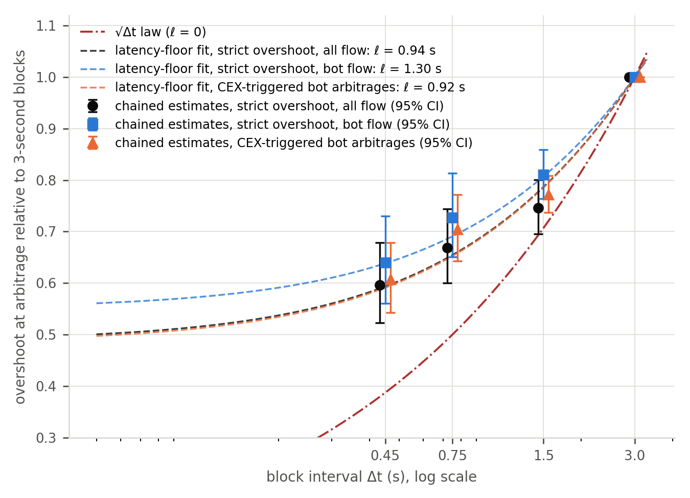
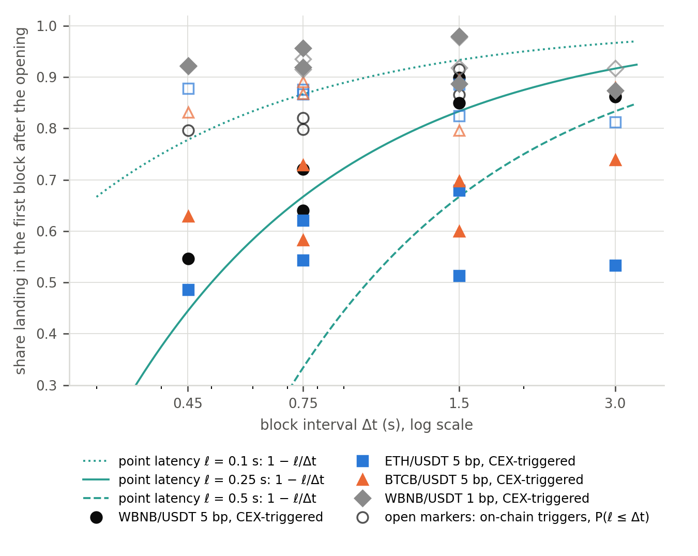
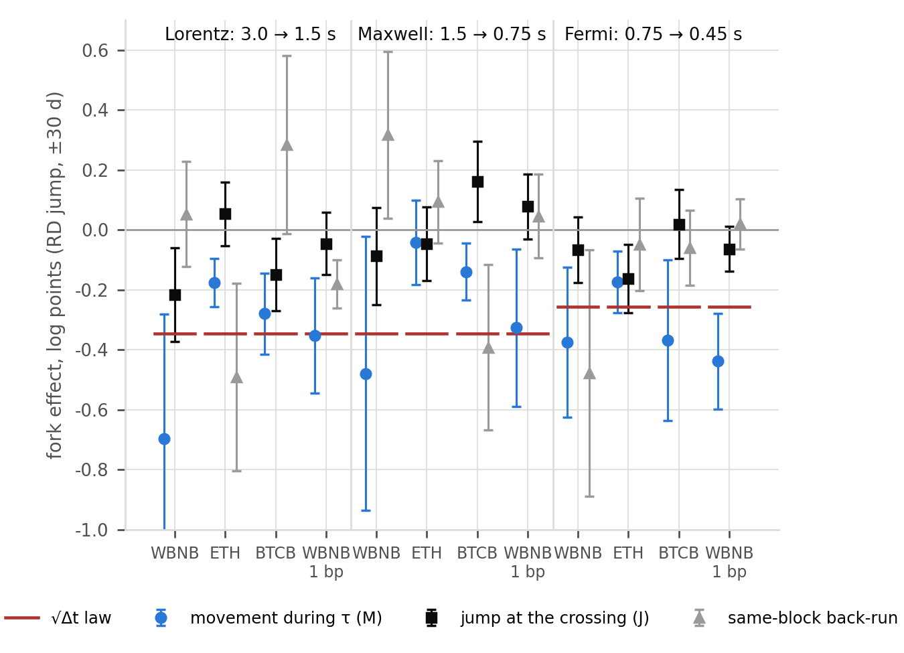

# Faster blocks fall short of the square-root law: arbitrage rents and latency across three block-interval reductions on BNB Chain

Zhengdong Zhu¹\*

¹ School of Business, Macau University of Science and Technology, Macau, China

\* Corresponding author: 2250030525@student.must.edu.mo (ORCID 0009-0001-8953-0061)

## Abstract

Automated market makers can only be repriced by trades, so the mispricing at which arbitrageurs trade against them is predicted to scale with the square root of the block interval. We test this on three pre-announced reductions of BNB Chain's block interval, from 3 s to 0.45 s, using 49 million PancakeSwap v3 swaps aligned to Binance trades at millisecond resolution. In one pre-specified jump-at-the-fork specification applied to all three forks, the mispricing falls at every fork but by less than the law: 84% of the predicted change at the first halving and at most half of it at the two sub-second reductions. Liquidity providers' gross adverse-selection loss does not fall and stays close to their fee income. Reconstructing when 6.5 million arbitrage opportunities opened shows why: arbitrageurs respond with a latency of 0.1–0.35 s that does not shrink with the block interval, so more arbitrages miss the first block; only the mispricing that accumulates while they wait follows the law, whereas the reference-price jump that opens an opportunity and same-block back-runs do not. The block interval is a lever over price efficiency and arbitrage rents, with diminishing returns below one second, not over the cost of liquidity provision.

## Introduction

A continuous price process observed only on a discrete time grid drifts out of a reflecting band by an amount that scales with the square root of the sampling interval. On a blockchain this sampling law governs every automated market maker (AMM): the pool quotes prices mechanically and can only be repriced by trades, the external price moves between blocks, and the first trader to act in the new block trades against the pool at a stale price. This stale quoting is the liquidity providers' *loss-versus-rebalancing* [@milionis2022lvr]; with trading fees, arbitrageurs act only when the mispricing exceeds the fee band, and the block interval — the sampling period — becomes a market-design parameter: the shorter the interval, the less the price can drift out of the band before the next opportunity to correct it [@milionis2024fees]. The policy conclusion has been drawn many times — simulations suggest that 100-millisecond blocks would cut LPs' arbitrage losses on Ethereum by 20–70% [@fritsch2024measuring], and layer-2 sequencers advertise sub-second blocks as an LP-friendly feature — but it rests on a functional form that has never been tested against a change of the block interval on a market whose participants stayed the same.

This paper tests it on three such changes. BNB Chain shortened its block interval from 3 s to 1.5 s (Lorentz, 29 April 2025), to 0.75 s (Maxwell, 30 June 2025) and to 0.45 s (Fermi, 14 January 2026) by pre-announced hard forks whose timing was set by an engineering roadmap rather than by market conditions [@bnbchain2025bep520; @bnbchain2025maxwell; @bnbchain2026fermi]; the protocol (PancakeSwap v3), the pools, the fee tiers, the liquidity providers and the arbitrageurs were the same before and after each fork. We study all three events on seven pools covering four fee tiers and 49 million swaps, with the last Binance trade before each swap's millisecond block timestamp as the external price. The fee-band model makes point predictions: the *overshoot* — how far beyond the fee band the price has drifted when an arbitrageur trades — scales with σ√Δt, so its log should fall by ½·ln(Δt₁/Δt₀) at a fork (−0.347 for a halving, −0.255 for the 40% reduction of Fermi); arbitrageurs' profit rate should fall by the same amount; the LPs' gross adverse-selection loss should fall only by the arbitrageurs' share of it times the change in that share's own law; and the elasticity of the overshoot to Δt should be 0.5 at every step of the roadmap, unless arbitrageurs face a delay that does not shrink with the block interval.

The design is a before–after comparison in an hourly pool panel around each fork. One specification is fixed in advance and applied uniformly to the three forks and to every outcome — a jump at the fork with separate pre- and post-fork trends in a ±30-day window, controlling for the hour's realised volatility on Binance, active liquidity, volume, time of day and pool fixed effects — and every other window and set of controls is reported as robustness with a fake-fork placebo (Supplementary Information).

The paper contributes to the theory of AMM design [@milionis2022lvr; @milionis2024fees; @capponi2025adoption; @hasbrouck2026model; @adams2025amamm] the first within-chain causal estimates of how the block interval enters arbitrage rents and LP costs, at three doses, and the first direct measurement of arbitrageurs' response times on a public chain: for each of 6.5 million trades by arbitrage contracts we reconstruct, from Binance's millisecond trade record and the pool's own trade history, when the opportunity opened and how long the arbitrageur took to close it, and decompose the overshoot into the part that accumulates while the arbitrageur waits and the parts that do not depend on the block interval. To the empirical literature on decentralised-exchange market quality [@lehar2025uniswap; @barbon2026quality; @capponi2026discovery; @alexander2025price; @fritsch2024measuring] it contributes a natural experiment in which the friction separating DEX from CEX prices was changed exogenously three times, and to the measurement of arbitrage and extractable value [@zhou2021hft; @qin2022bev; @oz2025crosschain] the finding that at sub-second block times the resolution and alignment of the reference price are first-order: the 1-second candle reference of the empirical literature goes stale by the fractional second of the block timestamp, and because the share of arbitrage trades that respond to price moves inside that fraction rises when blocks get faster, it manufactures part of the effect of a fork.

## Results

### The overshoot falls at every fork, by less than the square-root law

Table 1 reports the main specification for every outcome and fork: the jump at the fork, net of separate pre- and post-fork trends, in the ±30-day window, three core 0.05% pools pooled, with the estimate as a share of the prediction, its exact p-value and the fake-fork placebo of the same specification (Methods). Fig. 1 chains the estimates along the roadmap against the √Δt law and a latency-floor model; Supplementary Table S1 gives the full set of classifications, placebos and the range of each estimate across the windows and specifications of the Supplementary Information.

The strict overshoot falls at every fork: by −0.293 (s.e. 0.036) after Lorentz, 84% of the predicted −0.347; by −0.110 (0.041) after Maxwell, 32% of the prediction; and by −0.115 (0.037) after Fermi, 45% of the predicted −0.255. As elasticities with respect to the block interval the three forks give 0.42 (0.05), 0.16 (0.06) and 0.22 (0.07) against the law's 0.5; the precision-weighted elasticity is 0.29 (0.03), six standard errors below 0.5 (p < 0.001), and equality of the three elasticities is rejected for strict and for CEX-triggered arbitrages (χ²(2) = 12.1 and 13.0, p = 0.002 and 0.002) but not for bot flow (χ²(2) = 3.3, p = 0.20) or for all identified arbitrages (χ²(2) = 3.1, p = 0.21). Same-weekday-hour matched pairs and a daily event study give the same picture (Supplementary Table B9 and Supplementary Fig. B1).

Two features of Table 1 discipline the reading. First, the placebo of the main specification is +0.04 (0.03) at Lorentz, −0.08 (0.03) at Maxwell and −0.06 (0.04) at Fermi: a fictitious fork in the middle of the two sub-second pre-periods "finds" a fall of 0.06–0.08 log points where there was none, because the overshoot residuals drifted down before both forks. Read as a bound on the drift the design can mistake for a jump, the placebos say that the true sub-second effects are, if anything, smaller than the estimates and the Lorentz effect larger — netting each estimate of its placebo gives −0.33, −0.04 and −0.05, 95%, 10% and 21% of the law — so the ordering across forks is not produced by the drift and the shortfall of the sub-second forks is understated rather than manufactured. Second, the estimate depends on which trades are called arbitrages. Widening the strict definition to all identified arbitrages — trades that cross the band in the correcting direction whether or not they return the price to it — cuts the estimates to −0.09, −0.00 and −0.06, because the broader class is dominated by informed and partial trades whose size is not set by the clock. Narrowing it to the trades of arbitrage contracts (public routers excluded) lowers the Lorentz estimate to −0.210 (0.030), 61% of the law, and leaves Maxwell and Fermi within 0.02; narrowing it further to arbitrages triggered by a move of the reference price gives −0.259, −0.092 and −0.149, 75%, 26% and 58% of the law.

What survives every classification is the shape of the response, not its exact size. Every fork delivers less than the law; among the classifications that isolate arbitrage, the first halving delivers most of it (61–84%) and the two sub-second reductions between a quarter and three fifths, never more than two thirds in any of the eleven windows and specifications of the Supplementary Information; the pooled elasticity is 0.10–0.31 depending on the classification, never within six standard errors of 0.5.

**Table 1. Main specification: the effect of the three block-interval reductions on the core pools.** Jump at the fork in the ±30-day window: log outcome on Post, a trend in days with separate slopes before and after the fork, log σ, log L, log volume, hour-of-day and pool fixed effects; three 0.05% pools pooled; ordinary least squares with standard errors (in parentheses) clustered by calendar day; p is the two-sided p-value of the coefficient from a t distribution with G − 1 degrees of freedom, G being the number of clusters. Shares of the law in brackets (predicted changes −0.347, −0.347 and −0.255). n = 4,319, 4,303 and 4,307 pool-hours for the headline row at Lorentz, Maxwell and Fermi (4,213–4,319 for the other outcomes, as hours without the outcome drop out), 61 day-clusters per fork. Placebo rows re-estimate the same specification on the 30-day pre-period with a fictitious fork at its midpoint (n = 2,124–2,160 pool-hours, 31 clusters); the next row nets the headline estimate of its placebo (a bound, without a standard error). The last row is the elasticity β/ln(Δt₁/Δt₀) with its p-value against the law's 0.5.

| Outcome | Lorentz (3 → 1.5 s) | p | Maxwell (1.5 → 0.75 s) | p | Fermi (0.75 → 0.45 s) | p |
|:--|:--|:--|:--|:--|:--|:--|
| Strict overshoot (headline) | −0.293 (0.036) [84%] | <0.001 | −0.110 (0.041) [32%] | 0.010 | −0.115 (0.037) [45%] | 0.003 |
| Overshoot, all identified arbitrages | −0.094 (0.032) [27%] | 0.004 | −0.002 (0.043) [1%] | 0.95 | −0.062 (0.038) [24%] | 0.11 |
| Strict overshoot, bot flow | −0.210 (0.030) [61%] | <0.001 | −0.108 (0.049) [31%] | 0.031 | −0.129 (0.036) [50%] | <0.001 |
| Overshoot, CEX-triggered bot arbitrages | −0.259 (0.024) [75%] | <0.001 | −0.092 (0.040) [26%] | 0.025 | −0.149 (0.033) [58%] | <0.001 |
| Arbitrageur profit | −0.245 (0.056) [71%] | <0.001 | +0.153 (0.082) | 0.067 | −0.138 (0.066) [54%] | 0.040 |
| LP gross loss, block timestamp | −0.067 (0.020) | 0.001 | +0.001 (0.023) | 0.98 | +0.030 (0.018) | 0.099 |
| LP gross loss, 30 s mark-out | −0.051 (0.023) | 0.029 | +0.024 (0.027) | 0.39 | +0.056 (0.020) | 0.006 |
| Arbitrages per hour | +0.053 (0.039) | 0.19 | +0.177 (0.045) | <0.001 | −0.020 (0.039) | 0.61 |
| Loss per arbitrage | −0.186 (0.051) | <0.001 | −0.083 (0.052) | 0.11 | −0.064 (0.044) | 0.15 |
| Placebo: strict overshoot | +0.035 (0.032) | 0.28 | −0.075 (0.034) | 0.033 | −0.061 (0.037) | 0.11 |
| Placebo: arbitrageur profit | −0.018 (0.051) | 0.72 | −0.434 (0.056) | <0.001 | −0.305 (0.087) | 0.001 |
| Placebo: LP gross loss | +0.012 (0.024) | 0.61 | −0.040 (0.029) | 0.19 | +0.042 (0.028) | 0.14 |
| Strict overshoot net of placebo | −0.328 [95%] | — | −0.035 [10%] | — | −0.053 [21%] | — |
| Elasticity to Δt (strict; law 0.5) | 0.42 (0.05) | 0.14 | 0.16 (0.06) | <0.001 | 0.22 (0.07) | <0.001 |

**Figure 1. The arbitrage overshoot along the block-interval roadmap: chained main-specification estimates against the √Δt law and the latency-floor model.** The level at 3-second blocks is normalised to one and each fork's estimate is chained onto the previous level (error bars: 95% intervals of the cumulated estimates), for the strict overshoot of all flow, the strict overshoot of bot flow and the overshoot of CEX-triggered bot arbitrages. Curves: the √Δt law and the latency-floor model of the Discussion fitted to each set of estimates (χ²(2) p = 0.06, 0.24 and 0.02 for the three sets; Supplementary Table S3).

### What the reference price does to these estimates

Every estimate above uses the trade reference. With the 1-second candle reference of the empirical literature the same specifications give −0.325, −0.239 and −0.196 for the three forks — 94%, 69% and 77% of the law — and equality of the three elasticities can no longer be rejected in most specifications (Supplementary Appendix C). The difference is a measurement artefact of the block interval itself. The log ratio of the strict overshoot computed with the trade reference to the same hour's overshoot computed with the candle reference is flat before each fork and jumps on the fork day by 0.030 (0.007) at Lorentz, 0.128 (0.016) at Maxwell and 0.079 (0.030) at Fermi, while volatility does not jump. Before Lorentz, block timestamps were whole seconds and the two references coincide exactly; at the fork the half-second timestamps appear and the wedge jumps by an amount that the hour's reference gap absorbs entirely. The candle lags the block by the fractional part of the timestamp, an arbitrage trade responds to a move of the external price that occurred at most one block interval earlier, and the share of such moves that postdate the candle close rises with faster blocks, so the candle understates the deviation the arbitrageur acted on by more after a fork than before. Any study that aligns sub-second on-chain trades to second-level CEX candles contains an artefact of this kind, largest exactly at the transition to sub-second blocks.

### Arbitrageurs' profits fall; the liquidity providers' cost does not

Arbitrageur profit — the product of the overshoot, the trade size and the number of trades — falls by −0.245 (0.056) after Lorentz, 71% of the predicted −0.347, with a clean placebo, and by −0.138 (0.066) after Fermi, 54% of the predicted −0.255, with a contaminated one (the February 2026 sell-off enters the second half of the post-window; the ±14-day specification whose placebo is clean gives −0.088 (0.048)). At Maxwell the profit series is not identified (placebo −0.43). The number of identified arbitrages per hour does not fall at any fork while the loss per arbitrage does: more, smaller corrections, as the model implies.

The LPs' gross adverse-selection loss does not fall. Under the main specification the pooled change is −0.067 (0.020) after Lorentz, +0.001 (0.023) after Maxwell and +0.030 (0.018) after Fermi, and −0.051, +0.024 and +0.056 when the pool's execution is marked 30 seconds after the block. These magnitudes are what the model allows: with the arbitrageurs' pre-fork shares s of the gross loss (0.26–0.73 at Lorentz, 0.19–0.39 at Maxwell, 0.21–0.44 at Fermi), the √Δt law would predict changes of −8% to −21%, −6% to −11% and −5% to −10%, and with the profit changes actually observed −6% to −16% at Lorentz and −3% to −6% at Fermi. The observed −6% at Lorentz is of this order; the zero to +3% at the two sub-second forks is smaller than even the reduced prediction.

The level of the LPs' loss is as informative as its change (Table 2). In the ETH and BTCB 5 bp pools the loss is 79–120% of fee income at the block timestamp and 88–121% at the 30-second horizon in every regime from 3-second to 0.45-second blocks; the mark-out horizon matters little and, where it matters, raises the ratio. Read as a statement about LVR and fees — not about LPs' net returns, which also depend on inventory risk and range management — the fees that LPs in these pools collect on their volume approximately pay for the adverse selection they suffer on it, at 3-second and at 0.45-second blocks alike. The fee tier is the margin on which LPs can respond, and it did not move either: the 1 bp pool's share of WBNB/USDT volume was 64%, 89% and 98% in the 30 days before the three forks and 68%, 89% and 98% after, its share of active liquidity 34%, 64% and 92% before and 40%, 66% and 91% after, and hour-by-hour jumps of the log volume ratio have opposite signs at the three forks.

**Table 2. LPs' loss relative to fee income across the six block-interval regimes, and the fee-tier margin.** Panel A: Σ(fee income − pool gain) / Σ fee income over each ±30-day half-window, with the pool's gain marked at the reference price at the block timestamp and 30 seconds after it (L, M, F: Lorentz, Maxwell, Fermi windows). Panel B: the WBNB/USDT 1 bp pool's share of the pair's volume and active liquidity before → after each fork, and the jump at the fork of the log ratios under the main specification (standard errors in parentheses, two-sided p-values; n = 1,441 hours per fork, 61 day-clusters).

*Panel A. Loss / fee income*

| Statistic | Pool | 3 s (L pre) | 1.5 s (L post) | 1.5 s (M pre) | 0.75 s (M post) | 0.75 s (F pre) | 0.45 s (F post) |
|:--|:--|--:|--:|--:|--:|--:|--:|
| Block timestamp | ETH 5 bp | 1.20 | 1.05 | 1.07 | 1.03 | 1.09 | 1.03 |
| Block timestamp | BTCB 5 bp | 1.11 | 1.03 | 0.89 | 0.79 | 1.00 | 0.98 |
| Block timestamp | WBNB 5 bp | 0.98 | 0.36 | 0.56 | 0.84 | 0.86 | 1.00 |
| 30 s after the block | ETH 5 bp | 1.21 | 1.08 | 1.11 | 1.10 | 1.10 | 1.02 |
| 30 s after the block | BTCB 5 bp | 1.19 | 1.09 | 0.95 | 0.88 | 1.09 | 1.06 |
| 30 s after the block | WBNB 5 bp | 0.99 | 0.38 | 0.58 | 0.93 | 0.95 | 1.12 |

*Panel B. The fee-tier margin: WBNB/USDT 0.01% versus 0.05%*

| Fork | 1 bp share of volume | 1 bp share of liquidity | Jump at the fork, log(volume 1 bp / 5 bp) | Jump at the fork, log(L 1 bp / 5 bp) |
|:--|:--|:--|:--|:--|
| Lorentz | 0.641 → 0.680 | 0.336 → 0.398 | −1.442 (0.295), p < 0.001 | −0.618 (0.179), p = 0.001 |
| Maxwell | 0.890 → 0.891 | 0.639 → 0.657 | −0.270 (0.094), p = 0.006 | −0.184 (0.096), p = 0.059 |
| Fermi | 0.975 → 0.979 | 0.923 → 0.909 | +0.352 (0.100), p < 0.001 | +0.245 (0.072), p = 0.001 |

### Arbitrageurs' latency does not shrink with the block interval

For every arbitrage by an arbitrage contract we reconstruct when the opportunity it closed had opened (Methods): a *CEX-triggered* arbitrage is one for which the reference price crossed out of the pool's no-arbitrage band at some time t_open after the previous swap and stayed outside until the block, with response time τ = t_block − t_open; an *on-chain-triggered* one is opened by the pool's own previous trade, so that its response time is a difference of two block timestamps. Under a fixed latency ℓ the response time is ℓ plus a wait uniform on [0, Δt]: at a fork its median falls by half the change in Δt, its quantiles net of q·Δt share one intercept that does not move, and the share of arbitrages landing in the first block after the opening, E[max(0, 1 − ℓ/Δt)], falls as Δt shrinks toward ℓ.

At sub-second block times the picture is exactly this. In the Fermi window the intercepts of the tenth percentile and of the median differ by less than a tenth of a second and move by less than 50 ms at the fork (WBNB 125/187 → 132/203 ms, ETH 206/271 → 162/237 ms, BTCB 133/192 → 109/160 ms), an interval-censored maximum-likelihood estimator [@turnbull1976empirical] places the median latency at 160–230 ms, and the median response time falls by 134–184 ms in the three pools against the 150 ms by which the expected wait for a block fell; at Maxwell the corresponding changes are −420 to −505 ms against −375, with intercepts of 0.20–0.47 s. Fig. 2 is the least model-dependent evidence in the paper for a floor under the response to the clock: it requires no regression, no placebo screen and, for the on-chain-triggered series, no reference price at all. The share of CEX-triggered arbitrages landing in the first block after the opportunity opens falls at both sub-second forks in every pool (Fig. 2) — from 0.68–0.85 to 0.54–0.64 at Maxwell and from 0.62–0.73 to 0.49–0.63 at Fermi — so that at 0.45-second blocks 37–51% of arbitrages miss the first block; the points sit between the curves for a point latency of 0.1 and 0.25 s. At 3-second blocks arbitrageurs were slower and more heterogeneous (median intercepts of 0.56–1.4 s) and kept getting faster through the year, which is why Lorentz, alone, delivered most of the law.

**Figure 2. The share of CEX-triggered arbitrages landing in the first block after the opening, against the block interval.** Filled markers: CEX-triggered arbitrages; open markers: on-chain-triggered arbitrages, for which the share equals the distribution function of the latency at Δt. Curves: the share implied by a point latency of 0.1, 0.25 and 0.5 s. Three core pools and the WBNB/USDT 1 bp pool, bot flow, six block-interval regimes.

### The anatomy of the overshoot: what the shortfall is made of

The overshoot of a CEX-triggered arbitrage is the sum of two pieces: the excess J by which the crossing trade itself carried the reference price beyond the band edge, set by the size distribution of trades on Binance, and the movement M of the reference price between the crossing and the block, which accumulates over the response time and is the part to which the √Δt logic applies. Two further kinds of arbitrage are triggered by the pool's own trades: same-block back-runs, whose overshoot is set by the size of the trade they correct, and continuations of corrections begun in an earlier block. Fig. 3 and Supplementary Table S2 estimate the fork effect on each component under the main specification. The movement component M falls at every fork, by the law or more at Lorentz and Fermi and by a quarter of it at Maxwell: −0.32 (0.04), −0.09 (0.07) and −0.37 (0.07) against −0.35, −0.35 and −0.26, with clean placebos. The components that the model says should not respond respond little: the crossing jump J changes by −0.14, −0.02 and −0.09, the overshoot of same-block back-runs by +0.12, −0.00 and −0.16, continuations by −0.32, −0.12 and −0.13. The weighted sum of the components' effects, with each pool's pre-fork weights, reproduces the pool-level totals with a mean absolute difference of 0.03 across the twelve pool-forks.

The weights are what makes the returns diminish. In the fortnight before each fork the movement component is 28% of the strict overshoot on average (8–54%), the jump 19%, continuations 34% and same-block back-runs 18%; the two components that do not respond together rise from 32% of the overshoot before Lorentz to 35% before Maxwell and 44% before Fermi, because each fork removes part of M and none of the rest. If the overshoot were σ√τ, the fork effect implied by the response times alone tracks the pool-level estimates across the twelve pool-forks (correlation 0.67) and coincides with them at Lorentz, but at the two sub-second forks it is systematically larger than the estimates: the latency accounts for part of the sub-second shortfall, the composition for the rest.

**Figure 3. Fork effect by component of the overshoot, four liquid pools, main specification.** Post coefficients with 95% intervals for the movement component M (blue), the jump component J (black) and the overshoot of same-block back-runs (grey), against the √Δt law (red).

### Volatility and competition within the hour

The functional form tested above in the Δt dimension has a second dimension, and it fails there too: in every regime the elasticity of the strict overshoot to realised volatility is 0.34–0.59 for the pooled core pools, never near the model's 1. The two shortfalls have the same cause. Within a block-interval regime the movement component M of CEX-triggered arbitrages has an elasticity to σ of 0.52–0.97, rising to 0.8–1.0 at sub-second blocks, while the crossing jump J — set by the size of trades on Binance, not by their diffusion — has 0.22–0.39 without controls and −0.07 to +0.13 in five of six regimes once volume and liquidity are held fixed (Table 3); a simulation of the arbitrage process with three fixed latencies and no behavioural response reproduces the pattern, with elasticities of 0.90–0.91 for M, −0.01 to +0.03 for J and 0.36–0.41 for the overshoot (Supplementary Appendix D). An aggregate elasticity of about 0.4 is what the model itself produces once the jump that opens an opportunity is counted as part of the overshoot.

The σ dimension also shows what competition responds to within the hour. In hours of high σ, in each of the six regimes, more arbitrage contracts are active (elasticity 0.41–0.61), the median response time is shorter (−0.03 to −0.21), E[√τ] lower (−0.11 to −0.20) and the share of arbitrages landing in the first block higher (+0.02 to +0.14 per log unit of σ). Holding volume and liquidity fixed removes most of both responses: the number of active contracts rises by only 0.05–0.27 per log unit of σ, and the response times fall by −0.01 to −0.11, an elasticity of −0.11 (0.02) at the arbitrage level pooled across regimes. Whether that residual is a behavioural speed-up or a product of the convention that dates an opening at the last crossing of the band edge can be settled on the arbitrages whose opening time is unambiguous (Supplementary Table S5). Sharp openings — crossings that carry the reference price at least ½γ beyond the band edge — are too few to decide it: their pooled elasticity is +0.02 (0.07), consistent with zero but only 1.9 standard errors from the full-sample value. On-chain-triggered arbitrages, whose response time is a difference of two block timestamps, carry the test: their pooled elasticity is +0.05 (0.02), 5.5 standard errors above the full-sample value, and their first-block share rises with σ in none of the six regimes (p ≥ 0.11). The residual fall is consistent with what the opening convention would produce when the reference price crosses the band edge by a hair and the arbitrageur acts only once the deviation reaches its own threshold, a distance that volatile hours cover faster; and it sits where that mechanism puts it, since the elasticity is −0.13 (0.02) for crossings of less than 0.05 bp beyond the edge, −0.10 (0.02) at 0.15–0.4 bp, −0.05 (0.02) at 0.4–1 bp and +0.05 (0.04) at 1–2.5 bp. Volatility brings volume and volume brings entrants; the arbitrageurs' latency itself responds neither to the transient rise of the prize within the hour nor to the permanent, pre-announced change of the clock: the operators active on both sides of a fork moved their response times by the mechanical amount at Maxwell and Fermi, entrants took 1–12% of post-fork arbitrages, and concentration did not change systematically (Supplementary Appendix D).

**Table 3. Elasticities to realised volatility within each block-interval regime: response times, competition and the components of the overshoot.** Hourly panel of CEX-triggered bot arbitrages in the three core pools (hours with at least 20 such arbitrages); each cell is the coefficient on log σ in a regression of the hourly statistic (in logs, or in levels for shares) on log σ with hour-of-day and pool fixed effects within each regime, without further controls (upper block) and with log volume and log active liquidity added (lower block). n = 1,086, 880, 875, 1,288, 1,104 and 1,557 pool-hours in the six regimes (30–31 day-clusters each); standard errors clustered by day in parentheses; the exact two-sided p-value of every cell is given in Supplementary Table S7.

| Outcome | Lor. pre (3 s) | Lor. post (1.5 s) | Max. pre (1.5 s) | Max. post (0.75 s) | Fer. pre (0.75 s) | Fer. post (0.45 s) |
|:--|:--|:--|:--|:--|:--|:--|
| *No further controls* | | | | | | |
| Median τ (log) | −0.21 (0.02) | −0.15 (0.04) | −0.09 (0.01) | −0.12 (0.02) | −0.09 (0.01) | −0.03 (0.02) |
| E[√τ] (log) | −0.20 (0.01) | −0.17 (0.02) | −0.14 (0.01) | −0.17 (0.02) | −0.15 (0.01) | −0.11 (0.01) |
| First-block share (level) | +0.14 (0.01) | +0.09 (0.02) | +0.09 (0.01) | +0.08 (0.01) | +0.08 (0.01) | +0.02 (0.01) |
| Active contracts (log) | +0.53 (0.03) | +0.61 (0.03) | +0.48 (0.03) | +0.41 (0.02) | +0.45 (0.03) | +0.48 (0.04) |
| Movement M (log) | +0.52 (0.06) | +0.54 (0.18) | +0.55 (0.06) | +0.81 (0.33) | +0.80 (0.21) | +0.97 (0.12) |
| Crossing jump J (log) | +0.22 (0.03) | +0.35 (0.04) | +0.39 (0.03) | +0.37 (0.05) | +0.23 (0.04) | +0.39 (0.03) |
| CEX-triggered overshoot (log) | +0.43 (0.03) | +0.47 (0.05) | +0.45 (0.03) | +0.44 (0.03) | +0.32 (0.03) | +0.56 (0.03) |
| *With log volume and log active liquidity* | | | | | | |
| Median τ (log) | −0.08 (0.03) | −0.08 (0.05) | −0.08 (0.03) | −0.01 (0.03) | −0.04 (0.03) | −0.05 (0.02) |
| E[√τ] (log) | −0.08 (0.02) | −0.06 (0.03) | −0.11 (0.03) | −0.03 (0.03) | −0.09 (0.02) | −0.07 (0.02) |
| First-block share (level) | +0.04 (0.02) | +0.06 (0.03) | +0.08 (0.02) | −0.01 (0.03) | +0.07 (0.02) | +0.04 (0.02) |
| Active contracts (log) | +0.05 (0.07) | +0.25 (0.10) | +0.08 (0.09) | +0.08 (0.05) | +0.27 (0.06) | +0.08 (0.05) |
| Movement M (log) | +0.58 (0.31) | −0.03 (0.55) | +0.48 (0.14) | +0.58 (0.59) | +1.78 (0.55) | +0.64 (0.26) |
| Crossing jump J (log) | −0.03 (0.08) | +0.27 (0.09) | +0.13 (0.08) | −0.07 (0.09) | +0.07 (0.07) | −0.02 (0.09) |
| CEX-triggered overshoot (log) | +0.24 (0.05) | +0.31 (0.07) | +0.27 (0.07) | +0.16 (0.04) | +0.21 (0.04) | +0.18 (0.06) |

## Discussion

The result that organises the paper is the contrast between the arbitrageurs' rent, which falls at every fork, and the LPs' gross loss, which does not (Supplementary Table S4 collects the model's predictions, where each is tested and its verdict). It follows from the fee band. The pool loses relative to the external price whenever it executes at a stale price, and the stale price can be up to γ away from the external price without any arbitrageur having an incentive to correct it. The part of the staleness that depends on the block interval is the overshoot beyond the band — 0.3–2.8 bp in our pools against a band of 5 bp — and only this part shrinks when blocks get faster. The first halving removed about a quarter of the overshoot and the two sub-second reductions about a tenth each; because the arbitrageurs' profit is a quarter to three quarters of the gross loss at 3-second blocks and a fifth to almost a half at sub-second blocks, the LPs' loss was predicted to fall by 6–16% at Lorentz and by 3–11% at the later forks, and fell by 6% and by nothing. The rest of the LPs' loss is the price of allowing the pool price to sit anywhere inside the band, and no block-time change will remove it; only a narrower band, an oracle-updated price, or a mechanism that makes arbitrageurs pay for the right to correct the price [@adams2025amamm] would. Sub-second block roadmaps are good for price efficiency and bad for arbitrageurs, but of second-order and diminishing importance for the passive LP.

Two arguments explain why the response to the dose is not the one the √Δt law predicts, and both give a forward prediction for the next step of the roadmap. The composition of the overshoot is the stronger: the components that do not respond to the clock are 32% of the strict overshoot before Lorentz, 35% before Maxwell and 44% before Fermi, so the responsive share falls along the roadmap and with it the aggregate response, an argument that depends only on the components' shares and their separate fork effects. Its prediction for a further halving from 0.45 s to 0.225 s is the movement share times the law, −0.09, plus the partial response of continuations at the rate observed at Fermi, −0.14 to −0.16 in all, against the −0.35 of the law. The latency-floor extension — overshoot ∝ σ√(Δt + ℓ) — summarises the same shortfall in one parameter: fitted to the three main-specification estimates it gives ℓ = 0.9–1.3 s with 95% intervals of 0.5–2.3 s, rejects the pure law (χ² of 49–65 on three degrees of freedom), and predicts −0.07 to −0.09 for the next halving (Supplementary Table S3). Translated into a response latency, the fitted ℓ corresponds to about 0.4 s, whereas the response times measure 0.11–0.27 s at Fermi: the latency is real, and what the fitted ℓ absorbs on top of it is the composition of the overshoot. The two routes bracket the answer rather than coincide, and it is the bracket that we rely on: a further halving of the block interval from 0.45 s would reduce the mispricing at which arbitrageurs trade by something between 7% and 15%, by about a tenth, not by the 29% of the law, and most of what remains at 0.45-second blocks is set by the discreteness of the reference price, by the on-chain trades that create arbitrage opportunities and by the arbitrageurs' own latency, none of which the chain's clock can remove. The discreteness floor is not a measurement artefact: Binance's price increment is four to five times larger for BNB than for ETH, so measurement noise predicts a smaller Fermi effect in the WBNB pool than in the ETH pool, whereas the estimates are −0.11 for WBNB and −0.04 for ETH; and the mean jump component is 0.21–0.50 bp in the 5 bp pools, a component of the price path rather than of our measurement.

What a before–after comparison of the same pools estimates is the total effect of the fork as implemented over the window — the mechanical response plus whatever arbitrageurs, LPs and traders did in reaction within 30 days — and for the policy question "should blocks be made faster?" the total effect is the relevant one. Within the windows the behavioural component is small: the operators present on both sides of a fork moved their response times by the mechanical amount, entrants took 1–12% of post-fork arbitrages, concentration did not change systematically, and LPs did not move liquidity across fee tiers. The response that is large — the fall of the leading operators' tenth-percentile latency from 0.4–0.8 s in April 2025 to 0.1–0.15 s in January 2026 — is a trend across the nine months of the roadmap rather than a step at any fork. Each fork also shortened finality proportionally, because finality on BNB Chain is defined in blocks; faster finality could lower the deviation at which arbitrageurs are willing to act, and such a threshold effect would appear in every trigger type, whereas at the two sub-second forks the jump and the same-block back-runs moved by −0.02 to −0.16 against −0.09 to −0.37 for the movement component. The estimand is the effect of the fork as implemented, interval and finality together; the decomposition attributes most of it to the timing channel.

The design cannot rule out a chain-specific shock coincident with a fork; the fake-fork placebos bound the drift the design can mistake for a jump at 0.06–0.08 log points, in the direction that understates the shortfall, and the Fermi window, whose post-period contains the sell-off of February 2026, leans most on the volatility control. Arbitrage identification is price-based, and the range across four definitions is reported; response times conditional on an arbitrage having occurred are a selected sample, which the simulations reproduce. The measurement result stands on its own: the 1-second candle reference used throughout the empirical literature on decentralised exchanges manufactures part of the effect of faster blocks, and studies that align sub-second on-chain trades to second-level reference prices should expect an artefact of this kind. The block interval is a lever over price efficiency and arbitrage rents, and a weak and weakening lever over the cost of providing liquidity, which the fee band, the discreteness of the reference price and the arbitrageurs' latency set rather than the chain's clock.

## Methods

### Setting

BNB Smart Chain runs a proof-of-staked-authority consensus in which a fixed set of validators produce blocks in turn at a fixed nominal interval. The Lorentz hard fork (BEP-520, 29 April 2025 05:05 UTC, block 48,773,576) halved the interval from 3 s to 1.5 s, Maxwell (BEP-524, 30 June 2025 02:30 UTC, block 52,337,091) to 0.75 s and Fermi (BEP-619, 14 January 2026 02:30 UTC, block 75,140,593) to 0.45 s [@bnbchain2025bep520; @bnbchain2025maxwell; @bnbchain2026fermi]. Each fork bundled a proportional cut of the gas limit (per-second throughput unchanged; daily gas utilisation stayed between 9% and 61%) and, because finality on BNB Chain is defined in blocks (BEP-126, about 2.5 intervals), a proportional shortening of finality from roughly 7.5 s before Lorentz to about 1.1 s after Fermi; Fermi's BEP-590 lets a proposer include votes for up to three ancestor blocks without changing finality's latency. The windows contain other events (Supplementary Table S6): the Binance Alpha trading-rewards programme, which drove an activity wave through the Lorentz and Maxwell windows, PancakeSwap's tokenomics overhaul and the launch of PancakeSwap Infinity in the Lorentz window, and the crypto sell-off of 1–6 February 2026 in the Fermi post-window, after which realised volatility was 1.7–1.8 times its pre-period level.

PancakeSwap v3 is a concentrated-liquidity AMM with the Uniswap v3 design. We study seven pools: the three 0.05% pools for WBNB/USDT, ETH/USDT and BTCB/USDT are the core sample — liquid pools in which the pre-fork exposure σ√Δt/γ is 0.11–0.42, the fast-block regime of the model; the WBNB/USDT 0.01% pool carries most of the pair's volume and has a band of the order of the reference-price noise; the USDC/USDT 0.01% pool is a placebo with essentially no CEX–DEX arbitrage; the CAKE/WBNB 0.25% and WBNB/USDT 1% pools have low exposure. The pool identities are resolved on chain from the factory contract.

**Table 4. The seven pools.** Swaps in the ±30-day windows around Lorentz / Maxwell / Fermi (millions), and exposure σ√Δt/γ from Binance realised volatility in the 14 days before each fork; the pre-fork exposure is the position of the pool in the model's fast-block regime (σ√Δt ≪ γ).

| Pool | Fee | Role | Swaps (millions), L / M / F | Exposure before the fork, L / M / F |
|:--|:--|:--|:--|:--|
| WBNB/USDT 0.01% | 1 bp | routing pool | 6.56 / 15.05 / 12.46 | 0.92 / 0.60 / 0.51 |
| WBNB/USDT 0.05% | 5 bp | core | 5.24 / 2.33 / 0.62 | 0.18 / 0.12 / 0.11 |
| ETH/USDT 0.05% | 5 bp | core | 0.50 / 0.52 / 0.60 | 0.42 / 0.34 / 0.16 |
| BTCB/USDT 0.05% | 5 bp | core | 0.25 / 0.25 / 0.63 | 0.26 / 0.17 / 0.12 |
| USDC/USDT 0.01% | 1 bp | placebo (σ ≈ 0.09 bp/√s) | 0.70 / 2.37 / 1.09 | 0.14 / 0.11 / 0.08 |
| CAKE/WBNB 0.25% | 25 bp | low exposure | 0.07 / 0.08 / 0.02 | 0.10 / 0.04 / 0.03 |
| WBNB/USDT 1% | 100 bp | near-inactive | 0.003 / 0.003 / 0.004 | 0.01 / 0.01 / 0.01 |

### Model and predictions

Consider a pool with fee γ whose price can only change when a block is produced, every Δt seconds, and let the log external price follow a Brownian motion with volatility σ per √second. An arbitrageur who trades against the pool pays the fee, so a trade is profitable only when the mispricing exceeds γ; when it does, the arbitrageur trades until the mispricing is back at the edge of the band. In the fast-block regime σ√Δt ≪ γ the mispricing behaves like a Brownian motion reflected at ±γ and is approximately uniform over the band [@milionis2024fees]: the probability that a block is profitable is of order σ√Δt/γ, and conditional on a profitable block the overshoot that the arbitrageur captures is of order σ√Δt. Hence E[overshoot | arbitrage] ∝ σ√Δt and the arbitrageurs' profit rate ∝ L·σ³√Δt/γ, where L is the pool's active liquidity. The LPs' gross adverse-selection loss — the amount by which the pool's execution falls short of the external price on all trades — equals the arbitrageurs' profit Π plus the fees F they pay; Π vanishes as √Δt but F does not, so with s = Π/(Π + F) a change of the interval from Δt₀ to Δt₁ changes the gross loss by approximately −s·(1 − √(Δt₁/Δt₀)). With a constant latency ℓ that does not shrink with the block interval the overshoot scales with σ√(Δt + ℓ), a fork changes its log by ½·ln((Δt₁ + ℓ)/(Δt₀ + ℓ)), and the elasticity to Δt falls from 0.5 toward zero as Δt falls below ℓ. The overshoot of a CEX-triggered arbitrage further decomposes as |dev| − γ = J + M, the excess J by which the crossing trade carried the reference price beyond the band edge and the movement M accumulated over the response time; only M carries the √Δt logic, so the aggregate elasticity is that of M weighted by M's share, and falls along the roadmap even at zero latency. With θ = ½·ln(Δt₁/Δt₀) (−0.347 for Lorentz and Maxwell, −0.255 for Fermi) the predictions tested are: the log overshoot and the log arbitrageur profit rate change by θ (holding σ, γ and L fixed); the LPs' gross loss changes by −s·(1 − √(Δt₁/Δt₀)); the changes are multiplicative and the overshoot's elasticity to σ is 1; the elasticity to Δt is 0.5 at each fork if ℓ = 0 and falls from fork to fork if ℓ > 0; with a fixed latency the response time is ℓ plus a wait uniform on [0, Δt]; and at a fork only M responds.

### On-chain data and block timestamps

We collect every Swap event of the seven pools in a window of 720 hours before and after each fork — 13,336,583 swaps around Lorentz, 20,608,008 around Maxwell and 15,420,282 around Fermi — from public JSON-RPC nodes (eth_getLogs) and the Envio HyperSync log service, which return identical events on a reference slice. Each event gives the post-trade √price, the signed token amounts, the active liquidity and the transaction hash; the pre-trade price is the post-trade price of the preceding swap in the same pool. Block timestamps matter at the sub-second scale and are not returned by eth_getLogs; because BNB Chain's consensus sets each block's timestamp to its parent's plus the nominal interval, deviating only when the chain lags wall-clock time, the full timestamp vector is reconstructed from headers fetched every ten minutes, bisecting the spans whose elapsed time differs from the nominal one, and agrees with the provider-supplied timestamps of every swap block for which both are available. Millisecond timestamps exist since Lorentz; before Lorentz blocks were stamped in whole seconds, which is exact for a 3-second schedule. Hourly mean intervals are 3,000.7 and 1,500.6 ms around Lorentz, 1,500.7 and 750.1 ms around Maxwell and 750.1 and 450.2 ms around Fermi.

### Reference prices

The external price is Binance's spot market. The trade reference, used for all results in the main text, is the price of the last aggregate trade (BNBUSDT, ETHUSDT, BTCUSDT; CAKEUSDT/BNBUSDT as a cross-rate) executed at or before the swap's block timestamp, at millisecond resolution, from Binance's public data archive; the candle reference is the close of the last completed 1-second candle before the block timestamp, the convention of the empirical literature. Hourly realised volatility σ is computed from 1-minute log returns and expressed per √second. The trade reference has a noise floor — Binance's minimum price increment (0.1–0.2 bp for BNB, 0.03–0.05 bp for ETH) and bid–ask bounce — that is symmetric around the fork; a reference taken 250 ms before the block, bracketing the moment at which the arbitrageur observed the CEX price, raises the Maxwell and Fermi overshoot effects from 32% and 45% of the law to 37% and 52% and leaves every conclusion unchanged (Supplementary Appendix C).

### Arbitrage identification and LP economics

For each swap we compute the pre-trade deviation dev_pre = p_pre/P − 1, where p_pre is the pool price before the trade and P the reference price. A swap is an identified arbitrage if |dev_pre| > γ and the trade moves the pool price toward P; it is a strict arbitrage if in addition the post-trade deviation lies inside the band. The overshoot of an arbitrage is |dev_pre| − γ; averaged over strict arbitrages in an hour it is the empirical counterpart of E[overshoot | arbitrage]. For a swap that changes the pool's reserves by (ΔQ, ΔB) in quote and base tokens, the pool's mark-to-market gain is ΔQ + ΔB·P, fee income is γ times the input value, and the gross adverse-selection loss is fee income minus the pool's gain; summed over all swaps in an hour it is the empirical counterpart of Π + F, summed over identified arbitrages it is the LPs' loss to arbitrageurs, and the arbitrageurs' profit is that loss net of the fees they paid (gross of gas and CEX costs). Every swap is also marked at the reference price 30 seconds after the block. Price efficiency is measured on a 1-second grid as the mean length of runs of consecutive seconds with |dev| > γ; these episodes shortened by 20–35% at every fork in the WBNB and ETH pools and did not change in the USDC/USDT placebo pool (Supplementary Table B11).

### Opening times, response times and components

For every identified arbitrage we reconstruct when the opportunity it closed had opened. Because the pool price is constant between the pool's own trades, the no-arbitrage band around the pre-trade pool price is known at every instant since the previous swap, and Binance's millisecond trade record tells us when the reference price last crossed out of it. A CEX-triggered arbitrage is one for which the reference price crossed out of the band at some time t_open after the previous swap and stayed outside until the block (τ = t_block − t_open); an on-chain-triggered arbitrage is one whose previous swap, in an earlier block, pushed the pool price out of the band (τ = t_block − t_prev, a difference of two block timestamps immune to any clock offset between Binance and BNB Chain); a continuation is an arbitrage whose previous swap, in an earlier block, was itself an arbitrage that left the price outside the band; a same-block arbitrage follows another swap of the pool in the same block. For CEX-triggered arbitrages we record the number k of blocks sealed between the opening and the arbitrage, the jump J = |p_pre/P_open − 1| − γ, where P_open is the price of the crossing trade, and the movement M = (|dev_pre| − γ) − J. The latency is identified in three ways: the quantile intercepts Q_q(τ) − q·Δt; the nonparametric maximum-likelihood estimator for interval-censored data [@turnbull1976empirical], since the arbitrage was not in the block before the one it landed in and its latency therefore lies in (t_{b−1} − t_open, t_b − t_open]; and, for on-chain-triggered arbitrages, the share landing in the first block, which is the distribution function of ℓ at Δt. The construction is validated on simulated data with known latencies (Supplementary Appendix D).

The arbitrageur is identified through the transaction receipts: for every contract with at least twenty strict arbitrages in a window we retrieve the account that signed each of its swaps, its target and its gas. A public contract — PancakeSwap's routers, aggregators, the routers of retail trading bots — is called by many unrelated accounts, most of them once; every other contract is private, and private contracts and the wallets that sign for them form a bipartite graph whose connected components are the operators. The response-time and component statistics use the arbitrages of private contracts (bot flow), because the flow that reaches the pools through public routers from one-off accounts is ordinary order flow that happens to trade in the correcting direction (median overshoot 0.04–0.27 bp against 0.4–0.7 bp for the bots); such flow is 6–23% of strict arbitrages and matters only in the two WBNB pools. Across the three ±30-day windows the seven pools contain 10.3 million identified arbitrages, 6.5 million of them by arbitrage contracts.

### Hourly panel and estimation

All outcomes are aggregated to pool-hours: 10,081 (Lorentz), 10,075 (Maxwell) and 10,074 (Fermi) pool-hours over the seven pools in the ±30-day windows, of which the three core pools contribute 4,323 (1,441 each; 4,213–4,319 with a non-missing outcome, the n of every regression being reported with its table). For pool p and hour t the main specification is

log y_pt = β·Post_t + δ·log σ_pt + κ₁·log L_pt + κ₂·log volume_pt + λ·t + λ'·Post_t·t + α_p + η_h(t) + ε_pt,

estimated on the three core pools pooled in the ±30-day window, with 24 hour-of-day and pool fixed effects and standard errors clustered by calendar day (61 clusters); t is the time in days from the fork, so that β is the jump at the fork net of the pre-fork trend. This specification was fixed in advance and applied uniformly to the three forks and to every outcome; it nests the linear-trend specification, estimates the jump separately from any pre-existing drift, and has the precision of a 60-day window. We call it a jump-at-the-fork specification rather than a regression discontinuity: calendar time is not a running variable that assigns treatment by a cut-off, the windows contain other events (Supplementary Table S6), and the identifying assumption is that of a before–after comparison net of the pre-fork trend — that no other discrete change coincided with the fork hour — rather than the local continuity of covariates at a threshold; the fake-fork placebos bound the drift the design can mistake for a jump. Every other window (±7, ±14, ±30 days) and set of controls is reported as robustness in the Supplementary Information, each with a fake-fork placebo in which the pre-period is split at its midpoint and the same specification is re-estimated with a fictitious fork there; the placebo screen is a diagnostic, not a selection device, and no multiplicity correction is applied because the inference rests on the main specification alone. The design is a before–after comparison, not a difference-in-differences: there is no untreated pool on the chain with comparable arbitrage, and the confounders that matter in the windows are chain-specific (the Binance Alpha programme rewarded trading in BNB-Chain tokens; PancakeSwap's tokenomics overhaul and Infinity launch fall in the Lorentz window), whereas the market-wide shocks enter through the Binance volatility that is controlled for hour by hour. Elasticities to Δt are β/ln(Δt₁/Δt₀); the pooled elasticity is their inverse-variance-weighted mean and the equality test a χ² with two degrees of freedom. The latency-floor model is fitted to the three main-specification estimates by minimum χ² with profile-likelihood intervals. The simulation of Supplementary Appendix D runs the same pipeline on synthetic chains with three arbitrage bots of fixed latency (250, 500 and 900 ms) and no behavioural response.

### Statistics and software

All regressions are ordinary least squares on pool-hour panels (or, in Supplementary Table S5, on arbitrage-level observations) with standard errors clustered by calendar day (Liang–Zeger sandwich; 61 clusters per fork in the ±30-day windows, 31 in the pre-period placebos and 30–31 in the within-regime regressions); p-values are two-sided and refer the cluster-robust t-statistic to a t distribution with G − 1 degrees of freedom, G being the number of clusters, the usual practice with few clusters; they are reported exactly in the main text and its tables and in Supplementary Tables S5 and S7 (to three decimals below 0.1 and two above, and as "<0.001" below that level). In the other tables of the Supplementary Information ∗, ∗∗ and ∗∗∗ mark p < 0.10, 0.05 and 0.01 under the normal approximation, which with 31 or more clusters differs from t(G − 1) by at most about 0.01 in p at those thresholds. The n of each regression is the number of pool-hours (or arbitrages) it uses and is given with each table. Elasticities to Δt are β/ln(Δt₁/Δt₀) with standard errors s.e.(β)/|ln(Δt₁/Δt₀)|; the pooled elasticity is the inverse-variance-weighted mean of the three and the equality test the χ² statistic of the weighted deviations from it (two degrees of freedom). The latency-floor parameter ℓ is estimated by minimising the χ² distance between the three estimates and the model's predictions, with a profile-likelihood 95% interval (χ² within 3.84 of the minimum) and a goodness-of-fit p-value on two degrees of freedom. Response-time quantiles are computed per pool-hour; the Turnbull estimator uses a 10 ms grid. The pipeline and the estimation scripts are written in Python 3.11 (pandas 3.0, numpy 2.4, statsmodels 0.15, scipy 1.17, pyarrow 25.0, matplotlib 3.10) and are provided with the processed data in the replication package.

### Use of generative AI

A large language model (Claude, Anthropic) was used to assist with writing and debugging the data-pipeline and estimation code and with language editing of the manuscript. All analyses, results and interpretations were verified by the author, who takes full responsibility for the content.

## Data availability

All data are public: BNB Chain block headers and swap events (public JSON-RPC nodes, Envio HyperSync and eth_getLogs) and Binance's public market-data archive (1-second candles and aggregate trades, data.binance.vision). The processed data underlying the results — the reconstructed block timestamps, the hourly pool panels, the component panels, the arbitrage-level tables with opening and response times, and the operator tables — are provided in the replication package at https://github.com/Zzedd2001/bnb-blocktime-arbitrage (the arbitrage-level tables are attached to its Release v6.0), which will be deposited with a DOI on acceptance.

## Code availability

The data pipeline and the estimation scripts that produce every table and figure from the processed data are part of the replication package at https://github.com/Zzedd2001/bnb-blocktime-arbitrage, released under the MIT licence.

## References

[[REFERENCES]]

## Acknowledgements

The author received no financial support for the research, authorship or publication of this article.

## Author contributions

Z.Z. conceived the study, built the data pipeline, performed the analysis and wrote the manuscript.

## Competing interests

The author declares no competing interests.

## Additional information

Supplementary Information accompanies this paper: Supplementary Tables S1–S7 (the main specification with all classifications and placebos; the fork effects on the components of the overshoot; the latency-floor fits; the predictions, tests and verdicts; the response time and volatility on the subsamples with an unambiguous opening time; the three forks and the events in their windows; and the exact p-values of Table 3) and Appendices A–E (descriptive statistics and data validation, the full grid of specifications and additional estimates, the reference-price comparison, opening times, operators and simulations, and the replication package). Correspondence and requests for materials should be addressed to Z.Z.
